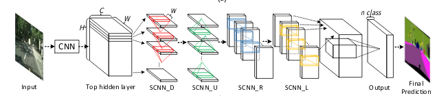
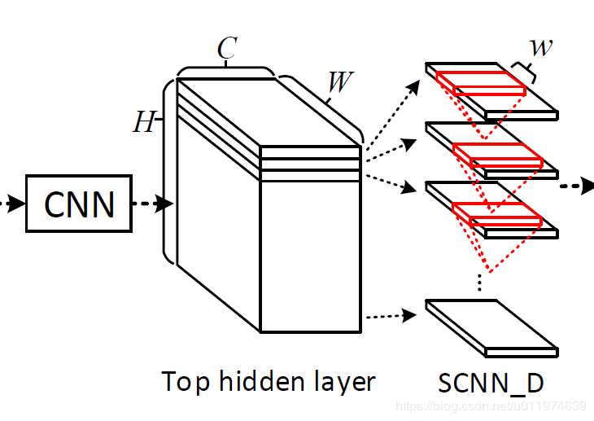
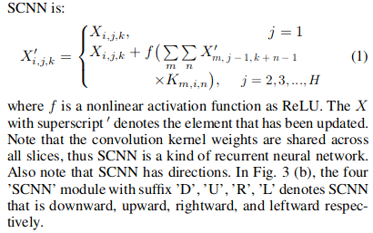

# Daily Thought (2019.4.1 - 2019.4.10)
**Do More Thinking!** ♈ 

**Ask More Questions!** ♑

**Nothing But the Intuition!** ♐
### 1. 图像翻译（Image-to-image Translation）生成高质量图像策略
就是指那种不用调参就可以得到不错效果的实现

#### 1). 来源于pix2pixHD的方法
**采用`multi-scale`的`Discriminator`以及`coarse-to-fine`的`Generator`**

所谓multi-scale的Discriminator是指多个D，分别判别不同分辨率的真假图像。比如采用3个scale的判别器，分别判别256x256，128x128，64x64分辨率的图像。

至于如何获得不同分辨率的图像，不同分辨率的GT，直接经过pooling下采样即可。

Coarse2fine的Generator是指先训练一个低分辨率的网络，训好了再接一个高分辨率的网络，高分辨率网络融合低分辨率网络的特征得到更精细的生成结果。

具体介绍可以参考pix2pixHD

#### 2). progressive growing的训练方式

先训小分辨率，再逐渐增加网络层数以增大分辨率，这个跟coarse2fine有点像。

### 2. 关于生成样本多样性

### 3. checkerboard现象

https://zhuanlan.zhihu.com/p/32294630

### 4. Spatial CNN
Spatial CNN就是那种CNN通过特征的设计架构传递空间信息。

SCNN更有效的学习空间关系，能平滑的找出连续的有强先验的结构目标。

SCNN结构：

SCNN的下标有D,U,R,L，这在结构上是类似的，方向上分别表示为向下，向上，向右，向左

先以SCNN_D分析：

考虑到SCNN应用在三维张量C × H × W
C × H × W上, C,H,W分别代表通道数，长和宽。为了实现空间信息传递，将张量切分成H片(slice)，先将第一片送到尺寸为C × w的卷积层(w为卷积核的宽度)。传统的CNN是将这层的输出传递给下一层，而这里是将这片输出相加到下一片作为新的一片。接着下一片继续应用卷积(这里卷积核共享)，直到处理完所有片。

前向传播：

