# Daily Thought (2019.4.6 - 2019.4.8)
**Do More Thinking!** ♈ 

**Ask More Questions!** ♑

**Nothing But the Intuition!** ♐

## Crowd Counting 方向 state-of-the-art总结
### 论文1：Learning from Synthetic Data for Crowd Counting in the Wild (CVPR2019)

**主要贡献** 创造了新的数据集，这个数据集是在GTA5上制作的，经过domain adaption将虚拟风格的图片转换成现实风格的图片

数据集概况简介：

GTA5 Crowd Counting(GCC) 数据集概况：

**解决方法** 使用一种`Spatial Fully Convolutional Networks`

**SFCN**

FCN就是用于关注 pixel-wise task (such as semantic segmentation,  saliency detection）

这里的`Spatial CNN`来自于 **Spatial As Deep: Spatial CNN for Traffic Scene Understanding** `AAAI2018`

For encoding the context information, 提出了 a spatial encoder via a sequence of convolution on the four directions (down, up,left-to-right and right-to-left). 原文的方法是用于车道线检测。

Spatial CNN(CNN),它将传统的卷积层接层(layer-by-layer)的连接形式的转为feature map中片连片卷积(slice-by-slice)的形式，使得图中像素行和列之间能够传递信息。这特别适用于检测长距离连续形状的目标或大型目标，有着极强的空间关系但是外观线索较差的目标，例如交通线，电线杆和墙.

CNN将视觉理解推向了一个新的高度。但是这依然不能很好地处理外形线索不多的有强结构先验的目标，而人类可以推断它们的位置并填充遮挡的部分,为了解决这个问题，论文提出了SCNN，将深度卷积神经网络推广到丰富空间层次。

传统的CNN，任意层接收上层的数据作输入，再作卷积并加激活传给下一层，这个过程是顺序执行的。与之类似的是，SCNN将feature map的行或列也看成layer，也使用卷积加非线性激活，从而实现空间上的深度神经网络。这使得空间信息能够在同层的神经元上传播，增强空间信息进而对于识别结构化对象特别有效。

### 补充：空间关系建模方法

传统的关于空间关系的建模方法是基于概率图模型的，例如马尔科夫随机场(MRF)或条件随机场(CRF)

**概率图模型（Probability Graph Model）**

简单的说概率图模型就是每个随机变量用节点表示，随机变量之间的如果是互相存在关联（非独立）那么用线段连接，所以总的来说是一个无向图。

漫谈：https://blog.csdn.net/vbskj/article/details/53338032

**马尔科夫随机场（Markov Random Field, MRF）**

马尔科夫随机场其里的Spatial不是指Spatial Convolution，而是CNN通过特征的设计架构传递空间信息。SCNN更有效的学习空间关系，能平滑的找出连续的有强先验的结构目标。SCNN的整体架构如下：

(图中SCNN的下标有D,U,R,L，这在结构上是类似的，方向上分别表示为向下，向上，向右，向左)

SCNN相比于传统方法，有三个优势

**Spatial FCN**

本文使用的网络结构

Backbone: `VGG-16` ,`Resnet-101`

The spatial encoder is added to the top of the backbone.

After the spatial encoder,a regression layer is added, which directly outputs the den-sity map with input’s 1/8 size.

**实验结果**

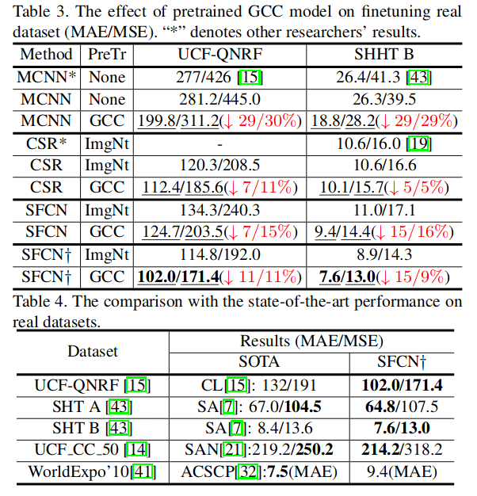

Table4表示： 是在这五个数据集上训练，但是，是在pretrained on GCC 的 model 上去 finetune的，使用SFCN，不过效果依然超过了很多18年的state-of-the-art

### 论文2：ADCrowdNet: An Attention-injective Deformable Convolutional Network forCrowd Understanding (CVPR2019)

关于crowd counting的任务，一般解决方案有两个
- crowd counting by detection
- crowd counting by regression

这篇文章解决思路基本运用下面理念
- 1. crowd understanding by CNN
- 2. crowd counting by regression

网络结构（整个网络结构叫做 Attention-injective Deformable Convolutional Network）：

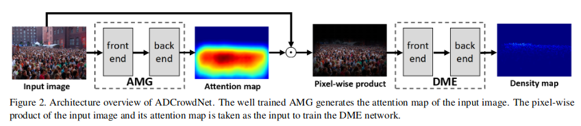

网络结构分为两个部分：

AMG 用于生成 Attention map，DME用于生成density map，具体是先训练第一阶段AMG模块，使用`crowd images`作为`positive`样本，使用`background images`作为`nagative`样本，之后使用训练过的AMG module，从输入图片中计算出attention map，然后根据attention map与原图进行pixel-wise product，然后得到的乘积作为第二阶段模块DME的输入，然后得到density map.

**AMG (Attention Map Generator)**

attention map本质是一个feature map来自于二分类网络，原本网络就是一个二分类网络，群体图片与非群体图片的分类，之后经过卷积层得到一些feature，通过一些操作，将feature map融合，得到具有空间响应信息的attention map.

pipeline：

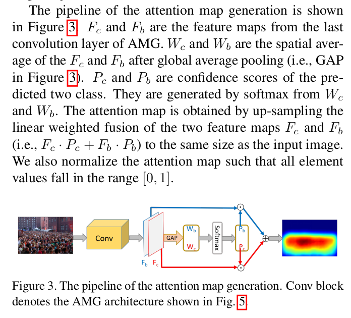

网络结构：

- front end: 使用VGG-16的前10层去extract low-level的信息
- back end: 采用不同dilated rate的空洞卷积，并使用类似与Inception的结构，这样使用多个空洞卷积可以增大感受野，对于inception模块，只要目的是整合visual信息在不同的scale下面，使用这种模块可以去处理不同拥塞程度的群体场景。

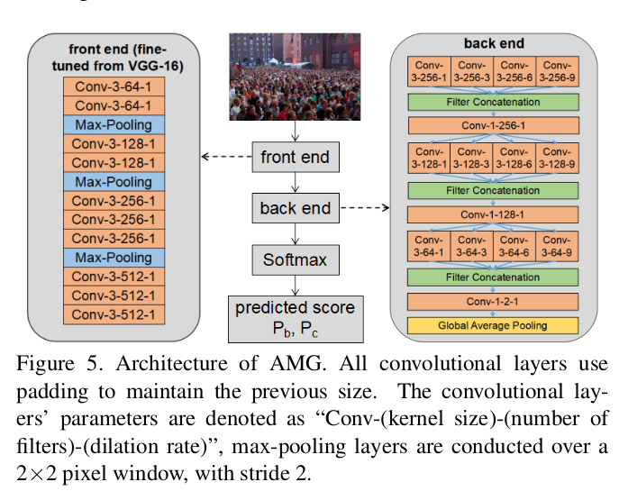

**DME (Density Map Estimator)**

- front end: 同样是使用VGG-16的前面10层去extract low-level的信息
- back end: 使用multi-scale deformable convolutional layer并且也具有相似的inception module，好处就是能够使得DME很好的应对多种的遮挡，复杂的群体分布。

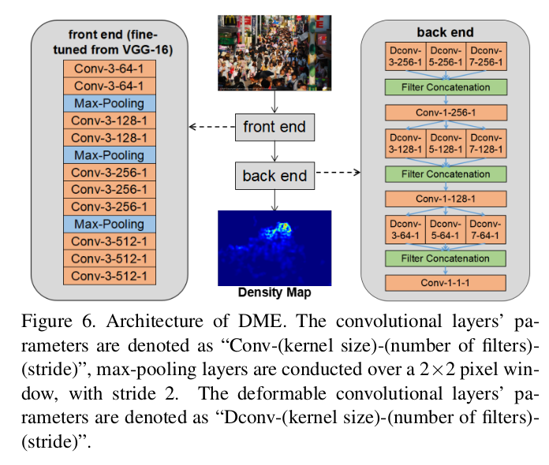

这种deformable卷积的设计其实还是比较有效的，能够很好的应对采样点的offset，而不是像普通卷积那样的均匀采样，uniform-sampling，deformable-conv能够通过在训练中调整优化然后学习这些采样点

**实验细节**

所使用的数据集情况

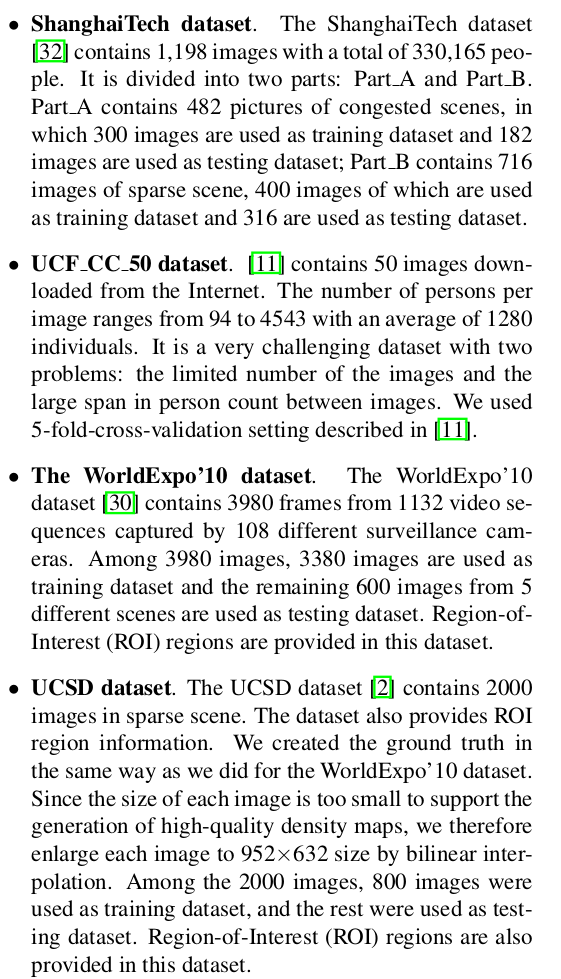

这四个数据集各自的特性：

In general, the scenes in ShanghaiTech Part A dataset are congested and noisy. Examples in ShanghaiTech Part B are noisy but not highly congested. The UCF CC 50 dataset consists of extremely congested scenes which have hardly any background noises. Both WorldExpo’10 dataset and UCSD dataset provide example with sparse crowd scenes in the form of ROI regions. Scenes in the ROI regions of the WorldExpo’10 dataset are generally noisier than the only one scene in the UCSD dataset.

一些评价度量(Metrics)：

对于所估计的度量，使用mean absolute error(MAE),mean square error(MSE)作为预测的 density map 的 quantitive evaluation.

使用PSNR以及SSIM去预测生成的density map的质量

训练细节：

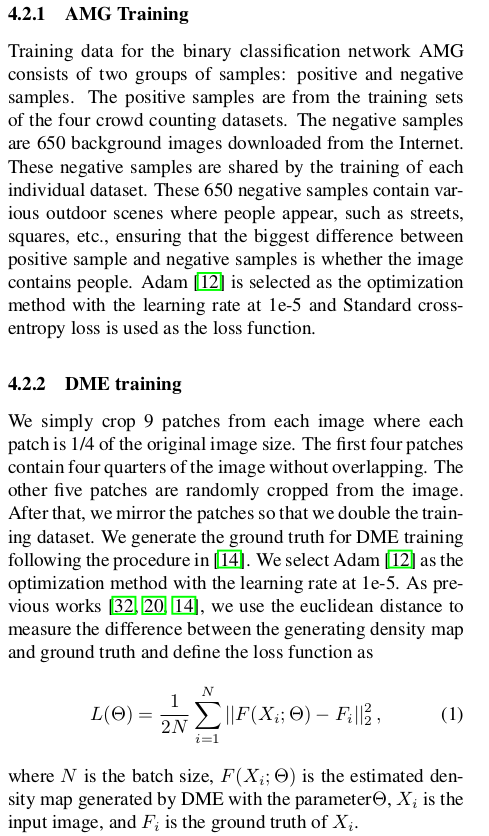

**实验结果**

关于各个模块的作用，做这样的验证实验

比较下面四个模型：
- DME: 只使用DME网络
- AMD-DME: 使用AMD+DME网络，其中的AMD得到的attention map的值是`[0,1]`之间的，将这个attention map与原图进行点积，相当于是soft attention
- AMD-bAttn-DME: 同样也是对AMD得到的attention map与原图进行点积，但是不同的是这个attention map的值是二值的mask，也就是有一个阈值t，对AMD得到的attention map进行了处理，高于阈值当作1，低于阈值当作0，关于阈值的影响也有一个实验
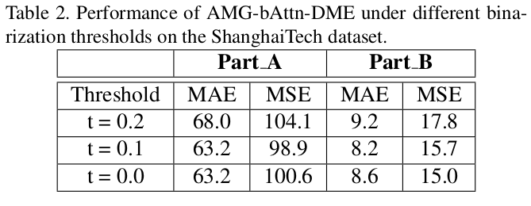
- AMD-attn-DME: 不同与之前的处理，这里是选择将attention map注入到DME的front-end与back-end之间
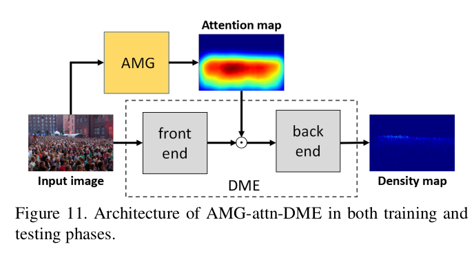

试验结果：

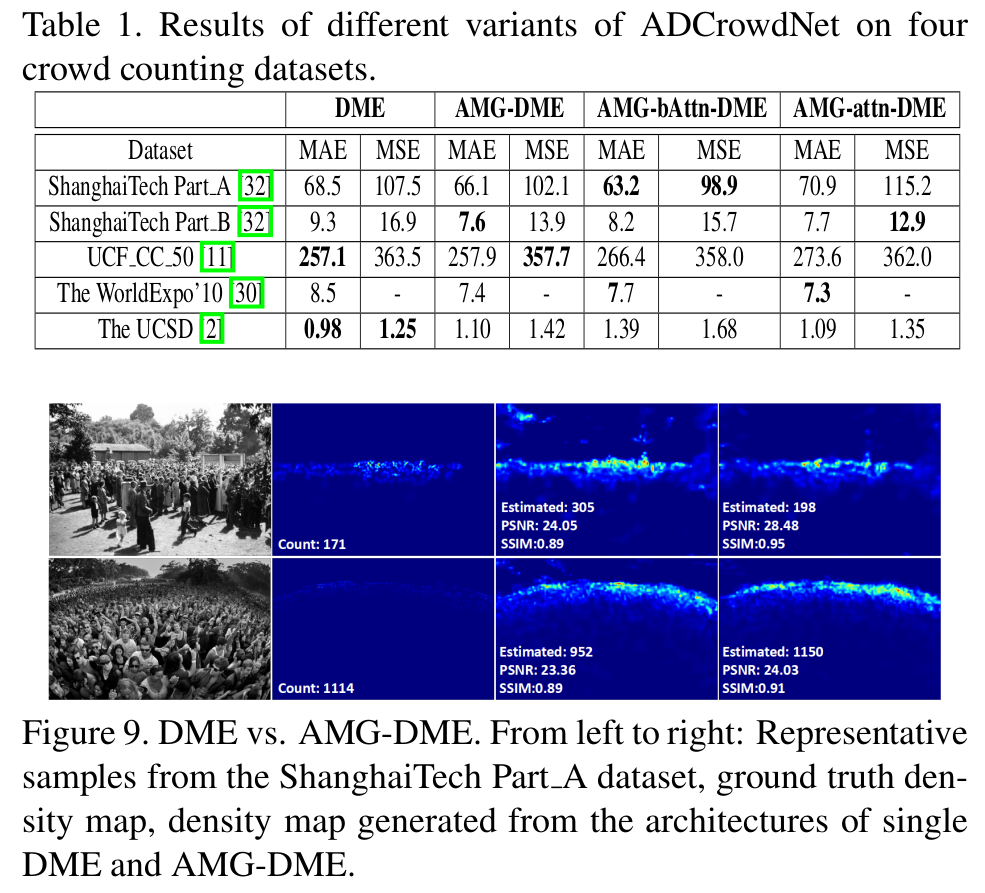

关于实验结果的一些解释如下：

针对不同数据集，不同方法会产生不同的结果

- 对于Shanghai_A + Shanghai_B数据集，发现`AMD-DME`效果要好于`AMD-attn-DME`，因为Shanghai数据集比较多congested noisy scenes，所以如果选择在中间注入AMG的attention map，里面会存在一些zero值，这样对于DME的front-end所学习到的一些信息与0进行乘积，就是一种损失。
- 对于UCF_CC_50 + UCSD数据集，发现这些方法都要比单纯使用`DME`要差，因为这两个数据集相对noise background比较少
- 对于UCSD + WorldExpo’10数据集，`AMG-attn-DME`实现了更好的效果，因为卷积特征消失问题被避免了。
- 对于UCSD数据集，场景不算congested以及noisy，对于MSE/MAE,`AMG-DME`的效果都要差于`DME`这可能是因为UCSD数据集已经提供了精确的信息属于ROI regions，所以AMG生成的attention map会破坏DME网络的效果

其他结果：

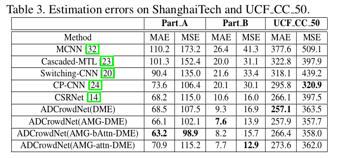

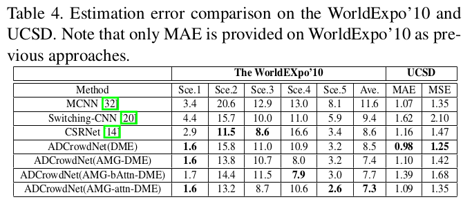

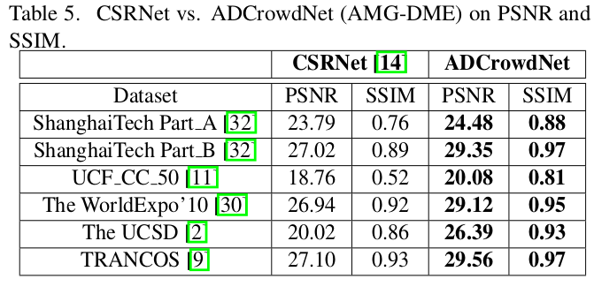

### 论文3：Almost Unsupervised Learning for Dense Crowd Counting (AAAI2019)
**crowd counting的主要问题：**

crowd counting的一个主要问题是数据少，标注难度大，而且如果当成person识别，一般往往不具有person的完全特征，而且样式多种多样，有些特别小识别不出来，解决办法一般都是无监督数据

存在的无监督方法大多都是基于autoencoder
