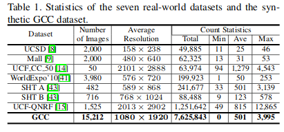
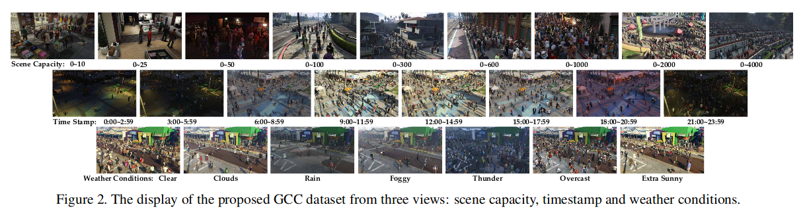
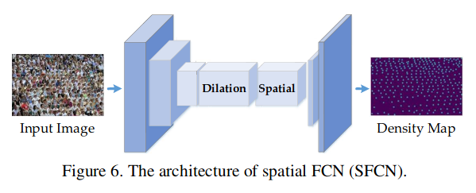
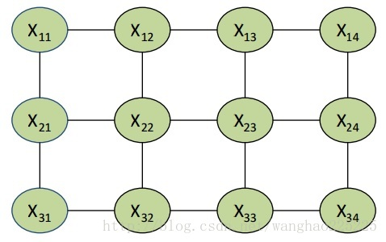
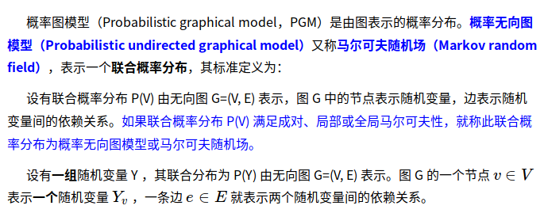
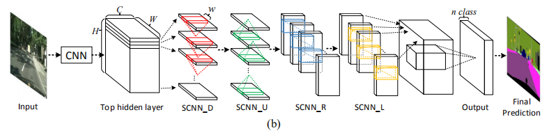
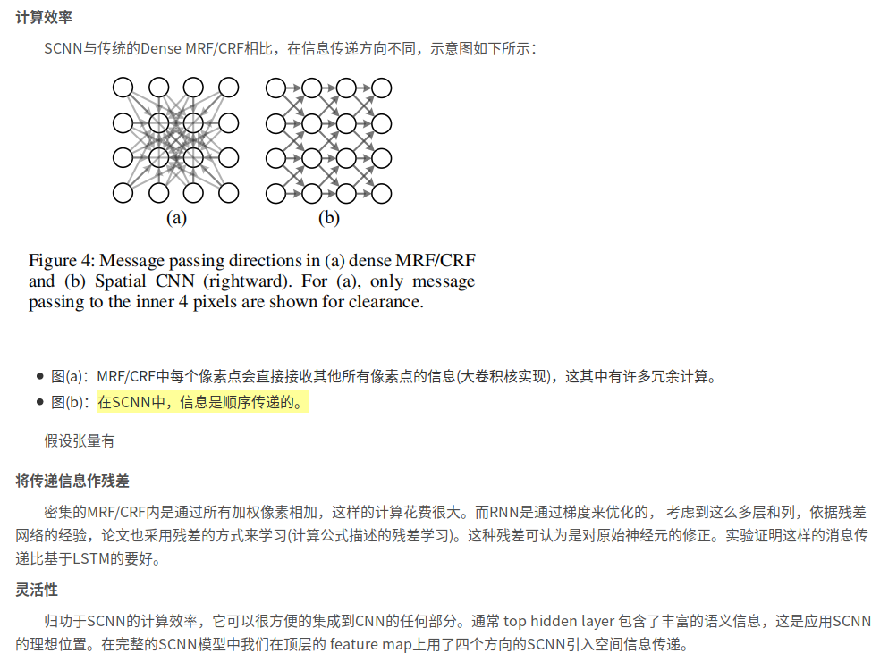

# Daily Thought (2019.4.6 - 2019.4.8)
**Do More Thinking!** ♈ 

**Ask More Questions!** ♑

**Nothing But the Intuition!** ♐

## Crowd Counting 方向 state-of-the-art总结
### 论文：Learning from Synthetic Data for Crowd Counting in the Wild (CVPR2019)

**主要贡献** 创造了新的数据集，这个数据集是在GTA5上制作的，经过domain adaption将虚拟风格的图片转换成现实风格的图片

数据集概况简介：

GTA5 Crowd Counting(GCC) 数据集概况：

**解决方法** 使用一种`Spatial Fully Convolutional Networks`

**SFCN**

FCN就是用于关注 pixel-wise task (such as semantic segmentation,  saliency detection）

这里的`Spatial CNN`来自于 **Spatial As Deep: Spatial CNN for Traffic Scene Understanding** `AAAI2018`

For encoding the context information, 提出了 a spatial encoder via a sequence of convolution on the four directions (down, up,left-to-right and right-to-left). 原文的方法是用于车道线检测。

Spatial CNN(CNN),它将传统的卷积层接层(layer-by-layer)的连接形式的转为feature map中片连片卷积(slice-by-slice)的形式，使得图中像素行和列之间能够传递信息。这特别适用于检测长距离连续形状的目标或大型目标，有着极强的空间关系但是外观线索较差的目标，例如交通线，电线杆和墙.

CNN将视觉理解推向了一个新的高度。但是这依然不能很好地处理外形线索不多的有强结构先验的目标，而人类可以推断它们的位置并填充遮挡的部分,为了解决这个问题，论文提出了SCNN，将深度卷积神经网络推广到丰富空间层次。

传统的CNN，任意层接收上层的数据作输入，再作卷积并加激活传给下一层，这个过程是顺序执行的。与之类似的是，SCNN将feature map的行或列也看成layer，也使用卷积加非线性激活，从而实现空间上的深度神经网络。这使得空间信息能够在同层的神经元上传播，增强空间信息进而对于识别结构化对象特别有效。

### 补充：空间关系建模方法

传统的关于空间关系的建模方法是基于概率图模型的，例如马尔科夫随机场(MRF)或条件随机场(CRF)

**概率图模型（Probability Graph Model）**

简单的说概率图模型就是每个随机变量用节点表示，随机变量之间的如果是互相存在关联（非独立）那么用线段连接，所以总的来说是一个无向图。

漫谈：https://blog.csdn.net/vbskj/article/details/53338032

**马尔科夫随机场（Markov Random Field, MRF）**

马尔科夫随机场其实就是一种概率图，叫做无向图，所谓无向图就是用没有方向的线连接节点构成的图。注意我们概率图的目的是为了描述概率关系，在马尔科夫随机场中，有线相连的两个节点就是不独立的。但是没有线相连的节点一定是独立的吗？答案是否定的。只要两个节点之间有一条通路，这两个节点就是不独立的（间接有关系）。 仔细想一下，如果节点有通路就不独立的话，那岂不是马尔科夫随机场中所有的节点都不是独立的了？这样的话，比如我要求某个节点表现出0的概率，那么我就需要确定所有其他变量对它造成的影响，这实在是太不简洁了。因此在马尔科夫场中还有一个性质，就是如果一个点的直接相邻节点都确定了的话，那么这个点的概率就和所有非相邻节点都独立了，这也就是所谓的马尔科夫性。也就是说，假如我已知X12和X21的取值的话，那么X11的取值仅和他们有关，与其余的所有节点都无关。

**条件随机场（Conditional Random Field, CRF）**

条件随机场是条件概率分布模型 P(Y|X) ，表示的是给定一组输入随机变量 X 的条件下另一组输出随机变量 Y 的马尔可夫随机场，也就是说 CRF 的特点是假设输出随机变量构成马尔可夫随机场。

条件随机场可被看作是最大熵马尔可夫模型在标注问题上的推广。

https://www.cnblogs.com/Determined22/p/6915730.html

**传统的方法**

传统方法在传递信息时，每个像素点接受来自全图其他像素的信息，这在计算上是非常昂贵的，难以应用于实时系统。且对于MRF的大卷积核权重很难学。这些方法是应用在CNN的输出上的，论文认为CNN的隐藏层，包含了丰富的空间关系，可更好的用于处理空间关系。

Spatial CNN，这里的Spatial不是指Spatial Convolution，而是CNN通过特征的设计架构传递空间信息。SCNN更有效的学习空间关系，能平滑的找出连续的有强先验的结构目标。SCNN的整体架构如下：

(图中SCNN的下标有D,U,R,L，这在结构上是类似的，方向上分别表示为向下，向上，向右，向左)

SCNN相比于传统方法，有三个优势

