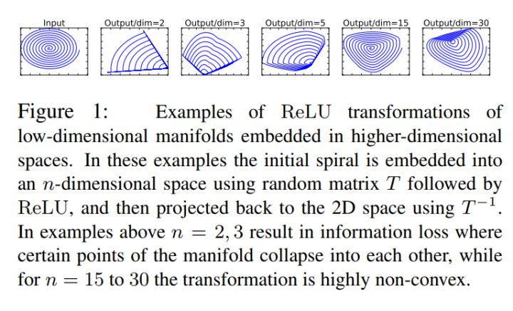
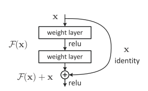
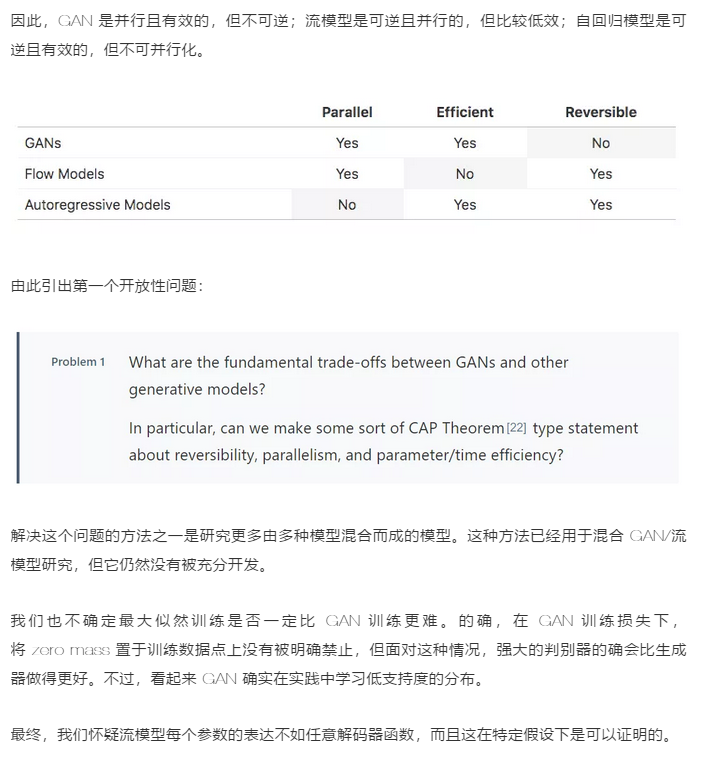
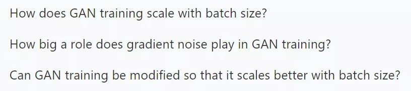

# Daily Thought (2019.4.8 - 2019.4.14)
**Do More Thinking!** ♈ 

**Ask More Questions!** ♑

**Nothing But the Intuition!** ♐

### 1. 对resnet本质的一些思考
FROM: https://zhuanlan.zhihu.com/p/60668529

**非线性激活层**

目的：引入了非线性，让模型具有更强的拟合能力

副作用：ReLU会造成的低维数据的坍塌（collapse）

解释：低维度的feature在通过ReLU的时候，这个feature会像塌方了一样，有一部分被毁掉了，或者说失去了

具体验证方式就是我们对于一个feature,经过一个映射T,映射到低维的embedding space，然后将这个低维embedding经过RELU，然后在通过同样的T的逆变换，将其映射到原来的featrue的空间

会发现像下面所展示的一样这时候的feature已经发生了很大的变化

ReLU这个东西，其实就是一个滤波器，只不过这个滤波器的作用域不是信号处理中的频域，而是特征域。那么滤波器又有什么作用呢？维度压缩

也就是降维，我们有m个feature被送入ReLU层，过滤剩下n个（n<m）

**低维数据流经非线性激活层会发生坍塌（信息丢失），而高维数据就不会**

维度低的feature，分布到ReLU的激活带上的概率小，因此经过后信息丢失严重，甚至可能完全丢失。而维度高的feature，分布到ReLU的激活带上的概率大，虽然可能也会有信息的部分丢失，但是无伤大雅，大部分的信息仍然得以保留。

因为维度低的feature信息冗余度较低，所以一旦损失一部分后果较严重，然而对于高维度的信息损失基本大部分都是需要淘汰的，经过学习优胜劣汰下来的有用信息保留度会高。

无法激活的值，当信息无法流过ReLU时，该神经元的输出就会变为0。而在反向传播的过程中，ReLU对0值的梯度为0，即发生了梯度消失。

对于一个M维的数据，我们可以将其看成是在M维空间中的一个M维流形（manifold）。而其中的有用信息，就是在该M维空间中的一个子空间（子空间的维度记为N维，N<=M）中的一个N维流形。非线性激活层相当于压缩了这个M维空间的维度（还记得前面提过的维度压缩吗？）。若是该M维空间中的M维流形本来就不含有冗余信息（M=N），那么再对其进行维度压缩，必然导致信息的丢失。

而维度低的数据其实就是这么一种情况：其信息的冗余度高的可能性本来就低，如果强行对其进行非线性激活（维度压缩），则很有可能丢失掉有用信息，甚至丢失掉全部信息（输出为全0）。

与非线性激活层不同的是，线性激活层并不压缩特征空间的维度。

**使用激活层原则**
- 1. 对含有冗余信息的数据使用非线性激活（如ReLU），对不含冗余信息的数据使用线性激活（如一些线性变换）。
- 2. 两种类型的激活交替灵活使用，以同时兼顾非线性和信息的完整性。
- 3. 由于冗余信息和非冗余信息所携带的有用信息是一样多的，因此在设计网络时，对内存消耗大的结构最好是用在非冗余信息上。

**ResNet就是满足这样原则的设计**

降低数据中信息的冗余度。

x分支：对非冗余信息采用了线性激活（通过skip connection获得无冗余的identity部分）

残差分支：然后对冗余信息采用了非线性激活（通过ReLU对identity之外的其余部分进行信息提取/过滤，提取出的有用信息即是残差）。

**从数据中拿掉了非冗余信息的identity部分，会导致余下部分的信息冗余度变高。这就像从接近饱和的溶液中移走了一部分溶质，会使得剩下的溶液的饱和度降低，一个道理。**

**Resnet它带来的好处：**

- 1. 由于identity之外的其余部分的信息冗余度较高，因此在对其使用ReLU进行非线性激活时，丢失的有用信息也会较少，ReLU层输出为0的可能性也会较低。这就降低了在反向传播时ReLU的梯度消失的概率，从而便于网络的加深，以大大地发挥深度网络的潜能。
- 2. 特征复用能加快模型的学习速度，因为参数的优化收敛得快（从identity的基础上直接学习残差，总比从头学习全部来得快）。

**最后是两个小tips：**
- 1. 如果一个信息可以完整地流过一个非线性激活层，则这个非线性激活层对于这个信息而言，相当于仅仅作了一个线性激活。
- 2. 解决由非线性激活导致的反向传播梯度消失的窍门，就是要提高进行非线性激活的信息的冗余度。

### 2. 对注意力机制 本质的一些思考
FROM：https://www.zhihu.com/question/318731473/answer/641021746

注意力实际是对信息进行加权，是引入了一个度量或者内积，所以注意力的主要作用是对重要的信息进行加权，从而防止重要信息被噪声掩盖。也许通过这种加权可以保证重要的信息在网络中更有效的传递。

### 3. 对cycleGAN中的对偶损失的理解
为什么要使用cycleGAN，加一个这样的cycle consistency loss

**原因**：

本质上主要是为了解决**没有成对数据**的问题，也就是说例如风格迁移问题，如果domain A有一张图片，想要转成到另一种风格也就是转到domain B，那么其实domain B 是没有对应的ground truth的。

所以怎么办呢？通过这样一种方式，转到domain B之后的监督是看看是否与这个domain融为一体，但是为了保证内容没有问题，所以同时再转回去，做一个**重构一致损失**。

这里对于cycleGAN其实有些问题虽然也是没有成对数据但是不一定适合，就是因为domain A与domain B的数据量是不对等的，也就是domain B的某个样例可能有多个domain A可能性。

所以cycleGAN的一个**缺点**：虽然保证了一对一，但是也限制了多样性

**事实上，B->A->B，不一定需要恢复到完全一样的B**

### 4. CSP（Center and Scale Prediction）检测器 (CVPR2019 | 行人检测)

> 提出了一种无需密集滑窗或铺设锚点框、全卷积式预测目标中心点和尺度大小的行人检测方法，为目标检测提供了一个新的视角。

目标检测通常采用传统的密集滑窗的方式或者当前主流的铺设锚点框（anchor）的检测方式，但不管哪种方式都不可避免地需要针对特定数据集设计甚至优化滑窗或锚点框超参数，从而增加了训练难度并限制了检测器的通用性。

## 关于GAN的灵魂问题
Author: Augustus Odena

### Problem 1: 如何在GAN和其他生成模型之见进行挑选？
除了GAN另外有两种生成模型也很流行：

**流模型**：将一堆可逆变换应用于先验样本，以计算观测值的精确对数似然性。

**自回归模型**：将观测值的分布分解为条件分布，并一次处理观测值的一个组件（对于图像，可能是一次处理一个像素）

这些模型具有不同的性能特点和权衡，对于**GAN**和**流模型**：

训练 GAN 和流模型的计算成本之间似乎存在巨大差异。

- GLOW 模型是用 40 个 GPU 花两周训练的，以生成 256x256 的名人面部图像，其使用的参数为 2 亿
- 自回归 GAN 是在相似的面部数据集上用 8 个 GPU 花 4 天训练的，以生成 1024x1024 的图像，它使用了 4600 万参数。流模型大概需要 17 倍多的 GPU 天数和 4 倍多的参数来生成像素少 16 倍的图像。

- 自回归模型可以看做不可并行化的流模型（因为它们都可逆）。

流模型效率低的原因：
- 最大似然训练可能比对抗训练的计算难度更大。
- 归一化流可能无法有效代表特定函数。

### Problem 2: GAN能建模哪些分布？

大多数 GAN 都侧重于图像合成，具体而言，研究者会在一些标准图像数据集上训练 GAN，例如 MNIST、CIFAR-10、STL-10、CelebA 和 Imagenet 等。这些数据集也是有难易之分的，而且生成的效果也有好有坏。经验表明，CelebA 上最先进的图像合成模型生成的图像似乎比 Imagenet 上最先进的图像合成模型生成的图像更有说服力。

**给定一个分布，我们怎么判别GAN去model这个distribution的难易程度呢？**

会想，会有一些 GAN 并不能学习到的分布吗？会不会有一些 GAN 理论上能学习的分布，但是在给定合理的计算资源下它学习的效率并不高？对于 GAN 来说，这些问题的答案和其他模型给出的会不会存在差别，现在很多都远没有解决。

**回答问题的方式：**
- 合成数据集：我们可以研究合成数据集来探讨到底哪些特征会影响数据集的可学习性。例如在论文《Are GANs Created Equal? A Large-Scale Study》中，研究者就创建了一个合成三角形的数据集。
- 修正现有的理论结果：我们可以利用现有的理论结果，并尝试修改假设以考虑数据集的不同属性。

### Problem 3: 除了图像合成外，GAN 还能用于哪些地方？
- 1. 文本：文本的离散属性使其很难应用 GAN。因为 GAN 会依赖判别器的梯度信号，且它会通过生成内容反向传播给生成器，所以离散的字符难以更新。目前有两种方法解决这个困难，第一种是令 GAN 只对离散数据的连续表征起作用，第二种则是用梯度估计和实际离散的模型来训练 GAN。
- 2. 结构化数据：GAN 能用于其它非欧氏空间的结构化数据（例如图）吗？这类数据的研究被称为几何深度学习。GAN 在这个领域的进展也不是非常显著，但其它深度学习方法取得的进步也比较有限，因此很难说是 GAN 自身的问题。
- 3. 音频：音频是 GAN 除了图像外最成功的领域，将 GAN 应用于无监督音频合成是第一次严格的尝试，研究人员对各种实际音频操作做出了特殊的限制。

最终希望 GAN 能在其它连续数据上获得类似图像合成方面的成功，**但它需要更好的隐式先验知识**。寻找这些先验可能需要**仔细思考到底哪些特征才是有意义的**，并且领域中的哪些特征是可计算的。

对于结构化数据或离散数据，我们暂时还没有比较好的解决方案。

### Problem 4: 我们该如何评估 GAN 的好坏，什么时候又该使用 GAN 这种生成模型？

说到评估 GAN，目前有很多方法，但是并没有一种统一的度量方法：

- Inception Score 和 FID：这两个分数都使用预训练的图像分类器，都存在已知问题。常见的批评是这些分数测量「样本质量」而没有真正捕获「样本多样性」。
- MS-SSIM：可以使用 MS-SSIM 单独评估多样性，但该技术也存在一些问题，并没有真正流行起来。
- AIS：它建议在 GAN 的输出上应用高斯观测值模型（Gaussian observation），并使用退火重要性采样来评估该模型下的对数似然。但事实证明，当 GAN 生成器也是流模型时，这种计算方式并不准确。
- 几何分数：这种方法建议计算生成数据流形的几何属性，并将这些属性与真实数据进行比较。
- 精度和召回率：该方法尝试计算 GAN 的精度和召回率。
- 技能评级：该方法以证明，训练好的 GAN 判别器能够包含用来评估的有用信息。

 Inception Score 和 FID 相对比较流行，但 GAN 评估显然还不是一个确定性问题
 
**我们应该用 GAN 来做什么？如果你想要真正的密集型模型，GAN 可能不是最好的选择。已有实验表明，GAN 学习了目标数据集的「low support」表征，这意味着 GAN（隐式地）将测试集的大部分分配为零似然度。**

我们没有太担心这一点，而是将 GAN 研究的重点放在支撑集没问题甚至有帮助的任务上。GAN 可能很适合感知性的任务，如图像合成、图像转换、图像修复和属性操作等图形应用。

### Problem 5: 如何扩展训练 GAN 的批量大小？

大的 minibatch 已经帮助扩展了图像分类任务——这些 minibatch 能帮助我们扩展 GAN 吗？对于有效地使用高度并行硬件加速器，大的 minibatch 可能非常重要。

乍一看，答案好像是肯定的,毕竟，多数 GAN 中的判别器只是个图像分类器而已。如果梯度噪声成为瓶颈，大的批量可以加速训练。然而，**GAN 有一个分类器没有的独特瓶颈：训练步骤可能存在差异**。

有证据表明，提高 minibatch 大小可以改进量化结果并减少训练时间。如果这一现象是鲁棒的，说明梯度噪声是非常重要的一个因素。然而，这一结论还没有得到系统性的验证，因此我们相信这一问题还有待解答。

交替训练步骤能否更好地利用大批量？理论上来看，最优传输 GAN 比一般 GAN 具有更好的收敛性，但需要一个大的批量，因为这种 GAN 需要对齐样本和训练数据批量。因此，最优传输 GAN 似乎是扩展到非常大的批量的潜在候选方法。

最后，异步 SGD 可以成为利用新硬件的不错备选项。在这种设定下，限制因素往往是：梯度更新是在参数的「陈旧」副本上计算的。但 GAN 实际上似乎是从在过去参数快照（snapshots）上进行的训练中获益，所以我们可能会问，异步 SGD 是否以一种特殊的方式与 GAN 训练交互。

