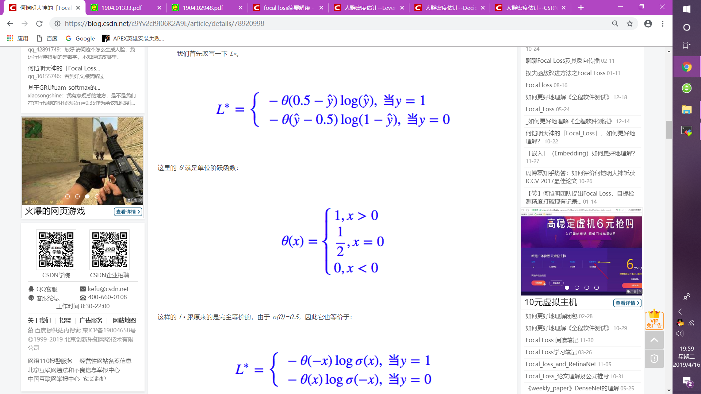

# Daily Thought (2019.4.14 - 2019.4.16)
**Do More Thinking!** ♈ 

**Ask More Questions!** ♑

**Nothing But the Intuition!** ♐

## 关于point supervision相关的detection文章
### 1. Point in, Box out: Beyond Counting Persons in Crowds (CVPR2019 Oral | 群体计数)

> 本文主要解决方式使用point supervision，同时检测human heads的大小与位置，并在人群里技术。

### 2. CSP（Center and Scale Prediction）检测器 (CVPR2019 | 行人检测)

> 提出了一种无需密集滑窗或铺设锚点框、全卷积式预测目标中心点和尺度大小的行人检测方法，为目标检测提供了一个新的视角。

目标检测通常采用传统的密集滑窗的方式或者当前主流的铺设锚点框（anchor）的检测方式，但不管哪种方式都不可避免地需要针对特定数据集设计甚至优化滑窗或锚点框超参数，从而增加了训练难度并限制了检测器的通用性。

### 3. focal loss

**提出**：

Kaiming在Focal Loss for Dense Object Detection 提出来的损失函数

**作用**：

聚焦于难训练的样本，对于简单的，易于分类的样本，给予的loss权重越低越好，对于较为难训练的样本，loss权重越好越好。

总之，Focal Loss 就是一个解决分类问题中类别不平衡、分类难度差异的一个 loss

**例子**：

对于目标点检测，我们发现正样本就是图中的某些像素点，负样本就是其他无关的像素点，显然这就是一个正负样本严重不均衡的例子。

**标准二分类问题的loss就是交叉熵**

**硬截断loss**

这样的做法就是：**正样本的预测值大于 0.5 的，或者负样本的预测值小于 0.5 的，我都不更新了，把注意力集中在预测不准的那些样本，当然这个阈值可以调整。** 这样做能部分地达到目的，但是所需要的迭代次数会大大增加。

原因是这样的：以正样本为例，**我只告诉模型正样本的预测值大于 0.5 就不更新了，却没有告诉它要“保持”大于 0.5**，所以下一阶段，它的预测值就很有可能变回小于 0.5 了。

当然，如果是这样的话，下一回合它又被更新了，这样反复迭代，理论上也能达到目的，但是迭代次数会大大增加。

**改进**：要想改进的话，重点就是“不只是要告诉模型正样本的预测值大于0.5就不更新了，而是要告诉模型当其大于0.5后就只需要保持就好了”。

**软化loss**

硬截断出现的不足就是**因子 λ(y,ŷ) 是不可导的，或者说我们认为它导数为 0，因此这一项不会对梯度有任何帮助，从而我们不能从它这里得到合理的反馈**

解决这个问题的一个方法就是“软化”这个 loss，**“软化”就是把一些本来不可导的函数用一些可导函数来近似，数学角度应该叫“光滑化”**。

要想“软化”这个 loss，就得“软化” θ(x)，而软化它就再容易不过，它就是 sigmoid 函数。我们有：

（这里的sigma就是sigmoid函数，theta就是之前的单位跃阶函数，也就是sigmoid作上述极限会逼近于单位跃阶函数）

与focal loss进行比较

**focal loss**

**比如负样本远比正样本多的话，模型肯定会倾向于数目多的负类（可以想象全部样本都判为负类），这时候，负类的 ŷ γ 或 σ(Kx) 都很小，而正类的 (1−ŷ )γ 或 σ(−Kx) 就很大，这时候模型就会开始集中精力关注正样本。**

https://blog.csdn.net/c9Yv2cf9I06K2A9E/article/details/78920998
