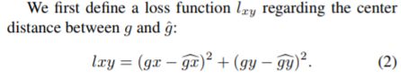
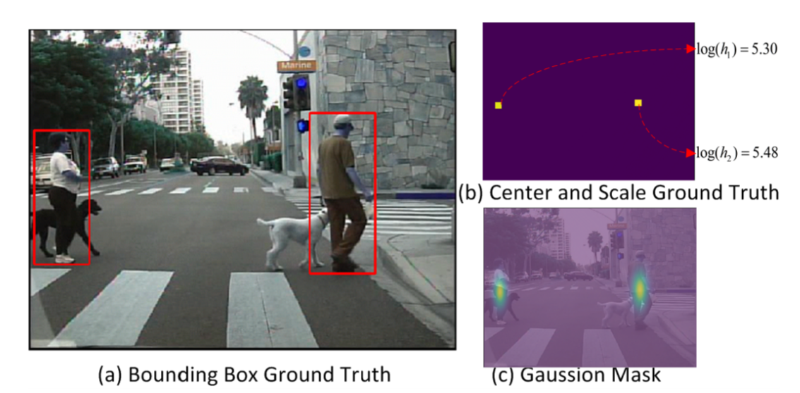
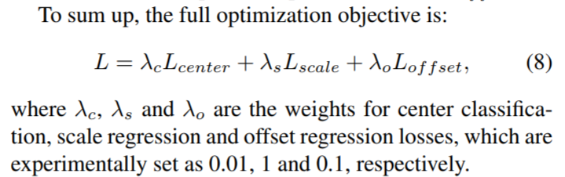

# Daily Thought (2019.4.14 - 2019.4.16)
**Do More Thinking!** ♈ 

**Ask More Questions!** ♑

**Nothing But the Intuition!** ♐

## 关于point supervision相关的detection文章
### 1. Point in, Box out: Beyond Counting Persons in Crowds (CVPR2019 Oral | 群体计数)

> 本文主要解决方式使用point supervision，同时检测human heads的大小与位置，并在人群里技术。

#### 网络模型

训练图片crop出来一个500x500，经过Resnet101的四个block
- 经过`Res B1`降采样为250x250，64channels
- 经过`Res B2`降采样为125x125，256channels
- 经过`Res B3`降采样为63x63，512channels
- 经过`Res B4`降采样为32x32，1024channels

对于`Res B3`与`Res B4`经过生成`1 x 1 x 25 x (1 + 4)`通道的卷积核，得到125个通道

这个表示为了得到25个候选anchor，1 + 4，1个表示预测score，4个表示bounding box的x,y,h,w

这里最终得到`pred map 1`,`pred map 2`，将`pred map 2`上采样两倍，然后两者相加，得到`final map`

最终得到的预测区域就是25个anchor中score最高的那个bounding box。

#### pseudo GT的生成

对于每个点，表示群体的个体，采用最近邻找到最近的点，然后连接这两个点的中点，作为伪GT bounding box边界上的一个点，从而生成GT，之后可以继续更新。

#### 损失函数

**classification loss**

与fast rcnn的分类loss是一样的计算方法，其中关于正负样本的选择，使用了相同的online hard mining strategy

**locally-constrained regression loss**

前面阶段得到的anchor bounding box a = (ax, ay, aw, ah)，与之前的伪GT g = (gx, gy, gw, gh).

学习一个transformation，作为训练过程中优化的参数

对于pseudo ground truth， 其中gx, gy是精确的，gw, gh是不精确的，所以xy的loss与wh的loss分开来统计。

对于width与height的loss 函数，依赖一些我们观察的常识：

- 1. 同一水平线的群体上的个体，一般size是差不多的。
- 2. 对于竖直上的，越靠上的个体的size越小，越靠下的size会越大。
- 3. 在一个图片上较小的局部的region里，往往size是差不多的。

依据上面的观察论，做法如下：

总loss函数：

#### Curriculum learning

因为对于伪GT，如果特别稀疏的场景，或者特别稠密的场景，这样的假设就是不准确的，所以在训练过程中提出一种策略：

在crowd counting数据集中，非常大的bounding box与非常小的bounding box都是很小第一部分，许多box相对来说都是中间尺寸的，算是比较容易计算的。

我们计算出来一个评分用来衡量box size的极端（难算）程度，我们计算一张图片中每一个个体点最近邻点的距离，计算出来均值与方差，根据高斯函数来进行评分

这样如果某个点的最近邻距离特别小或者特别大，那么高斯评分就会低，因为离均值远，根据下面的公式就会计算出来，偏离的多，图片的训练困难度就较高：

If an image contains mostly medium-sized bounding boxes, its difficulty will be small; otherwise, big.

根据image difficulty的定义，从而split数据分成很多份I1, I2, I3 ... In

First fold I1 with images containing mostly medium-sized bounding boxes， I1最好训练，所以先在I1上训练模型，之后再在I1与I2的交集上训练，之后再在I1,I2,I3的交集上训练，依次类推。

这篇文章只设置了3折（3 fold）

### 2. CSP（Center and Scale Prediction）检测器 (CVPR2019 | 行人检测-Anchor Free)
High-level Semantic Feature Detection: A New Perspective for Pedestrian Detection

> 提出了一种无需密集滑窗或铺设锚点框、全卷积式预测目标中心点和尺度大小的行人检测方法，为目标检测提供了一个新的视角。

目标检测通常采用传统的密集滑窗的方式或者当前主流的铺设锚点框（anchor）的检测方式，但不管哪种方式都不可避免地需要针对特定数据集设计甚至优化滑窗或锚点框超参数，从而增加了训练难度并限制了检测器的通用性。

在传统的计算机视觉领域，特征点检测是一个非常基础且重要的任务。通常，它被当成是一种低层视觉技术，包括边缘检测、角点（或关键点）检测和感兴趣区域检测等。一般而言，一个特征点通常是图像的一个感兴趣部分。

但当今的CNN被认为具有对图像的高级抽象能力，因此 CNN 也被广泛应用于特征点检测，并取得了非常有吸引力的结果。

**关键：能否将目标检测这样一个高层视觉任务简化为语义特征点检测的问题**

**基本方法**：

将目标检测构建为一个目标中心点检测和目标尺度预测的任务。一个简单的示意图如下图所示，首先将一张图像输入全卷积网络，基于网络提取的特征图再卷积式地预测两个映射图，一个以热图的方式呈现目标的中心点位置，一个负责预测目标的尺度大小。在此基础上，便可以将两者映射到原图上并解译成目标检测框：中心点热图的位置对应检测框的中心位置，预测的尺度大小对应检测框的大小，而中心点热图上的置信度则对应检测框的得分。

**之前传统目标检测策略存在的问题**：

不管是两阶段的 Faster R-CNN 系列，还是单阶段的 SSD 系列，其采用的铺设锚点框的检测方法，本质上仍然是子窗口分类器的形式。即是说，这些检测器本质上都是在训练一个局部分类器用于判断预设的子窗口或锚点框内是否存在目标。然而这些方法都不可避免地需要针对特定数据集设计甚至优化滑窗或锚点框超参数，从而增加了训练难度并限制了检测器的通用性。这些滑窗或锚点框超参数包括：窗口数目、窗口大小、长宽比例、与标注框的重叠率阈值等。这些超参数通常是检测任务和数据集相关的，难以调优也难以通用。一般而言，目标检测涉及两个方面：目标在哪里（where），以及目标有多大（how）。但这些已有方法把这两方面绑定在一个窗口或锚点框里，并通过局部分类器一次性判断各种不同大小、不同比例的窗口或锚点框是否是目标。这种绑定就造成了超参数的各种组合问题。

**基本框架**：

包含两个模块特征提取模块（Feature Extraction）和检测头模块（Detection Head）：

**特征提取模块：** 以 ResNet-50 为例，低层的特征图拥有较高的空间分辨率，因而能提供更多的定位信息，而高层的特征图则包含更多的语义信息，为此可以把低层和高层的特征图融合成一个特征图用于检测任务。具体地，出于减少算法复杂度的考虑，这里采用一种最简单的特征融合方式：首先对所有要融合的特征图进行 L2 归一化，再利用反卷积层将第 3、4 和 5 级的特征图分辨率提升到和第 2 级的特征图分辨率保持一致，也即原图的 1/4，然后再将这些特征图在通道维度上拼接起来，得到最终用于检测的特征图（图中紫色部分）。给定一张输入图像，其大小为，则用于检测的特征图的大小为 H/r×W/r，其中 代表降采样率，一个更大的 意味着特征图分辨率较小进而导致检测器定位性能下降，而一个更小的 则会带来更多的计算负担。

**检测头模块：** 基于以上特征图，检测头负责将特征图解译成检测结果。在检测头模块中，首先接上一个 3x3 卷积层将输入特征图的维度压缩到 256，然后接上两个并联的 1x1 卷积层产生目标中心点热图和目标尺度预测图，这样相较于 R-CNN 及 SSD 等系列工作而言极大地简化了检测头模块。实验表明中心点检测和尺度预测已经足以胜任行人检测任务。但采用降采样的特征图会影响目标定位性能，为了弥补这一缺陷，在中心点以及尺度预测之外，还可以额外添加一个偏移预测分支，用以进一步预测中心点到真实目标中心的偏移。

**训练时损失函数：**

所有结果都是在预测的heatmap上进行操作，size是 `(H/r, W/r)`

对于ground truth，中心点以及宽和高都可以通过目标检测的bounding box直接生成

对于行人检测，一般都是h与w是固定的比例，所以预测尺度只用预测一个就可以了，根据w:h = 0.41来设定。

因为对于ground truth一个点的范围实在太过狭窄，所以把`positive point`周围半径为2的`negative point`也当做是positive，把positive的点赋值为`log(h_k)`，h_k就是这张图片第k个物体的height，经过作者实验，发现只预测`height`的效果要比预测`height+width`和只预测`width`要好。

总共分成了3个branch
- center prediction branch
- scale prediction branch
- offset prediction branch

**center prediction**

因为大多数都是负样本对于ground truth，这种hard-designation of positives and negatives带来了很大的训练困难。

为了改进，生成了2D Gaussian mask在正样本周围（如上图）：

为了应对正负样本严重不平衡问题，采用focal weights

**scale prediction**

使用smooth L1 loss计算ground truth (t_k) 与prediction (s_k) 的回归

**offset prediction**

这里的offset预测损失，主要是预测中心点与ground truth中心点的偏离距离，与scale loss的处理办法类似

The ground truth for the offsets of those centers can be defined as 

**总的loss函数：**

### 3. focal loss

**提出**：

Kaiming在Focal Loss for Dense Object Detection 提出来的损失函数

**作用**：

聚焦于难训练的样本，对于简单的，易于分类的样本，给予的loss权重越低越好，对于较为难训练的样本，loss权重越好越好。

总之，Focal Loss 就是一个解决分类问题中类别不平衡、分类难度差异的一个 loss

**例子**：

对于目标点检测，我们发现正样本就是图中的某些像素点，负样本就是其他无关的像素点，显然这就是一个正负样本严重不均衡的例子。

**标准二分类问题的loss就是交叉熵**

**硬截断loss**

这样的做法就是：**正样本的预测值大于 0.5 的，或者负样本的预测值小于 0.5 的，我都不更新了，把注意力集中在预测不准的那些样本，当然这个阈值可以调整。** 这样做能部分地达到目的，但是所需要的迭代次数会大大增加。

原因是这样的：以正样本为例，**我只告诉模型正样本的预测值大于 0.5 就不更新了，却没有告诉它要“保持”大于 0.5**，所以下一阶段，它的预测值就很有可能变回小于 0.5 了。

当然，如果是这样的话，下一回合它又被更新了，这样反复迭代，理论上也能达到目的，但是迭代次数会大大增加。

**改进**：要想改进的话，重点就是“不只是要告诉模型正样本的预测值大于0.5就不更新了，而是要告诉模型当其大于0.5后就只需要保持就好了”。

**软化loss**

硬截断出现的不足就是**因子 λ(y,ŷ) 是不可导的，或者说我们认为它导数为 0，因此这一项不会对梯度有任何帮助，从而我们不能从它这里得到合理的反馈**

解决这个问题的一个方法就是“软化”这个 loss，**“软化”就是把一些本来不可导的函数用一些可导函数来近似，数学角度应该叫“光滑化”**。

要想“软化”这个 loss，就得“软化” θ(x)，而软化它就再容易不过，它就是 sigmoid 函数。我们有：

（这里的sigma就是sigmoid函数，theta就是之前的单位跃阶函数，也就是sigmoid作上述极限会逼近于单位跃阶函数）

与focal loss进行比较

**focal loss**

**比如负样本远比正样本多的话，模型肯定会倾向于数目多的负类（可以想象全部样本都判为负类），这时候，负类的 ŷ γ 或 σ(Kx) 都很小，而正类的 (1−ŷ )γ 或 σ(−Kx) 就很大，这时候模型就会开始集中精力关注正样本。**

https://blog.csdn.net/c9Yv2cf9I06K2A9E/article/details/78920998
