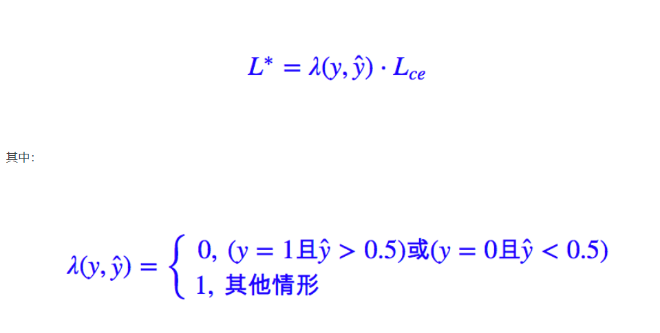

# Daily Thought (2019.4.14 - 2019.4.16)
**Do More Thinking!** ♈ 

**Ask More Questions!** ♑

**Nothing But the Intuition!** ♐

## 关于point supervision相关的detection文章
### 1. Point in, Box out: Beyond Counting Persons in Crowds (CVPR2019 Oral | 群体计数)

> 本文主要解决方式使用point supervision，同时检测human heads的大小与位置，并在人群里技术。

#### 网络模型

训练图片crop出来一个500x500，经过Resnet101的四个block
- 经过`Res B1`降采样为250x250，64channels
- 经过`Res B2`降采样为125x125，256channels
- 经过`Res B3`降采样为63x63，512channels
- 经过`Res B4`降采样为32x32，1024channels

对于`Res B3`与`Res B4`经过生成`1 x 1 x 25 x (1 + 4)`通道的卷积核，得到125个通道

这个表示为了得到25个候选anchor，1 + 4，1个表示预测score，4个表示bounding box的x,y,h,w

这里最终得到`pred map 1`,`pred map 2`，将`pred map 2`上采样两倍，然后两者相加，得到`final map`

最终得到的预测区域就是25个anchor中score最高的那个bounding box。

#### pseudo GT的生成

对于每个点，表示群体的个体，采用最近邻找到最近的点，然后连接这两个点的中点，作为伪GT bounding box边界上的一个点，从而生成GT，之后可以继续更新。

#### 损失函数

**classification loss**

与fast rcnn的分类loss是一样的计算方法，其中关于正负样本的选择，使用了相同的online hard mining strategy

**locally-constrained regression loss**

前面阶段得到的anchor bounding box a = (ax, ay, aw, ah)，与之前的伪GT g = (gx, gy, gw, gh).

学习一个transformation，作为训练过程中优化的参数

对于pseudo ground truth， 其中gx, gy是精确的，gw, gh是不精确的，所以xy的loss与wh的loss分开来统计。

对于width与height的loss 函数，依赖一些我们观察的常识：

- 1. 同一水平线的群体上的个体，一般size是差不多的。
- 2. 对于竖直上的，越靠上的个体的size越小，越靠下的size会越大。
- 3. 在一个图片上较小的局部的region里，往往size是差不多的。

依据上面的观察论，做法如下：

总loss函数：

#### Curriculum learning

因为对于伪GT，如果特别稀疏的场景，或者特别稠密的场景，这样的假设就是不准确的，所以在训练过程中提出一种策略：

在crowd counting数据集中，非常大的bounding box与非常小的bounding box都是很小第一部分，许多box相对来说都是中间尺寸的，算是比较容易计算的。

我们计算出来一个评分用来衡量box size的极端（难算）程度，我们计算一张图片中每一个个体点最近邻点的距离，计算出来均值与方差，根据高斯函数来进行评分

这样如果某个点的最近邻距离特别小或者特别大，那么高斯评分就会低，因为离均值远，根据下面的公式就会计算出来，偏离的多，图片的训练困难度就较高：

If an image contains mostly medium-sized bounding boxes, its difficulty will be small; otherwise, big.

根据image difficulty的定义，从而split数据分成很多份I1, I2, I3 ... In

First fold I1 with images containing mostly medium-sized bounding boxes， I1最好训练，所以先在I1上训练模型，之后再在I1与I2的交集上训练，之后再在I1,I2,I3的交集上训练，依次类推。

这篇文章只设置了3折（3 fold）

### 2. CSP（Center and Scale Prediction）检测器 (CVPR2019 | 行人检测)

> 提出了一种无需密集滑窗或铺设锚点框、全卷积式预测目标中心点和尺度大小的行人检测方法，为目标检测提供了一个新的视角。

目标检测通常采用传统的密集滑窗的方式或者当前主流的铺设锚点框（anchor）的检测方式，但不管哪种方式都不可避免地需要针对特定数据集设计甚至优化滑窗或锚点框超参数，从而增加了训练难度并限制了检测器的通用性。

### 3. focal loss

**提出**：

Kaiming在Focal Loss for Dense Object Detection 提出来的损失函数

**作用**：

聚焦于难训练的样本，对于简单的，易于分类的样本，给予的loss权重越低越好，对于较为难训练的样本，loss权重越好越好。

总之，Focal Loss 就是一个解决分类问题中类别不平衡、分类难度差异的一个 loss

**例子**：

对于目标点检测，我们发现正样本就是图中的某些像素点，负样本就是其他无关的像素点，显然这就是一个正负样本严重不均衡的例子。

**标准二分类问题的loss就是交叉熵**

**硬截断loss**

这样的做法就是：**正样本的预测值大于 0.5 的，或者负样本的预测值小于 0.5 的，我都不更新了，把注意力集中在预测不准的那些样本，当然这个阈值可以调整。** 这样做能部分地达到目的，但是所需要的迭代次数会大大增加。

原因是这样的：以正样本为例，**我只告诉模型正样本的预测值大于 0.5 就不更新了，却没有告诉它要“保持”大于 0.5**，所以下一阶段，它的预测值就很有可能变回小于 0.5 了。

当然，如果是这样的话，下一回合它又被更新了，这样反复迭代，理论上也能达到目的，但是迭代次数会大大增加。

**改进**：要想改进的话，重点就是“不只是要告诉模型正样本的预测值大于0.5就不更新了，而是要告诉模型当其大于0.5后就只需要保持就好了”。

**软化loss**

硬截断出现的不足就是**因子 λ(y,ŷ) 是不可导的，或者说我们认为它导数为 0，因此这一项不会对梯度有任何帮助，从而我们不能从它这里得到合理的反馈**

解决这个问题的一个方法就是“软化”这个 loss，**“软化”就是把一些本来不可导的函数用一些可导函数来近似，数学角度应该叫“光滑化”**。

要想“软化”这个 loss，就得“软化” θ(x)，而软化它就再容易不过，它就是 sigmoid 函数。我们有：

（这里的sigma就是sigmoid函数，theta就是之前的单位跃阶函数，也就是sigmoid作上述极限会逼近于单位跃阶函数）

与focal loss进行比较

**focal loss**

**比如负样本远比正样本多的话，模型肯定会倾向于数目多的负类（可以想象全部样本都判为负类），这时候，负类的 ŷ γ 或 σ(Kx) 都很小，而正类的 (1−ŷ )γ 或 σ(−Kx) 就很大，这时候模型就会开始集中精力关注正样本。**

https://blog.csdn.net/c9Yv2cf9I06K2A9E/article/details/78920998
