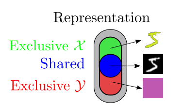
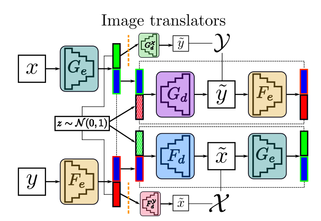
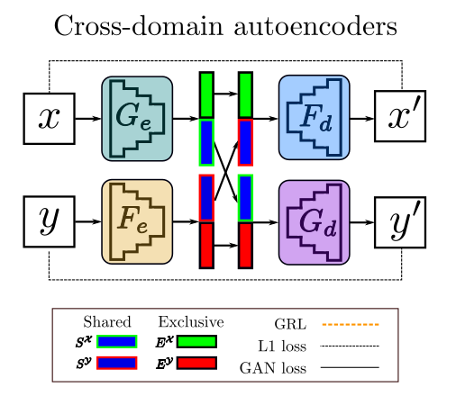
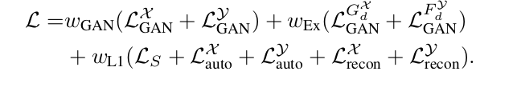
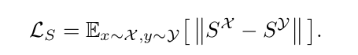
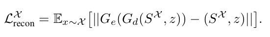
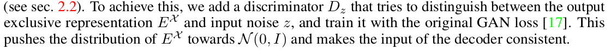
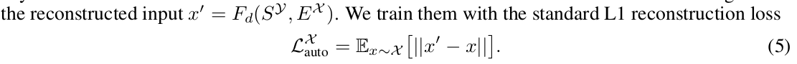

# Daily Thought (2019.4.22 - 2019.4.24)
**Do More Thinking!** ♈ 

**Ask More Questions!** ♑

**Nothing But the Intuition!** ♐

## 关于 Disentangled image generation 论文汇总（将输入信息分解去纠缠的图像生成）
### 1. InfoGAN: Interpretable Representation Learning byInformation Maximizing Generative Adversarial Nets (NIPS 2016)

InfoGAN能够以一种无监督的方式去学习disentangled representations,主要是通过encoder结构以及互信息的loss

**motivation:**

在标准的GAN中，生成数据的来源一般是一段连续单一的噪声z，这样带来的一个问题是，Generator往往会将z高度耦合处理，我们无法通过控制z的某些维度来控制生成数据的语义特征，也就是说，z是不可解释的。比如，假设我们打算生成像MNIST那样的手写数字图像，每个手写数字可以分解成多个维度特征：代表的数字、倾斜度、粗细度等等，在标准GAN的框架下，我们无法在上述维度上具体指定Generator生成什么样的手写数字。
为了解决这一问题，文章对GAN的目标函数进行了一些小小的改进，成功让网络学习到了可解释的特征表示（即论文题目中的interpretable representation）。

**latent code**

既然原始的噪声是杂乱无章的，那就人为地加上一些限制，于是作者把原来的噪声输入分解成两部分：一是原来的z；二是由若干个latent variables拼接而成的latent code c，这些latent variables会有一个先验的概率分布，且可以是离散的或连续的，用于代表生成数据的不同特征维度，比如MNIST实验的latent variables就可以由一个取值范围为0-9的离散随机变量（用于表示数字）和两个连续的随机变量（分别用于表示倾斜度和粗细度）构成。
但仅有这个设定还不够，因为GAN中Generator的学习具有很高的自由度，它很容易找到一个解，使得 P_G(x|c) = P_G(x)

从而使c完全不起作用

latent code可以自己选择维度分布，例如：c_i ∼ Unif(−1, 1) with 1 ≤ i ≤ 5.

**mutual information**

**Variational Mutual Information Maximization**

实际上`I(c; G(z, c))`很难直接最大化，因为需要posterior `P(c|x)`,幸运的是我们可以获取一个lower bound，定义一个辅助的distribution `Q(c|x)`去近似`P(c|x)`

**loss function**

前面一部分标准GAN的loss

后面一部分根据引理推导

（这里Q相当于encoder模型，D是discriminator，G是generator）

https://www.jianshu.com/p/1b84adec15e7

### 2. Disentangled Person Image Generation (CVPR 2018）

本身目的合成一个person image

将一个person image看成是由 `background features`, `foreground featrues`, `pose features`组合而成

**本文的目标是将person images中的外观因素(Appearance factors)与结构因素(structure factors)去纠缠**

类似于将群体个体与背景去纠缠的任务

**实现方法**

输入一张condition image，另一张目标pose, 然后生成目标图像

分为两个阶段
- stage1: multi-branched reconstruction architencture，将几部分去纠缠，采用一种分治策略，将去纠缠的部分encode到embedding vector中，然后concat到一起，之后把输入图像恢复，而且按照encode进去的feature恢复
- stage2: 将这些feature看作是real的，去对抗性的学习一个mapping functions，能够从 gaussian distribution 映射到 embedding feature distribution.

**Stage-I : Disentangled image reconstruction**

先通过之前文章的方法Pose guided person image generation，去生成 `pose heatmap` 以及与pose有关的 `mask`.

`foreground branch`

输入的不是图像，而是加了coarse pose mask的feature maps

为了从pose信息中更好的将fore ground去纠缠，encode pose invariant features with 7 Body Regions-Of-Interest instead of the whole image

对于每一个ROI，extract feature maps然后resize到48x48

之后放入一个weight sharing的encoder

最终得到7个body ROI embedding 然后 concatenate 成为一个 224维特征向量 （每个之前是32维）

`background branch`

应用 inverse pose mask 到原来的 feature map 去得到 background feature map

然后放进background encoder中，得到128维向量

最后将128维，224维向量concatenate在一起，然后tile成为 128x64x352维的 appearance feature map

`pose branch`

将pose keypoints的 map 经过卷积得到 18 channels 的 feature maps

然后与之前的 352 channels的 appearance feature maps concatenate在一起，通过一个"U-net"的结构（convolutional autoencoder with skip connections）（结构来自于 Pose guided person image generation. In NIPS 2017）然后生成一个重构的图片

这样的限制会迫使网络去学习怎样使用 pose structure 信息去选择每个像素有用的外观信息。

因为pose需要一个embedding用在第二阶段，所以pose branch还有一个encoder + decoder结构

这里使用fully-connected networks（全连接）去重建pose information，所以我们能够decode embedded pose feature to obtain the heatmaps

这里因为一些body regions处于被遮挡的情况，是看不到的，所以在引入一个visibility variable，表示每个pose keypoint的visibility state

The pose information can be represented by a 54-dim vector (36-dim keypoint coordinates γ and 18-dim keypoint visibility α).

然后经过全连接的encoder得到32-dim的向量，再经过全连接decoder得到重构的pose information

**Stage-II: Embedding feature mapping**

图像可以被represented成为一个low-dimensional，continuous的feature embedding space

这些低维manifold的feature embedding space更加容易学习

本文不是直接学习guassian noise vector 映射到 image

而是先学习一个mapping function能够将 `a Gaussian space Z` 映射到 `continuous feature embedding space E`

再使用 stage-I 预训练的decoder去将 `continuous feature embedding space E` 映射到 `real image space X`

对抗策略：

把 features mapped from Gaussian noise z 视作为fake的embedding features

对抗性的学习mapping function，这样就可以sample fake embedding features from noise，然后可以map成为图片，利用stage-I的方法

**理解**

对于这种image generation任务，把condition信息编码进入低维vector是非常有效的，然后再通过decoder生成图像。

想通过pix2pix解决类似问题是不现实的，因为降采样次数不够，pix2pix的降采样只可以应对low-level级别的image generation

而且pix2pix没有引入噪声，会使GAN很难模拟正确分布。

对于pix2pix的discriminator输入是condition + image，discriminator很难学习到两者的关联因为很浅层，所以效果不好。

**网络架构**

stage-I的架构：encoder, auto-decoder

(里面的feature之间都是经过的convolutional residual blocks)

stage-II的架构：mapping function

**loss function**

stage-I, we use both `L1` and `adversarial` loss to optimize the image (i.e. foreground and background) reconstruction network生成更加逼真的图片

stage-I的`generator`与`discriminator`的loss:

`pose reconstruction`的loss：

使用WGAN loss去优化第二阶段的全连接mapping的loss

**实现细节**

- 所有卷积kernel size都使用的是3x3
- 全连接层中间维度是512
- 激活函数ReLU
- convolutional residual blocks的数量依赖于input size的大小
- Each residual block consists of two convolution layers with stride=1, followed by one sub-sampling convolution layer with stride=2, except for the last block

对于Market1501数据集，, containing 32,668 images of 1,501 persons

All images are resized to 128×64 pixels. We use the same train/test split (12,936/19,732)

We train the foreground and background models with a mini-batch of `size 16 for ∼70k` iterations at `stage-I` 

and with a mini-batch of `size 32 for ∼30k` iterations at `stage-II`.

The pose models are trained with a mini-batch of `size 64 for ∼30k` iterations at `stage-I` 

and with a mini-batch of `size 32 for ∼60k` iterations at `stage-II`.

On both datasets, we use the Adam optimizer with weights β1 = 0.5 and β2 = 0.999. The initial learning rate is set to 2e-5. For adversarial training, we optimize the discriminator and generator alternatively.

### 3. Image-to-image translation for cross-domain disentanglement (NIPS 2018）

进行domain到另一个domain的转换，

partition the representation into three parts

将表示两个域的信息分为三个部分，一个表示shared信息，另外两个表示各自域的信息

**Cross-domain disentanglement for image-to-image translation的优点：**

- 1. Sample diversity: 可以生成一个关于 images conditioned on the input image的分布，然而许多image-to-image translation的架构只能生成deterministic的结果
- 2. Cross domain retrieval: 基于representation可以检索相似图像
- 3. Domain-specific image transfer：是基于domain而不是单个图像的
- 4. Domain-specific interpolation: 是基于domain的，根据representation可以进行插值

**主要方法**

主要用了两个模块

`image translator`

`cross domain autodecoders`

**loss函数**

总共算起来有五部分的loss:

1. shared representation的L1 loss

用来监督，保证domain X与domain Y生成的shared representation相似

问题就是这样的设置会导致representation向量的绝对值趋向于0，从而减小l1 loss，但是达不到理想效果

解决办法：
- 1. 在得到shared representation输出的encoder上加一个噪声，可以有效缓解这个现象。
- 2. 另一种办法，通过正则项，限制Sx,Sy的绝对值在1附近，不过在这里的实验效果不如第一种的效果好

2. reconstruction loss的L1 loss

保证之前encoder分离出来的shared presentation,decoder合成图片后，在经过encoder得到的shared representation还是它自己。

3. Ex的GAN loss

因为在decoder的时候输入的是shared representation + noise, 这里的noise是代替exclusive representation的，所以exclusive representation应该尽量与noise有近似的分布

这个GAN是区分`Ex的output`与`noise的output`的，使它们尽量是真实的分布

4. 生成结果的GAN loss

保证由share representation重构出来的输出符合真实的数据分布

5. Cross-domain autoencoders中的loss

这里的loss保证在使用另一个域的shared representation的时候，进行重构得到的x与原图是相等的，所以这个loss保证经过antoencoder生成的结果与原结果表示相同的概念。

**一些重要理解点**

1. exclusive representation的训练策略：**Gradinet Reversal Layer (GRL) **

因为我们要保证exclusive representation Ex 不包含domain Y的信息，所以不可能去使用Ex 生成Y，为了强化这种行为，我们先尝试用Ex生成Y，然后反向传播计算loss的时候，将loss取反，这里取反的位置就是图中橙色截线的地方，也就是说正向传播是identity, 反向传播取反 （GRL来实现）

2. Architectural bottleneck 

对于许多image-to-image translation的任务， 输入与输出的大部分信息都是相似的，所有信息都要经过一个bottleneck, 算是一个latent representation，但是为了防止一些高分辨率的细节损失，所以使用skip-connection，例如U-net.

但是如果disentangling the latent representation， skip-connection就会造成问题：

更高分辨率的特征包括shared与exclusive的信息来自于encoder的，但是去纠缠要做到decoder的信息只包括shared或者exclusive其中一部分的。

所以这里不使用skip-connection

引入architectural bottleneck通过增加latent representation的大小

we only increase the spatial dimensions of the shared part of the representation, from 1 × 1 × 512 to 8 × 8 × 512. 

We found out that in the considered domains, the exclusive part can be successfully modeled by a 1×1×8 vector, which is later tiled and concatenated with the shared part before decoding

对于encoder需要将两个representation分开，这里是并行实现：

We implement the different size of the latent representation by parallel last layers in the encoder, `convolutional` for the
`shared part` and `fully connected` for the `exclusive part`.
