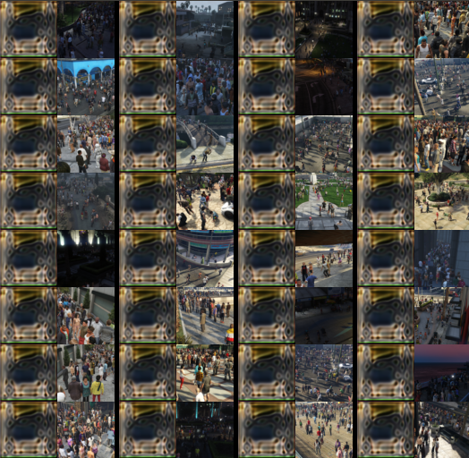
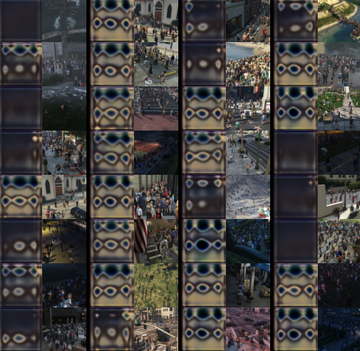
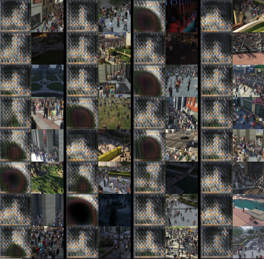
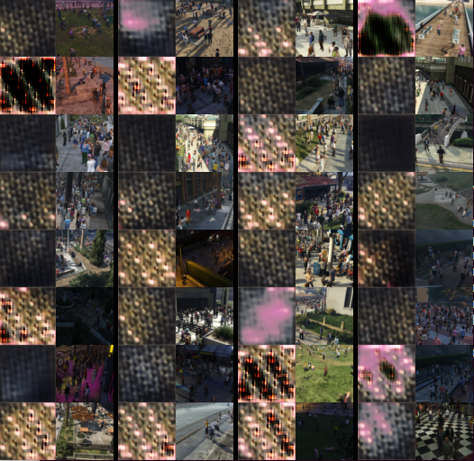

# Daily Thought (2019.4.28 - 2019.4.30)
**Do More Thinking!** ♈ 

**Ask More Questions!** ♑

**Nothing But the Intuition!** ♐

## GAN训练经验总结

### 1. 学习率对GAN的影响
一般情况下很多任务会有两种GAN的训练策略

**策略1**

lr_D = lr_G = 0.0002， Adam: beta1 = 0.5, beta2 = 0.999

**策略2**

lr_D = 0.0004, lr_G = 0.0001, Adam: beta1 = 0, beta2 = 0.9

不过其实还是要具体情况具体分析：

例如在训练spectral normalizarion GAN的时候，发现把optimizer设定设置为策略1，导致学习到的效果很差，失去variation，训练到3400 iters的时候



只改动了判别器的学习率改成了0.0008，放大4倍，同样的其余设定，发现variation就多了很多



### 2. upsample函数 对生成质量的影响

一般使用`TransposeConv2d`进行上采样会出现很大的checkerboard效应

一般推荐使用`nn.Upsample(scale_factor=2)`

但是实现过程中发现有时候效果也比较差：





使用`nn.UpsamplingBilinear2d(scale_factor=2)`效果会更好一些


### 3. 几种GAN loss简介

**Original GAN**

一个discriminator只得到`1`或者`0`，损失函数类似于二分类任务的cross-entropy loss, 也叫BCEloss（Binary Classification Entropy)

```python
loss = F.binary_cross_entropy_with_logits(input, target_tensor)
```

**LSGAN**

一般使用的比较多

discriminator得到一个tensor，然后损失函数是MSE, 计算discriminiator得到的tensor与目标tensor的距离

```python
loss = F.mse_loss(input, target_tensor)
```

**hinge loss GAN**

```python
if for_discriminator:
    if target_is_real:
        minval = torch.min(input - 1, self.get_zero_tensor(input))
        loss = -torch.mean(minval)
    else:
        minval = torch.min(-input - 1, self.get_zero_tensor(input))
        loss = -torch.mean(minval)
else:
    assert target_is_real, "The generator's hinge loss must be aiming for real"
    loss = -torch.mean(input)
return loss
```

**WGAN loss**

也就是缩小经过discriniator后的正样本tensor 与 负样本tensor 之间的距离，相当于缩小w距离

```python
if target_is_real:
    return -input.mean()
else:
    return input.mean()
```

### 4. pytorch的padding

这里从最基础的地方重现一下padding的原理

```python
>> input 
tensor([[[[ 0.7504, 0.1157, 1.4940, -0.2619, -0.4732], 
          [ 0.1497, 0.0805, 2.0829, -0.0925, -1.3367],
          [ 1.7471, 0.5205, -0.8532, -0.7358, -1.3931], 
          [ 0.1159, -0.2376, 1.2683, -0.0959, -1.3171], 
          [-0.1620, -1.8539, 0.0893, -0.0568, -0.0758]]]]) 
# set padding from 0 to 1 equals to (1, 1) 

>> m1 = torch.nn.Conv2d(1, 1, 1, padding=1) 
>> m1(input) 
tensor([[[[0.9862, 0.9862, 0.9862, 0.9862, 0.9862, 0.9862, 0.9862], 
          [0.9862, 1.0771, 1.0002, 1.1672, 0.9544, 0.9288, 0.9862], 
          [0.9862, 1.0043, 0.9959, 1.2385, 0.9749, 0.8242, 0.9862], 
          [0.9862, 1.1978, 1.0492, 0.8828, 0.8970, 0.8174, 0.9862], 
          [0.9862, 1.0002, 0.9574, 1.1398, 0.9745, 0.8266, 0.9862], 
          [0.9862, 0.9665, 0.7615, 0.9970, 0.9793, 0.9770, 0.9862], 
          [0.9862, 0.9862, 0.9862, 0.9862, 0.9862, 0.9862, 0.9862]]]], 
          grad_fn=<ThnnConv2DBackward>)

```

这里卷积核的kernel size = 1

padding部分经过计算后为什么不是0: 虽然padding是在补0，但是convolution包含bias计算，所以需要加上bias

**convolution层都含有bias参数，对于每个卷积核**

**对于spectral normalization的convolution layer，bias参数被删除了**

**GAN图片输入padding技巧：**

建议最开始输入图片第一层卷积之前不要补0(padding)

而是使用reflection padding:

```python
nn.ReflectionPad2d(3),
nn.Conv2d(in_channels=4, out_channels=64, kernel_size=7, padding=0)
```
