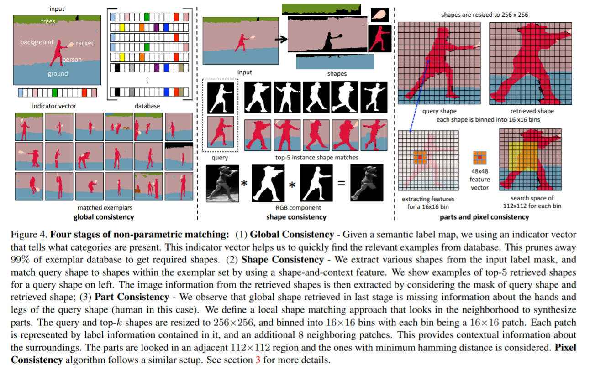

# Daily Thought (2019.8.1 - 2019.8.15)
**Do More Thinking!** ♈ 

**Ask More Questions!** ♑

**Nothing But the Intuition!** ♐

## 论文阅读笔记

### 1. Shapes and Context: In-the-Wild Image Synthesis & Manipulation(ICCV2019)
**一种非深度学习无参数的semantic label map转换成image的方法，主要依赖有效的library检索，然后对parts进行组合.**

深度学习GAN+包含参数生成模型的问题：不够泛化，多样性很差

对于semantic map转换成image的问题，一般的GAN模型都是一个数据集一个模型，也就是cityscapes, coco...

**parametric methods问题**

While parametric methods do well on limited data distributions, they struggle to perform on diverse datasets.

**一般尝试解决的办法就是增大模型size**

