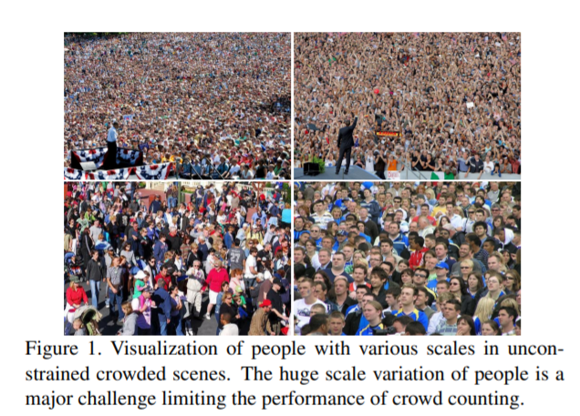
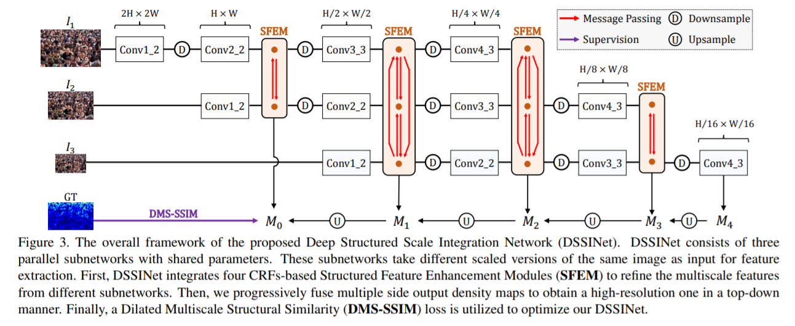
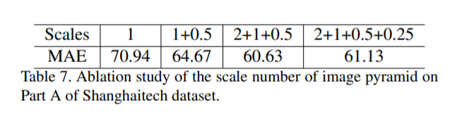
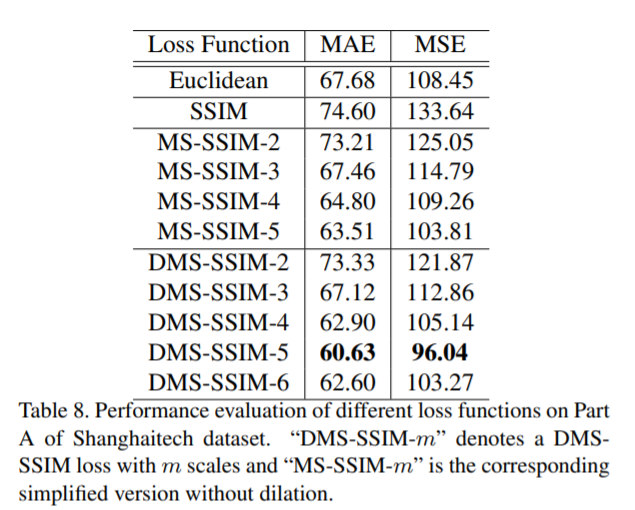

# Daily Thought (2019.8.15 - 2019.8.30)
**Do More Thinking!** ♈ 

**Ask More Questions!** ♑

**Nothing But the Intuition!** ♐

# Crowd Counting 论文阅读

### 1. Crowd Counting with Deep Structured Scale Integration Network (DSSINet, ICCV2019）

主要思路就是：对于crowd counting任务就是预测density map

而且一般往往距离摄像机近的位置人的头比较大，density map就比较稀疏，对于距离摄像机远的位置，density map就比较sharp

这也就是说明density map本身相邻区域具有一定的**结构化特征，也就是structured feature**

但是对于Euclidean loss不能去学习到这种结构化的信息，所以这篇文章主要是**引入一个有效的结构化loss函数**来更好的进行density estimation

主要提出：
- structured feature representation learning（文中叫做CRFs-based Structured Feature Enhancement Module，其实就是一个multi-scale特征的融合模块）
- hierarchically structured loss function optimization（文中叫做Dilated Multiscale Structural Similarity loss，其实就是基于MS-SSIM的结构相似性loss函数，之前有文章使用这个在crowd-counting中产生了效果，这里更新点在于使用了空洞卷积）

网络结构：

一些验证试验：

关于网络的scale-number：

关于网络的MS-SSIM loss/ DMS-SSIM loss设计的scale数：

