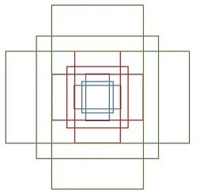

# Daily Thought (2019.2.1 - 2019.2.28)
**Do More Thinking!** ♈ 

**Ask More Questions!** ♑

**Nothing But the Intuition!** ♐

### 1.调参过程中初始学习率的设置（2.2)
**初始学习率的设置**

首先我们设置一个非常小的初始学习率，比如1e-5，然后在每个batch之后都更新网络，同时增加学习率，统计每个batch计算出的loss。最后我们可以描绘出学习的变化曲线和loss的变化曲线，从中就能够发现最好的学习率。

下面就是随着迭代次数的增加，学习率不断增加的曲线，以及不同的学习率对应的loss的曲线。

**注意：这里都是在一次训练中完成的，所以是一种高效的调参策略**

从上面的图片可以看到，随着学习率由小不断变大的过程，网络的loss也会从一个相对大的位置变到一个较小的位置，同时又会增大，这也就对应于我们说的学习率太小，loss下降太慢，学习率太大，loss有可能反而增大的情况。从上面的图中我们就能够找到一个相对合理的初始学习率，0.1。

之所以上面的方法可以work，因为小的学习率对参数更新的影响相对于大的学习率来讲是非常小的，比如第一次迭代的时候学习率是1e-5，参数进行了更新，然后进入第二次迭代，学习率变成了5e-5，参数又进行了更新，那么这一次参数的更新可以看作是在最原始的参数上进行的，而之后的学习率更大，参数的更新幅度相对于前面来讲会更大，所以都可以看作是在原始的参数上进行更新的。正是因为这个原因，学习率设置要从小变到大，而如果学习率设置反过来，从大变到小，那么loss曲线就完全没有意义了。

**实现**上面已经说明了算法的思想，说白了其实是非常简单的，就是不断地迭代，每次迭代学习率都不同，同时记录下来所有的loss，绘制成曲线就可以了。
PyTorch的optim里面并没有把learning rate的接口暴露出来，导致显示修改学习率非常麻烦。

https://github.com/SherlockLiao/mxtorch

一般的，batch size越小，梯度随机性越大，batch size越大，梯度随机性越小

https://zhuanlan.zhihu.com/p/31424275

### 2.Unet为什么在医学图像分割表现好（2.3）
**Unet两大特点**：U型结构 与 skip-connection

UNet的encoder下采样4次，一共下采样16倍，对称地，其decoder也相应上采样4次，将encoder得到的高级语义特征图恢复到原图片的分辨率。

相比于FCN和Deeplab等，UNet共进行了4次上采样，并在同一个stage使用了skip connection，而不是直接在高级语义特征上进行监督和loss反传，这样就保证了最后恢复出来的特征图融合了更多的low-level的feature

**医学影像任务特点**
医疗影像有什么样的特点呢（尤其是相对于自然影像而言）？
- 1. 图像语义较为简单、结构较为固定。由于器官本身结构固定和语义信息没有特别丰富，所以高级语义信息和低级特征都显得很重要(UNet的短连接和U型结构就派上了用场)。
- 2. 数据量少。医学影像的数据获取相对难一些，很多比赛只提供不到100例数据。所以我们设计的模型不宜多大，参数过多，很容易导致过拟合。 UNet的参数量不到8M，而如果把channel数成倍缩小，模型可以更小，把UNet的channel降四倍，模型参数量在2.47M，非常轻量。
- 3. 多模态。相比自然影像，医疗影像比较有趣和不同的一点是，医疗影像是具有多种模态的。
- 4. 可解释性重要。由于医疗影像最终是辅助医生的临床诊断，所以网络告诉医生一个3D的CT有没有病是远远不够的，医生还要进一步的想知道，病灶在哪一层，在哪一层的哪个位置，分割出来了吗，能求体积嘛？同时对于网络给出的分类和分割等结果，医生还想知道为什么，所以一些神经网络可解释性的trick就有用处了，比较常用的就是画activation map。看网络的哪些区域被激活了

**什么是多模态？**
什么叫做模态（Modality）呢？

每一种信息的来源或者形式，都可以称为一种模态。例如，人有触觉，听觉，视觉，嗅觉；信息的媒介，有语音、视频、文字等；多种多样的传感器，如雷达、红外、加速度计等。以上的每一种都可以称为一种模态。

同时，模态也可以有非常广泛的定义，比如我们可以把两种不同的语言当做是两种模态，甚至在两种不同情况下采集到的数据集，亦可认为是两种模态。

https://www.zhihu.com/question/269914775/answer/586501606

### 3.目标检测基础 Faster-RCNN（2.4）
Faster-RCNN主要分为四个部分
- 1. Conv layers。作为一种CNN网络目标检测方法，Faster RCNN首先使用一组基础的conv+relu+pooling层提取image的feature maps。该feature maps被共享用于后续RPN层和全连接层。
- 2. Region Proposal Networks。RPN网络用于生成region proposals。该层通过softmax判断anchors属于foreground或者background，再利用bounding box regression修正anchors获得精确的proposals。
- 3. Roi Pooling。该层收集输入的feature maps和proposals，综合这些信息后提取proposal feature maps，送入后续全连接层判定目标类别。
- 4. Classification。利用proposal feature maps计算proposal的类别，同时再次bounding box regression获得检测框最终的精确位置。

**整体结构：**
`pascal_voc/VGG16/faster_rcnn模型`
1. 网络对于一副任意大小PxQ的图像，首先缩放至固定大小MxN，然后将MxN图像送入网络；
2. `Conv layers`中包含了13个conv层+13个relu层+4个pooling层
3. `RPN网络`首先经过3x3卷积，再分别生成foreground anchors与bounding box regression偏移量，然后计算出proposals
4. `Roi Pooling层`则利用proposals从feature maps中提取proposal feature
5. 将proposal feature送入后续全连接和softmax网络作classification（即分类proposal到底是什么object）。

详细理解链接：
https://zhuanlan.zhihu.com/p/31426458

### 4.RPN网络(Region Proposal Networks)(2.4)
**RPN具体结构**

- 上面一条通过softmax分类anchors获得foreground和background（检测目标是foreground）
- 下面一条用于计算对于anchors的bounding box regression偏移量，以获得精确的proposal
- 最后的Proposal层则负责综合foreground anchors和bounding box regression偏移量获取proposals，同时剔除太小和超出边界的proposals

整个faster-rcnn到proposal layer这里，其实基本上相当于完成了目标定位的功能。

**ancher基本含义**

输入图像reshape成800x600（即图2中的M=800，N=600）。再回头来看anchors的大小，anchors中长宽1:2中最大为352x704，长宽2:1中最大736x384，基本是cover了800x600的各个尺度和形状。

那么这9个anchors是做什么的呢？借用Faster RCNN论文中的原图，遍历Conv layers计算获得的feature maps，为每一个点都配备这9种anchors作为初始的检测框。这样做获得检测框很不准确，不用担心，后面还有2次bounding box regression可以修正检测框位置。

那么Anchor一共有多少个？原图800x600，VGG下采样16倍，feature map每个点设置9个Anchor，

所以：`ceil(800/16) × ceil(600/16) × 9 = 17100`

**rpn步骤**

step0: 前面的conv-layers中最后的conv5是num_output=256，对应生成256张feature maps

step1: 在conv5之后，做了rpn_conv/3x3卷积且num_output=256，相当于每个点又融合了周围3x3的空间信息,当然得到的还是256维feature maps

step2.1: 假设在conv5 feature maps中每个点上有k个anchor（默认k=9），而每个anchor要分foreground和background,也就是二分类，所以每个点由256维 feature转化为cls=2k scores。也就是其中一个分支每个spatial点从256维经过1×1卷积得到18维。

step2.2: 而每个anchor都有(x, y, w, h)对应4个偏移量，所以reg=4k coordinates, 也就是每个spatial点从256维经过1×1卷积得到36维。

（训练时：全部anchors拿去训练太多了，训练程序会在合适的anchors中随机选取128个postive anchors+128个negative anchors进行训练）

**其实RPN最终就是在原图尺度上，设置了密密麻麻的候选Anchor。然后用cnn去判断哪些Anchor是里面有目标的foreground anchor，哪些是没目标的backgroud。所以，仅仅是个二分类而已！**

第二条线路（step2.2）是bounding box regression

如图所示绿色框为飞机的Ground Truth(GT)，红色为提取的foreground anchors，即便红色的框被分类器识别为飞机，但是由于红色的框定位不准，这张图相当于没有正确的检测出飞机。所以我们希望采用一种方法对红色的框进行微调，使得foreground anchors和GT更加接近

对于窗口一般使用四维向量  (x, y, w, h) 表示，分别表示窗口的中心点坐标和宽高。对于图 11，红色的框A代表原始的Foreground Anchors，绿色的框G代表目标的GT，我们的目标是寻找一种关系，使得输入原始的anchor A经过映射得到一个跟真实窗口G更接近的回归窗口G'，即：

给定：anchor A=(Ax, Ay, Aw, Ah) 和 GT= [Gx, Gy, Gw, Gh]

寻找一种变换F，使得：F(Ax, Ay, Aw, Ah)=(G\`x, G\`y, G\`w, G\`h)，其中(G\`x, G\`y, G\`w, G\`h)≈(Gx, Gy, Gw, Gh)

那么经过何种变换F才能从图10中的anchor A变为G'呢？ 比较简单的思路就是先做平移，再做缩放。

anchor A与GT相差较小时，可以认为这种变换是一种线性变换， 那么就可以用线性回归来建模对窗口进行微调

step3. proposal layer：负责综合所有[dx(A),dy(A),dw(A),dh(A)]变换量和foreground anchors，计算出精准的proposal，送入后续RoI Pooling Layer

### 5.RoI pooling层
RoI Pooling层则负责收集proposal，并计算出proposal feature maps，送入后续网络。

Rol pooling层有2个输入：
- 原始的feature maps
- RPN输出的proposal boxes（大小各不相同）

对于传统的CNN（如AlexNet，VGG），当网络训练好后输入的图像尺寸必须是固定值，同时网络输出也是固定大小的vector or matrix。如果输入图像大小不定，这个问题就变得比较麻烦。有2种解决办法：

1. 从图像中crop一部分传入网络

2. 将图像warp成需要的大小后传入网络

可以看到无论采取那种办法都不好，要么crop后破坏了图像的完整结构，要么warp破坏了图像原始形状信息。

**RoI Pooling layer forward过程：**

由于proposal是对应 M×N 尺度的，所以首先使用spatial_scale参数将其映射回 (M/16)×(N/16) 大小的feature map尺度；
再将每个proposal对应的feature map区域水平分为pooled_w × pooled_h 的网格；

对网格的每一份都进行max pooling处理。
这样处理后，即使大小不同的proposal输出结果都是pooled_w × pooled_h 固定大小，实现了固定长度输出。

### 6.Deformable ConvNet v1 （DCN v1）
目标检测中有一个比较棘手的问题，即所谓的**几何形变问题（Geometric variations）**。就拿人检测来讲，人的姿态有多种多样（想想跳舞的场景），这就需要我们设计的模型具备deformation的能力。通常情况下为了解决这类问题有两种思路：

（a) 收集更多样的数据用于模型的训练；

（b) 设计transformation invariant 的特征来提升模型多样化能力。

Deform ConvNet是在卷积神经网络的框架下，对transformation-invariant feature的比较成功的尝试。思想非常直观，在标准的卷积核上加入了可学习的offset，使得原来方方正正的卷积核具备了形变的能力。

https://www.zhihu.com/question/303900394/answer/540818451

### 7.Deformable ConvNet v2
我认为，Deform ConvNet是在解决如何让学到的offset能更聚焦到感兴趣的物体上边，也就是提取到更聚焦的feature来帮助物体的识别定位。在下边的图片中，我们当然希望模型的feature能够聚焦到物体上边，这样才能提取到更有意义的supporting feature。

为了做到这一点，作者主要用了几种策略:

(a) 增加更多的offset层，这个不必细说；

(b) 在deform convolution中引入调节项(modulation)，这样既学到了offset，又有了每个位置的重要性信息

(c) Feature Mimicking:
作者强调，简单在对应的feature上用roi-pooling来提取对应位置的feature并不一定能提取到最有用的信息（可能包含无用的context）。如何才能让feature更加聚焦到物体上呢？解决就是Mimicking技术，让roi-pooling之后的feature更像直接用R-CNN学到的feature。

https://www.zhihu.com/question/303900394/answer/540896238
