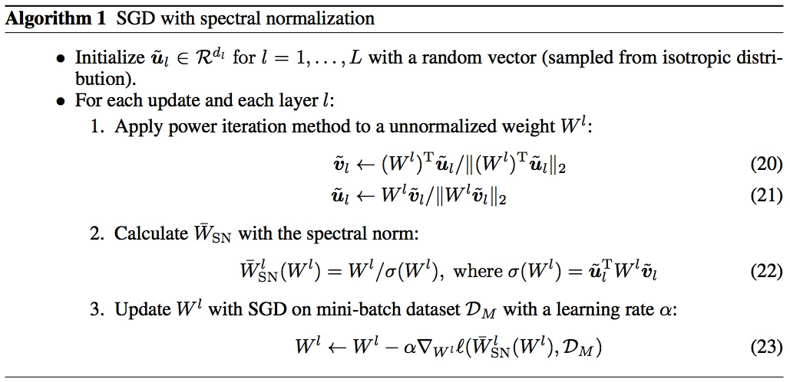

# Daily Thought (2019.2.11 - 2019.2.14)
**Do More Thinking!** ♈ 

**Ask More Questions!** ♑

**Nothing But the Intuition!** ♐

## Normalization专题（2.13-2.14）
### 1. 为什么需要Normalization?
主要解决深度神经网络中internal covariate shift问题，详见小本或链接

https://zhuanlan.zhihu.com/p/33173246

### 2. 机器学习最希望数据有什么特点？ 独立同分布
也就是为什么需要归一化的原因，就是因为希望数据满足独立同分布。

独立同分布不是机器学习的必要，但是独立同分布的数据可以简化常规机器学习模型的训练、提升机器学习模型的预测能力

独立同分布的介绍，数据白化的介绍，详见小本或链接

https://zhuanlan.zhihu.com/p/33173246

### 3. 深度学习中造成的internel covariate shift
详见小本或链接

https://zhuanlan.zhihu.com/p/33173246

### 4. 深度神经网络模型为什么训练困难？
详见小本或链接

https://zhuanlan.zhihu.com/p/33173246

### 5. Internel Covariate Shift（ICS）会造成什么?
详见小本或链接

https://zhuanlan.zhihu.com/p/33173246

### 6. Normalization通用框架与基本思想
详见小本和链接

https://zhuanlan.zhihu.com/p/33173246

### 7. Normalization方法操作
详见小本和链接

https://zhuanlan.zhihu.com/p/33173246

### 8. Normalization进一步变化（第二步）的目的是什么？（明明第一步已经标准化了）
详见小本和链接

https://zhuanlan.zhihu.com/p/33173246

### 9. Normalization第一步变化+第二步变化变来变去会不会跟没变一样？
详见小本和链接

https://zhuanlan.zhihu.com/p/33173246

### 10. 这样的normalization变化离标准的白化还有多远？
详见小本和链接

https://zhuanlan.zhihu.com/p/33173246

### 11. Batch Normalization (BN) 横向归一化
详见小本和链接

https://zhuanlan.zhihu.com/p/33173246

### 12. Layer Normalization (LN) 纵向归一化
详见小本和链接

https://zhuanlan.zhihu.com/p/33173246

### 13. Weight Normalization (WN) 权重归一化
详见小本和链接

https://zhuanlan.zhihu.com/p/33173246

### 14. Cosine Normalization (CN) 余弦归一化
详见小本和链接

https://zhuanlan.zhihu.com/p/33173246

### 15. 数学上分析Normalization为什么会有效？
详见小本和链接

https://zhuanlan.zhihu.com/p/33173246

### 16. Batch Normalization 与 Instance Normalization对比 
BN和IN其实本质上是同一个东西，只是IN是作用于单张图片，但是BN作用于一个batch。但是为什么IN还会被单独提出，而且在Style Transfer的这个任务中大放异彩呢？

主要是这样的逻辑：

1. 通过调整BN统计量，或学习的参数beta和gamma，BN可以用来做domain adaptation。

2. Style Transfer是一个把每张图片当成一个domain的domain adaptation问题。

**在GAN，STYLE TRANSFER这类任务上IN的实验结论要优于BN**，给出的普遍的阐述性解释是：这类生成式方法，自己的风格比较独立不应该与batch中其他的样本产生太大联系。所以目前的结论是：在图片视频分类等特征提取网络中大多数情况BN效果优于IN，在生成式类任务中的网络IN优于BN。

batch norm是对一个batch里所有的图片的所有像素求均值和标准差。而instance norm是对单个图片的所有像素求均值和标准差。

这里其实可以看到的一个问题，由于shuffle的存在，每个batch里每次的均值和标准差是不稳定，本身相当于是引入了噪声。

而instance norm的信息都是来自于自身的图片，某个角度来说，可以看作是全局信息的一次整合和调整。对于训练也说也是更稳定的一种方法。

其实我们完全可以把instance norm当做L2 norm这种方法的一个变种。前者适合卷积层，后者适合全连接层。

### 17. Spectral Normalization谱归一化

本身设计的提出是为了训练WGAN，WGAN的训练改进策略有weight-clipping，gradinet panelty 以及这里的谱归一化。

因为WGAN的思路就是将Wasserstein距离转换为使神经网络中的判别器函数具有 Lipschitz continuity 

因为矩阵乘法是线性映射对线性映射来说，如果它在零点处是 K-Lipschitz 的，那么它在整个定义域上都是 K-Lipschitz 的。

因此数学证明：矩阵 A 除以它的 spectral norm（ A^TA 最大特征值的开根号）可以使其具有 1-Lipschitz continuity。

多层神经网络，正是多个复合函数嵌套的操作。最常见的嵌套是：一层卷积，一层激活函数，再一层卷积，再一层激活函数，这样层层包裹起来。而激活函数通常选取的 ReLU，Leaky ReLU 都是 1-Lipschitz 的，带入到复合函数lipschitz公式中相乘不影响总体的 Lipschitz constant，我们只需要保证卷积的部分是 1-Lipschitz continuous 的，就可以保证整个神经网络都是 1-Lipschitz continuous 的。

我们已经知道，想让矩阵满足 1-Lipschitz continuous，只需要让它所有元素同时除以它的最大奇异值，或者说是它的 spectural norm。因此，下一步的问题是如何计算 W 的最大奇异值。

Power iteration 是用来近似计算矩阵最大的特征值（dominant eigenvalue 主特征值）和其对应的特征向量（主特征向量）的。

详细数学原理：https://zhuanlan.zhihu.com/p/55393813

代码项目：https://github.com/christiancosgrove/pytorch-spectral-normalization-gan

