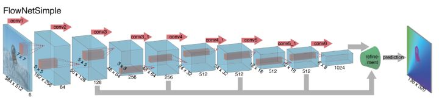

# Daily Thought (2019.2.14 - 2019.2.17)
**Do More Thinking!** ♈ 

**Ask More Questions!** ♑

**Nothing But the Intuition!** ♐

## Attention机制专题
注意力机制是本质上是为了模仿人类观察物品的方式。通常来说，人们在看一张图片的时候，除了从整体把握一幅图片之外，也会更加关注图片的某个局部信息，例如局部桌子的位置，商品的种类等等

注意力机制其实包含两个部分：

- 1. 注意力机制需要决定整段输入的哪个部分需要更加关注；
- 2. 从关键的部分进行特征提取，得到重要的信息。

### 1. RA-CNN (recurrent attention convolutional neural network, CVPR2017)

问题背景：在图像识别领域，通常都会遇到给图片中的鸟类进行分类，包括种类的识别，属性的识别等内容。为了区分不同的鸟，除了从整体来对图片把握之外，更加关注的是一个局部的信息，也就是鸟的样子，包括头部，身体，脚，颜色等内容。至于周边信息，例如花花草草之类的，则显得没有那么重要，它们只能作为一些参照物。

在图像识别领域引入注意力机制就是一个非常关键的技术，让深度学习模型更加关注某个局部的信息。

作者们提出了一个基于 CNN 的注意力机制，叫做 recurrent attention convolutional neural network（RA-CNN）

RA-CNN的子网络（sub-network）存在分类结构，得到分类的概率评分。

还有一个子网络叫做 **Attention Proposal Sub-Network（APN）** ，也就是引入了 attention 机制，让整个网络结构不仅关注整体信息，还关注局部信息。

整个网络结构如下：

整体网路来看，RA-CNN 的输入时是整幅图片（Full Image），输出的时候就是分类的概率。而提取图片特征的方法通常来说都是使用卷积神经网络（CNN）的结构，然后把 Attention 机制加入到整个网络结构中。

一开始，整幅图片从上方输入，然后判断出一个分类概率；然后中间层输出一个坐标值和尺寸大小，其中坐标值表示的是子图的中心点，尺寸大小表示子图的尺寸。在这种基础上，下一幅子图就是从坐标值和尺寸大小得到的图片，第二个网络就是在这种基础上构建的；再迭代持续放大图片，从而不停地聚焦在图片中的某些关键位置。

局部注意力和放大策略（Attention Localization and Amplification）指的是：从上面的方法中拿到坐标值和尺寸，然后把图像进行必要的放大。为了提炼局部的信息，其实就需要在整张图片 X 的基础上加上一个面具（Mask）。

**面具（mask）**:

所谓面具，指的是在原始图片的基础上进行点乘 0 或者 1 的操作，把一些数据丢失掉，把一些数据留下。在图片领域，就是把周边的信息丢掉，把鸟的信息留下。但是，有的时候，如果直接进行 0 或者 1 的硬编码，会显得网络结构不够连续或者光滑，因此就有其他的替代函数。

在激活函数里面，逻辑回归函数（Logistic Regression）是很常见的。其实通过逻辑回归函数，我们可以构造出近似的阶梯函数或者面具函数。

**分类（Classification）和排序（Ranking）部分**

RA-CNN 也有着自己的方法论。在损失函数（Loss Function）里面有两个重要的部分，第一个部分就是三幅图片的 LOSS 函数相加，也就是所谓的 classification loss.

另外一个部分就是排序的部分:

并且最大值函数强制了该深度学习模型在训练中可以保证 `p(s+1) > p(s) + margin` ，也就是说，局部预测的概率值应该高于整体的概率值。

在这种 Attention 机制下，可以使用训练好的 conv5_4 或者 VGG-19 来进行特征的提取。在图像领域，location 的位置是需要通过训练而得到的，因为每张图片的鸟的位置都有所不同。进一步通过数学计算可以得到.

### 2. Multiple Granularity Descriptors for Fine-grained Categorization

这篇文中同样做了鸟类的分类工作，与 RA-CNN 不同之处在于它使用了层次的结构，因为鸟类的区分是按照一定的层次关系来进行的，粗糙来看，有科 -> 属 -> 种三个层次结构。

因此，在设计网络结构的过程中，需要有并行的网络结构，分别对应科，属，种三个层次。
从前往后的顺序是 **检测网络（Detection Network）**， **区域发现（Region Discovery）** ， **描述网络（Description Network）**。
并行的结构是 `Family-grained CNN + Family-grained Descriptor`，`Genus-grained CNN + Genus-grained Descriptor`，`Species-grained CNN + Species-grained Descriptor`。
而在区域发现的地方，作者使用了 `energy 的思想`，让神经网络分别聚焦在图片中的不同部分，最终得到鸟类的预测结果。

https://zhuanlan.zhihu.com/p/56501461

### 3. 图像分类比赛的一个trick

一堆patch抽特征跑个ensemble模型，例如一张图crop五个部位，对预测值求平均。

### 4. ColorNet数据增广新思路（新的trick）

来自于清华大学2019年2月

将原本图像来自于RGB空间的图像转化为HSV，HED, YIQ, YUV, LAB, YCbCr，这6个其他颜色空间的图像，将这七个颜色空间的数据传给7个DenseNet，然后将每个DenseNet输出传递到Dense Layer，有助于对每个颜色空间进行加权预测，Dense Layer的输出用作最终分类。

实验效果提升了很多

https://mp.weixin.qq.com/s/zo0mZih64-Bc883nIfVbUQ

## 2.17 Group Presentations
### 5. 图像质量评价指标（2.17）
PSNR、MS-SSIM、MOS，这些是业界通用的图像质量评估（Image Quality Assessment，IQA）标准

**MOS(Mean Opinion Score)平均主观得分**

评估图像质量，最简单直接的方法，就是人工评分。为了尽量减少误差，可以多找些人，取评分的均值。
然而，MOS有两个问题：

1. 成本高昂，耗时漫长。影响因素多。比如显示设备、照明条件、评分员的视力状况，都可能影响评分。

2. 另外，一些擅长“编造”细节（生成原图中不存在，但看起来很逼真的细节）的算法（比如GAN）的评分容易出现偏高的现象。

**MSE（Mean-Square Error）均方误差**

比较和原图的差异，最容易想到的方法就是逐像素比较。由于像素之差可能是正值，也可能是负值，为了避免正负抵消，因此我们取一下平方。最后，取下均值就可以了

**PSNR(Peak Signal to Noise Ratio)峰值信噪比**

对同一规格的图像而言，可以直接使用均方误差。

但要比较不同规格的图像，直接使用均方误差有所不妥。比如，纯黑白图像，非黑即白，每个像素的值要么是1，要么是0，而通常所谓的黑白图像，其实是8位的灰度图像，每个像素的值在0到255之间。同样的MSE值，对这两种规格的图像而言，意义大不一样。因此，我们还需要将每个像素的取值范围（动态范围）纳入指标，也就是MAX_I，像素可能值的最大值。纳入MAX_I后，再取下对数（因为在图像之外的某些场景中，信号可能有非常大的动态范围），我们就得到了峰值信噪比（Peak Signal-to-Noise Ratio），简称PSNR，单位是dB.

MAX_I = 2^B - 1 (正常是255）

PSNR是非常简单明了的方法，计算起来也很快，因此得到了广泛应用。然而，PSNR基本上是直接比较像素的差异，没有考虑到人眼对不同类别的差异的敏感程度不同。

**SSIM（structural similarity）结构相似性指标**

SSIM的主要思路是，将人类主观感知纳入考量：

- 1. 在非常亮的区域，失真更难以察觉。（luminance，亮度）
- 2. 在“纹理”比较复杂的区域，失真更难以察觉。（contrast，对比）
- 3. 空间上相邻的像素之间形成某种“结构”，而人眼对这种结构信息很敏感。（structure，结构）

具体而言，SSIM通过以下公式测度以上三者：

上式中，μ为均值，σ为方差，C1、C2、C3为对SSIM进行微调的常数。C1、C2、C3满足以下关系：

其中，L为像素的动态范围，对8位灰阶图像而言，L = 255. K1、K2远小于1，默认情况下，K1 = 0.01，K2 = 0.03.

由此，SSIM的计算公式为：

通常，我们认为以上三个因素对主观感受的影响效应相似，故取α = β = γ = 1. 通常我们使用下式计算SSIM：

从SSIM的定义，我们可以看到SSIM满足以下性质：

- 1. 对称：SSIM(x, y) = SSIM(y, x)
- 2. 有界：SSIM(x, y) <= 1
- 3. 唯一最大值：当且仅当x = y时，SSIM(x, y) = 1

**MS-SSIM指标，即多尺度（Multi-Scale）SSIM**

SSIM考虑了亮度、对比、结构因素，然而，还有一个主观因素没有考虑，分辨率。

显然，在不同分辨率下，人眼对图像差异的敏感程度是不一样的。比如，在高分辨率的视网膜显示器上显而易见的失真，在低分辨率的手机上可能难以察觉。因此，后来又进一步提出了MS-SSIM指标, 对图像进行降采样处理，在多尺度上分别计算对比比较和结构比较，最后汇总多尺度上的SSIM分数。

(详见链接）

尽管MS-SSIM有很多优势，但尚不足以取代PSNR。主要有两个原因：
- 1. 速度，SSIM计算要比PSNR复杂不少。
- 2. 在很多场景下，MS—SSIM效果未必比PSNR效果好。

https://zhuanlan.zhihu.com/p/37813759

### 6. Tips
任何CV方向的论文，不能只展示图片效果，应该有数据，指标类的才有说服力。

### 7.FlowNet生成光流图
**什么是光流图**

光流预测一直都是计算机视觉中的经典问题，同时又是解决很多其他问题的基础而备受关注，例如，运动估计、运动分割和行为识别，光流（optical flow）是指平面上，光照模式的变化情况。在计算机视觉领域，是指视频图像中各点像素随时间的运动情况。光流具有丰富的运动信息，光流预测通常是从一对时间相关的图像对中，估计出第一张图像中各个像素点在相邻图像中的位置。

光流图如下所示

FlowNet是第一个尝试利用CNN去直接预测光流的工作，它将光流预测问题建模为一个有监督的深度学习问题。模型框架如下：

输入端为待求光流的图像对I_1，I_2，输出端为预测的光流W。

  W=CNN(θ,I_1,I_2)

其中 W，I_1,I_2均为x，y的函数，x，y为图像中像素的位置坐标。θ为CNN中待学习的参数。通过调节θ，来使网络具有光流预测的能力。

到底什么样的网络具有光流预测的能力？

FlowNet提出两种平行结构：

网络整体上为编码模块接解码模块结构，编码模块均为9层卷积加ReLU激活函数层，解码模块均为4层反卷积加ReLU激活函数层，在文中解码模块又被称为细化模块。整个网络结构类似于FCN(全卷机网络)，由卷积和反卷积层构成，没有全连接层，因此理论上对输入图像的大小没有要求。

根据输入方式的不同，FlowNet又分为FlowNetSimple和FlowNetCorr。

**FlowNetS（FlowNetSimple）** 直接将两张图像按通道维重叠后输入。

**FlowNetC （FlowNetCorr）**为了提升网络的匹配性能，人为模仿标准的匹配过程，设计出“互相关层”，即先提取特征，再计算特征的相关性。相关性的计算实际上可以看做是两张图像的特征在空间维做卷积运算。

**解码部分**在解码细化的过程中，对每层的反卷积ReLU层，不仅输入前一层的输出，同时还输入前一层预测的低尺度的光流和对应编码模块中的特征层。这样使得每一层反卷积层在细化时，不仅可以获得深层的抽象信息，同时还可以获得浅层的具象信息，以弥补因特征空间尺度的缩小而损失的信息。

https://zhuanlan.zhihu.com/p/37736910

### 8. A Two-step Disentanglement Method (CVPR2018) 阅读
Disentanglement任务就是：就是将given data分解成与label相关的vector，以及与label完全无关的vector

例如分类任务的mnist数据，存在是个label，1，2，。。。，10

对于disentangle这样的数据就是保证分出来的不相关信息的语义向量分类错误率尽可能接近随机猜测错误率，也就是90%

网络结构如下，其实整个实验设定和ECCV2016的实验设定一样，主要是网络结构不同了

第一步单独训练EncoderS，然后在第二步固定

主要好的地方就是，对抗分类器，Adv Classifier主要就是努力让EncoderZ，编码出来的向量Z尽可能分类错误，如果是数字1图片,那么2，3，4，5...，10就是判断错误，如果分类器得到1就是正确，会惩罚。

同时Encoder根据S + Z再进行重构信息，保证信息的完整性，三轮训练DecoderZ, Encoder， 一轮训练Adv Classifier
