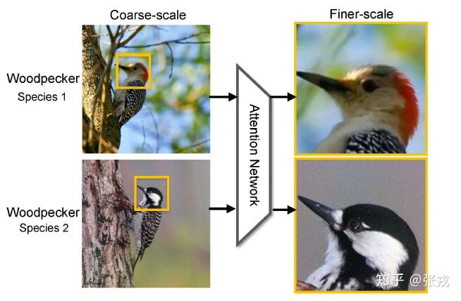

# Daily Thought (2019.2.14 - 2019.2.20)
**Do More Thinking!** ♈ 

**Ask More Questions!** ♑

**Nothing But the Intuition!** ♐

## Attention机制专题
注意力机制是本质上是为了模仿人类观察物品的方式。通常来说，人们在看一张图片的时候，除了从整体把握一幅图片之外，也会更加关注图片的某个局部信息，例如局部桌子的位置，商品的种类等等

注意力机制其实包含两个部分：

- 1. 注意力机制需要决定整段输入的哪个部分需要更加关注；
- 2. 从关键的部分进行特征提取，得到重要的信息。

### 1. RA-CNN (recurrent attention convolutional neural network, CVPR2017)

问题背景：在图像识别领域，通常都会遇到给图片中的鸟类进行分类，包括种类的识别，属性的识别等内容。为了区分不同的鸟，除了从整体来对图片把握之外，更加关注的是一个局部的信息，也就是鸟的样子，包括头部，身体，脚，颜色等内容。至于周边信息，例如花花草草之类的，则显得没有那么重要，它们只能作为一些参照物。

在图像识别领域引入注意力机制就是一个非常关键的技术，让深度学习模型更加关注某个局部的信息。

作者们提出了一个基于 CNN 的注意力机制，叫做 recurrent attention convolutional neural network（RA-CNN）

RA-CNN的子网络（sub-network）存在分类结构，得到分类的概率评分。

还有一个子网络叫做 **Attention Proposal Sub-Network（APN）** ，也就是引入了 attention 机制，让整个网络结构不仅关注整体信息，还关注局部信息。

整个网络结构如下：

整体网路来看，RA-CNN 的输入时是整幅图片（Full Image），输出的时候就是分类的概率。而提取图片特征的方法通常来说都是使用卷积神经网络（CNN）的结构，然后把 Attention 机制加入到整个网络结构中。

一开始，整幅图片从上方输入，然后判断出一个分类概率；然后中间层输出一个坐标值和尺寸大小，其中坐标值表示的是子图的中心点，尺寸大小表示子图的尺寸。在这种基础上，下一幅子图就是从坐标值和尺寸大小得到的图片，第二个网络就是在这种基础上构建的；再迭代持续放大图片，从而不停地聚焦在图片中的某些关键位置。

局部注意力和放大策略（Attention Localization and Amplification）指的是：从上面的方法中拿到坐标值和尺寸，然后把图像进行必要的放大。为了提炼局部的信息，其实就需要在整张图片 X 的基础上加上一个面具（Mask）。

**面具（mask）**:

所谓面具，指的是在原始图片的基础上进行点乘 0 或者 1 的操作，把一些数据丢失掉，把一些数据留下。在图片领域，就是把周边的信息丢掉，把鸟的信息留下。但是，有的时候，如果直接进行 0 或者 1 的硬编码，会显得网络结构不够连续或者光滑，因此就有其他的替代函数。

在激活函数里面，逻辑回归函数（Logistic Regression）是很常见的。其实通过逻辑回归函数，我们可以构造出近似的阶梯函数或者面具函数。

**分类（Classification）和排序（Ranking）部分**

RA-CNN 也有着自己的方法论。在损失函数（Loss Function）里面有两个重要的部分，第一个部分就是三幅图片的 LOSS 函数相加，也就是所谓的 classification loss.

另外一个部分就是排序的部分:

并且最大值函数强制了该深度学习模型在训练中可以保证 `p(s+1) > p(s) + margin` ，也就是说，局部预测的概率值应该高于整体的概率值。

在这种 Attention 机制下，可以使用训练好的 conv5_4 或者 VGG-19 来进行特征的提取。在图像领域，location 的位置是需要通过训练而得到的，因为每张图片的鸟的位置都有所不同。进一步通过数学计算可以得到.

### 2. Multiple Granularity Descriptors for Fine-grained Categorization

这篇文中同样做了鸟类的分类工作，与 RA-CNN 不同之处在于它使用了层次的结构，因为鸟类的区分是按照一定的层次关系来进行的，粗糙来看，有科 -> 属 -> 种三个层次结构。

因此，在设计网络结构的过程中，需要有并行的网络结构，分别对应科，属，种三个层次。
从前往后的顺序是 **检测网络（Detection Network）**， **区域发现（Region Discovery）** ， **描述网络（Description Network）**。
并行的结构是 `Family-grained CNN + Family-grained Descriptor`，`Genus-grained CNN + Genus-grained Descriptor`，`Species-grained CNN + Species-grained Descriptor`。
而在区域发现的地方，作者使用了 `energy 的思想`，让神经网络分别聚焦在图片中的不同部分，最终得到鸟类的预测结果。

https://zhuanlan.zhihu.com/p/56501461

### 3. 图像分类比赛的一个trick

一堆patch抽特征跑个ensemble模型，例如一张图crop五个部位，对预测值求平均。

### 4. ColorNet数据增广新思路（新的trick）

来自于清华大学2019年2月

将原本图像来自于RGB空间的图像转化为HSV，HED, YIQ, YUV, LAB, YCbCr，这6个其他颜色空间的图像，将这七个颜色空间的数据传给7个DenseNet，然后将每个DenseNet输出传递到Dense Layer，有助于对每个颜色空间进行加权预测，Dense Layer的输出用作最终分类。

实验效果提升了很多

https://mp.weixin.qq.com/s/zo0mZih64-Bc883nIfVbUQ
