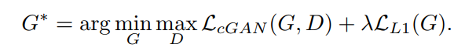
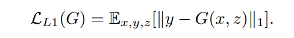

# Daily Thought (2019.2.18 - 2019.2.25)
**Do More Thinking!** ♈ 

**Ask More Questions!** ♑

**Nothing But the Intuition!** ♐

## GAN专题

### 1. pix2pix (Image-to-Image Translation with Conditional Adversarial Networks) （2019.2.24）

2016年11月21日发表于arxiv 已投CVPR 2017

**根据cGAN提出可以用于Image-to-Image Translation中多个任务的通用框架**

**这篇论文虽然技巧平平，都是以前用过的，但是里面内容值得思考，干货满满**

通用框架主要的任务有：
- semantic labels <-> photo
- BW (gray) <-> color photos
- Edges <-> photos
- Sketch <-> photos
- Day <-> night

之前阅读的用于image inpainting的edge-connect，stage2是将想象的边缘图转化为彩色图从而达到修复效果，stage2的网络架构就是应用这篇里的网络结构。

**使用的是cGAN:**
- GAN: from random noise vector z to output image y, G: x → y
- cGAN: learn a mapping from observed image x and random noise vector z, to y, G : {x, z} → y

cGAN loss (D最大化，G最小化):

cGAN 结构：

 
可以拿前面的loss函数与下面的loss函数对比一下，前者在discriminartor也加了condition

之前有的方法证明 conditioning the discriminator + generator 的效果要优于只condition generator的效果

最终cGAN loss结合L1 loss一起使用，最终loss（没有用z随机化，而是用dropout略微增加随机性）：

### 2. L1/L2的pix2pix loss有什么问题呢？（pix2pix的启发）

直接设置两张图片（预测与ground-truth）对应位置的pixel与pixel之间的euclidean distance 或者 曼哈顿距离为loss，会造成 **图像模糊**

因为Euclidean distance 是通过平均所有plausible outputs来最小化loss，肯定会造成blurring，极度low-level的信息

相对而言GAN损失就是一个极度high-level的语义信息，根据人为判断真假来决定的。

### 3. patchGAN （pix2pix的启发）

思想最早提出是在 （ECCV2016）Precomputed real-time texture synthesis with markovian generative adversarial networks. 

叫作markovian generative adversarial networks

应用完善并且命名“patchGAN”是在（CVPR2017）Image-to-Image Translation with Conditional Adversarial Networks.

并且调查改变patch size的大小产生的影响

### 4. 单纯使用GAN损失为什么不行，L1 pix2pix loss 与 L2的pix2pix loss 有什么区别？（pix2pix的启发）
因为对于生成任务，不仅要fool the discriminator， 还要与ground truth接近，所以需要接近输出以一种L2 sense.

使用L1 loss而不使用L2 loss，是因为l1 loss可以鼓励less blurring

### 5. cGAN中加z这样的随机性因子效果相对于不加会不会好一些呢？（pix2pix的启发）

因为cGAN本身其实不像纯的GAN生成各式各样的图片，cGAN是在一个限制条件下完成生成任务，效果至上，不需要那么大的多样性。

但是，不使用z,只学习从x到y的映射，将会产生deterministic的输出，所以不能match distribution，也就不是一个变动的函数，也会影响GAN本身的效果。

pix2pix的实验中最初没有发现随机vector z对效果有太大帮助，于是最终实验设计的随机性完全依赖dropout，但是尽管dropout有随机性，但是对于网络输出结果这样的随机性还是很小。

**（后续可以重点关注一下关于cGAN是否随机性，怎么随机性相关的讨论）**

