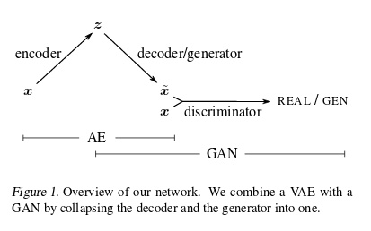

# Daily Thought (2019.1.1 - 2019.1.31)
**Do More Thinking!** ♈ 

**Ask More Questions!** ♑

**Nothing But the Intuition!** ♐

### 1.为什么Encoder-Decoder要生成latent variable？（1.14)
理解：相当于是把原本高维图像降维成了一组相对低维度的vector，就叫做隐变量（latent variable）。

计算出latent variable目的就是**滤去无关信息，浓缩了有用信息的**，什么有关什么无关根据损失函数的定义来规划。

如果不生成这样一个latent variable，直接通过一层层网络生成，那么它就不能除去掉原来图片中不想要的信息。

例如：风格转换，滤去原图中的风格信息，保留内容信息，就是encoder-decoder的结构。

### 2.迁移理解：根据对latent variable的思考反过来理解bottleneck以及降维升维结构 （1.14）

关于bottleneck的理解：https://zhuanlan.zhihu.com/p/39976502

bottle-neck就是指将信息压缩再放大的结构：自编码器以及squeeze-net里的fire-module都是这种结构。

能够work的原因：

- 1.降维又升维，类似NMF，去除高频噪声的作用
- 2.不同应用或者不同需求，有用的信息域是不一样的。针对任意一个具体的需求（人脸识别，物体追踪……）,**数据里有用的信息只占少数**，而算法需要的就是**排除掉无用信息，仅保留有用信息的表达形式**。
- 3.正因为数据本身是臃肿的需要精简的，所以无用信息的损失是必要的。

图片可以通过简单的描述来压缩，长宽高，位置，角度，颜色，物体，材质等等。

所以理论上可以描述为：**图片是高维空间的低位流型**

### 3.GAN与VAE有什么关系和区别呢？（1.14）
不说loss里，JS散度和KL散度上的区别

主要说本质区别

**VAE**: Variational AutoEncoder

- 本质上：就是图片A encode 成为 latent vector 再 decode 成图片B
- 监督策略：（loss）就是图片A类与图片B类之间差别作为监督（就是看折腾一下前后一样不一样呗）
- 变分策略：variational变分具体就是指 encode 得到的latent vector经过高斯噪声（变化量）处理，为了防止前后生成都是一样的图片（就没有意义了），所以就是加一些变化。

**GAN**: Generative Adversarial Network

- 本质上：就是latent vector 通过 decoder(这里叫作generator) 生成 图片。
- 监督策略：就是对抗监督，加入一个discriminator来协助监督，loss就是这样的一个对抗损失。
- 变分策略：刚开始的latent vector就是由高斯分布生成的。

那么我们其实发现**VAE的侧重点是AE，也就是 encoder + decoder**， **GAN的侧重点就是对抗策略**

其实VAE的decoder就相当于GAN里的generator，所以就有了GAN+VAE结合的思路

之后论文 ECCV2018的adaptive-style-aware 也就是这种AE+GAN的结构：https://arxiv.org/pdf/1807.10201.pdf

### 4.U-net网络结构 （1.18）
U-net与FCN差不多，区别就是
- 1.u-net是完全对称的，下采样与上采样一样的结构
- 2.u-net是skip connection的结构, FCN是也是skip connection的结构, 区别就是:
  - FCN用的是加操作summation
  - u-net用的是叠操作concatnation

关于U-net/FCN的思考：

U-Net和FCN为什么成功，因为它相当于给了一个网络的框架，具体用什么特征提取器，随便。这个时候，高引就出现了，各种在encoder上的微创新络绎不绝，最直接的就是用ImageNet里面的明星结构来套嘛，前几年的BottleNeck，Residual，还有去年的DenseNet，就比谁出文章快。这一类的论文就相当于从1到10的递进，而U-Net这个低层结构的提出却是从0到1。说句题外话，像这种从1到10的论文，引用往往不会比从0到1的论文高，因为它不自觉的局限了自己的扩展空间

U-net详细研习：https://zhuanlan.zhihu.com/p/44958351

### 5.skip-connection结构（1.18）
skip-connection属于**拓扑结构**的范畴

skip connection是由resnet里面提出的

关于resnet，densenet其中都涉及到了**dense topology**的观点

表面上resnet是一种简单的skip connection结构，但是《Mixed Link Networks》这篇论文推导证明了ResNet本质上也是一种Dense的密集拓扑连接。

换句话说，DenseNet并没有提出新的拓扑连接模式，它和ResNet唯一的区别就是：在一个相同的“Dense Topology”的基础上，ResNet使用了element-wise addition来连接，而DenseNet则使用了concatenation来连接。

很明显，ResNet和DenseNet都走了两个极端—一个只逐元素加“+”，一个只做拼接“||”。于是一个混合它们来提升的思路就非常显而易见了，mixnet就是两者融合了。

关于mixnet：https://zhuanlan.zhihu.com/p/33634915

### 6.Resnet的直觉理解（1.19）
**残差网络是用来解决什么问题？，残差网络为什么这样设计，与传统网络区别在哪？**
- 传统网络，网络输入是x，网络的输出是F(x)，网络要拟合的目标是H(x)，传统网络的训练目标是F(x)=H(x)。

- 残差网络，则是把传统网络的输出F(x)处理一下，加上输入，将F(x)+x作为最终的输出，训练目标是F(x)=H(x)-x，因此得名残差网络。

现在我们要训练一个深层的网络，它可能过深，假设存在一个性能最强的完美网络N，与它相比我们的网络中必定有一些层是多余的，那么这些多余的层的训练目标是恒等变换，只有达到这个目标我们的网络性能才能跟N一样。

对于这些需要实现恒等变换的多余的层，要拟合的目标就成了H(x)=x.

- 所以在传统网络中，要使拟合目标H(x)=x，那么网络的输出目标是F(x)=H(x)=x，这比较困难。

- 而在残差网络中，拟合的目标成了x-x=0，网络的输出目标为F(x)=0，这比前者要容易得多。

**F(x)+x为什么是x而不是其他？**

因为多余的层的目标是恒等变换，即F(x)+x=x，那F(x)的训练目标就是0，比较容易。如果是其他，比如x/2，那F(x)的训练目标就是x/2，是一个非0的值，比0难实现。

参考：https://www.zhihu.com/question/53224378/answer/343061012

### 7.Resnet目的 （1.20）
直觉上我们得出结论：增加网络深度后，网络可以进行更加复杂的特征提取，因此更深的模型可以取得更好的结果。

事实并非如此，人们发现随着网络深度的增加，模型精度并不总是提升，并且这个问题显然不是由过拟合（overfitting）造成的，因为**网络加深后不仅测试误差变高了，它的训练误差竟然也变高了**。

这可能是因为更深的网络会伴随梯度消失/爆炸问题，从而阻碍网络的收敛。作者将这种加深网络深度但网络性能却下降的现象称为**退化问题（degradation problem）**

随着网络层数的增加，梯度爆炸和梯度消失问题严重制约了神经网络的性能，研究人员通过提出包括**Batch normalization**在内的方法，已经一定程度上缓解了这个问题，但依然不足以满足需求。

作者想到了 **构建恒等映射（Identity mapping）** 来解决这个问题，问题解决的标志是：增加网络层数，但训练误差不增加。为什么是恒等映射呢，这样想：20层的网络是56层网络的一个子集，如果我们将56层网络的最后36层全部短接，这些层进来是什么出来也是什么（也就是做一个恒等映射），那这个56层网络不就等效于20层网络了吗，至少效果不会相比原先的20层网络差吧。那不引入恒等映射的56层网络为什么不行呢？因为梯度消失现象使得网络难以训练，虽然网络的深度加深了，但是实际上无法有效训练网络，训练不充分的网络不但无法提升性能，甚至降低了性能。

本质是**密集拓扑结构**

参考：https://zhuanlan.zhihu.com/p/54289848

### 8.VGG的精妙之处（1.22）
VGG最大的贡献并不是VGG网络本身，而是他对于卷积叠加的一个巧妙观察。

**小卷积核**

7 x 7 的卷积层的正则等效于 3 个 3 x 3 的卷积层的叠加。而这样的设计**不仅可以大幅度的减少参数**，其本身带有正则性质的 convolution map 能够**更容易学一个 generlisable, expressive feature space**。这也是现在绝大部分基于卷积的深层网络都在用小卷积核的原因。

### 9.空洞卷积思路提出基础（1.22）

Deep CNN网络中**up-sampling和pooling**的致命缺陷：

主要问题有：

- 1. Up-sampling / pooling layer (e.g. bilinear interpolation) is deterministic（确定的）. (a.k.a. not learnable，不是学习的)
- 2. 内部数据结构丢失；空间层级化信息丢失。
- 3. 小物体信息无法重建 (假设有四个pooling layer 则 任何小于 2^4 = 16 pixel 的物体信息将理论上无法重建。)

在语义分割领域，图像输入到CNN（典型的网络比如FCN）中，FCN先像传统的CNN那样对图像做卷积再pooling，降低图像尺寸的同时增大感受野，但是由于图像分割预测是pixel-wise的输出，所以要将pooling后较小的图像尺寸upsampling（一般采用deconv反卷积）到原始的图像尺寸进行预测。之前的pooling操作使得每个pixel预测都能看到较大感受野信息。

**因此图像分割FCN中有两个关键，一个是pooling减小图像尺寸增大感受野，另一个是upsampling扩大图像尺寸。**

先减小再增大尺寸的过程中，肯定有一些信息损失掉了，所以语义分割问题一直处在瓶颈期无法再明显提高精度。那么能不能设计一种新的操作，不通过pooling也能有较大的感受野看到更多的信息呢？dilated convolution 的设计就很好的解决了这个问题。

### 10.空洞卷积（DilatedConv）（1.22）
**空洞卷积（dilated convolution）**：标准的convolution map里注入空洞，以此来增加reception field

**优点： dilated convolution有保留内部数据结构同时避免使用 down-sampling 这样的特性**

多了一个超参数 dilation rate，就是值kernel的间隔数量，普通卷积的dilation rate = 1

对比如下：

下图（a）：3 × 3， dilation rate = 1, (1-dilated conv)与普通卷积操作一样。

下图（b）：3 × 3， dilation rate = 2, (2-dilated conv)空洞为1，如果考虑到前一层是1-dilated conv，这一层是2-dilated conv，那么两层结合在一起感受野就达到了7 × 7

下图（c）：3 × 3， dilation rate = 4, (4-dilated conv)空洞为3，同理跟在一层1-dilated conv + 一层2-dilated conv后面，能达到15 × 15的感受野。

3层普通的3 × 3空洞卷积加起来，stride为1，感受野只能达到7 × 7

3层3 × 3的空洞卷积加起来，stride为1，感受野可以达到15 × 15

dilated的好处是不做pooling损失信息的情况下，加大了感受野，让每个卷积输出都包含较大范围的信息。在图像需要全局信息或者语音文本需要较长的sequence信息依赖的问题中，都能很好的应用dilated conv，比如图像分割[3]、语音合成WaveNet[2]、机器翻译ByteNet[1]中

参考：https://www.zhihu.com/question/54149221/answer/323880412

### 11.逆卷积（DeConv）与空洞卷积（DilatedConv）

- deconv的其中一个用途是做upsampling，即增大图像尺寸。
- dilated conv并不是做upsampling，而是增大感受野。

可以形象的做个解释：对于标准的`k*k`卷积操作，stride为s，分三种情况：
- (1) s>1，即卷积的同时做了downsampling，卷积后图像尺寸减小；
- (2) s=1，普通的步长为1的卷积，比如在tensorflow中设置padding=SAME的话，卷积的图像输入和输出有相同的尺寸大小；
- (3) 0<s<1，fractionally strided convolution，相当于对图像做upsampling。比如s=0.5时，意味着在图像每个像素之间padding一个空白的像素后，stride改为1做卷积，得到的feature map尺寸增大一倍。

而dilated conv不是在像素之间padding空白的像素，而是在已有的像素上，skip掉一些像素，或者输入不变，对conv的kernel参数中插一些0的weight，达到一次卷积看到的空间范围变大的目的。

当然将普通的卷积stride步长设为大于1，也会达到增加感受野的效果，但是stride大于1就会导致downsampling，图像尺寸变小。

所以dilated conv就是增大感受野，但是没有downsampling/upsampling。

可以理解到理解到deconv，dilated conv，pooling/downsampling，upsampling之间的联系与区别

### 12.空洞卷积的潜在问题（1.22）
**潜在问题 1：The Gridding Effect**

假设我们仅仅多次叠加 dilation rate = 2 的 3 x 3 kernel 的话，则会出现这个问题：

kernel 并不连续，也就是并不是所有的 pixel 都用来计算了，这样会损失信息的连续性。这对 pixel-level dense prediction 的任务来说是致命的。
 

**潜在问题 2：Long-ranged information might be not relevant.**

从dilated convolution 的设计背景推测出这样的设计是用来获取 long-ranged information。然而光采用大 dilation rate 的信息或许只对一些大物体分割有效果，而对小物体来说可能则有弊无利了。如何同时处理不同大小的物体的关系，则是设计好 dilated convolution 网络的关键。

解决：**Hybrid Dilated Convolution (HDC) 设计结构**

- 第一个特性是，叠加卷积的 dilation rate 不能有大于1的公约数。比如 [2, 4, 6] 则不是一个好的三层卷积，依然会出现 gridding effect。
- 第二个特性是，我们将 dilation rate 设计成 锯齿状结构，例如 [1, 2, 5, 1, 2, 5] 循环结构。
- 第三个特性是，我们需要满足一下这个式子：

一个简单的例子: dilation rate [1, 2, 5] with 3 x 3 kernel (可行的方案):

而这样的锯齿状本身的性质就比较好的来同时满足小物体大物体的分割要求(小 dilation rate 来关心近距离信息，大 dilation rate 来关心远距离信息)。这样我们的卷积依然是连续的也就依然能满足VGG组观察的结论，大卷积是由小卷积的 regularization 的 叠加。

### 13.为什么深度网络要采用unstrided convolution + max pooling的结构来Downsampling
**问题1：如果只用conv-layer会怎么样？**
- 过于执着局部特征学习，忽视全局
  - 经过三层conv-layer 3x3 filter后，我们相当于只用了一层conv-layer 7x7 filter来扫描原图
  - 对原图整体状态信息学习较少
  - 从底层细小局部简单的特征到高层复杂全局性更高的特征，推进速度太慢
- 计算量仍旧太大
  - 相比而言pooling layer的参数量就大幅下降

**问题2：为什么使用pooling layer？**
- 大幅降低参数量，降低计算量
- pooling通过多层conv-layer，相当于间接用更大的filter扫描全图

**问题3：为什么max-pooling要优于strided convolution和average-pooling?**
- strided convolution的弊端
  - 容易overlook忽视或者丢失细节数据
  - 跳格平移 **（待搞懂）**
- average pooling的弊端
  - 取均值，容易造成稀释特征程度效果的问题

**所以最佳downsampling方案：unstrided conv + max pooling**
