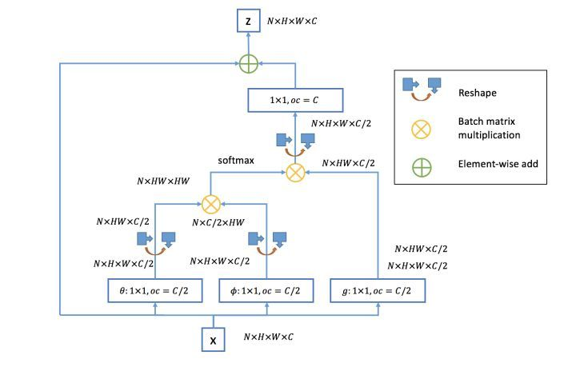
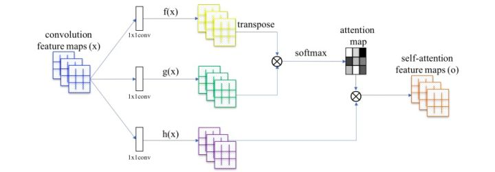
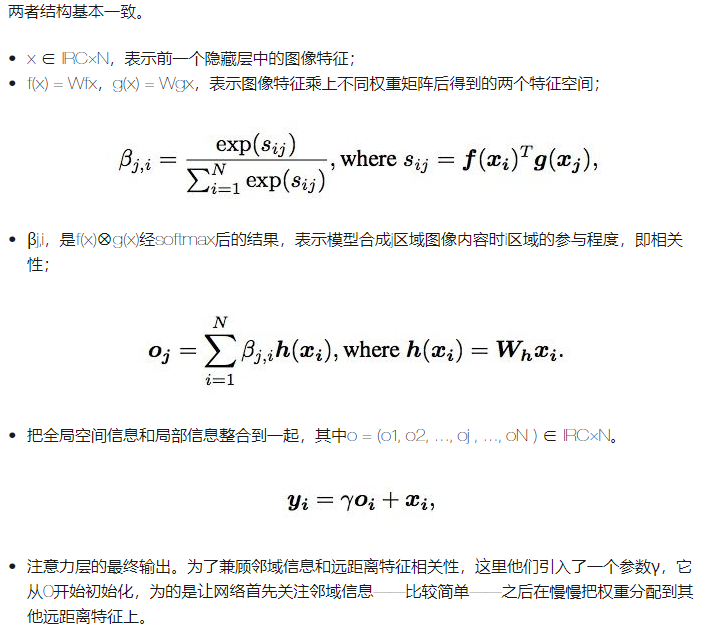
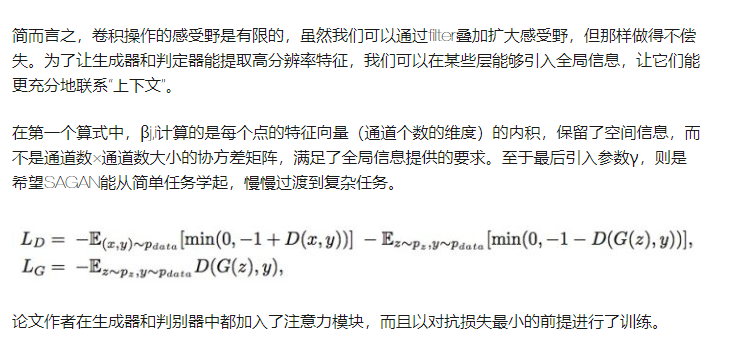
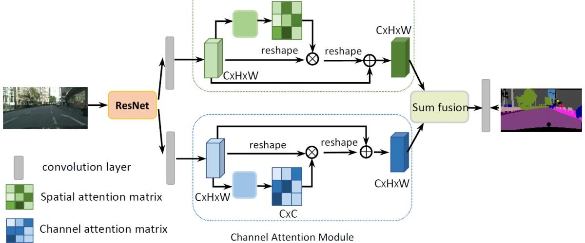
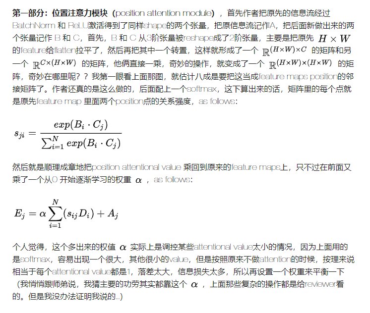
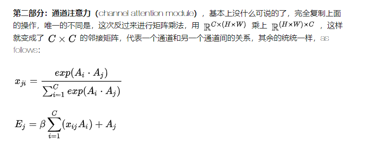
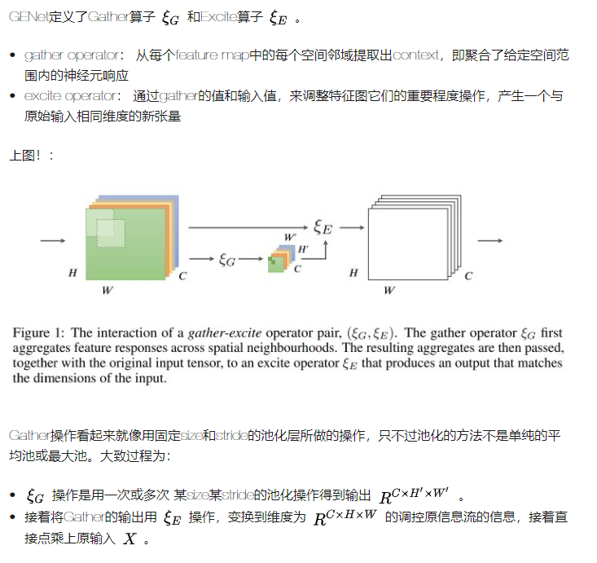
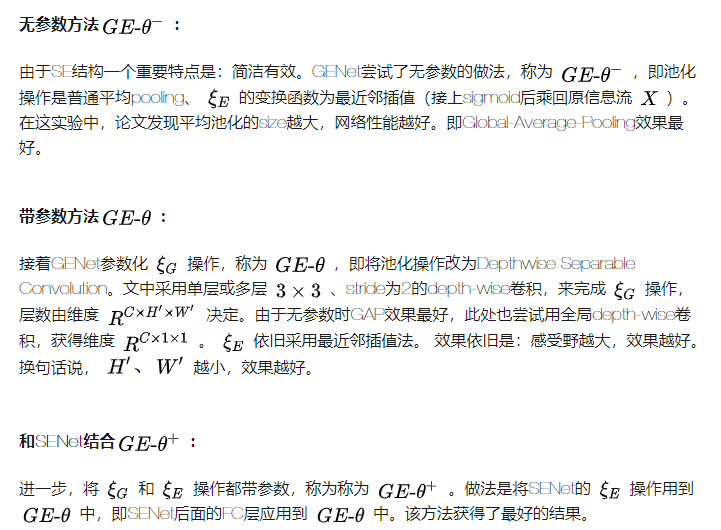
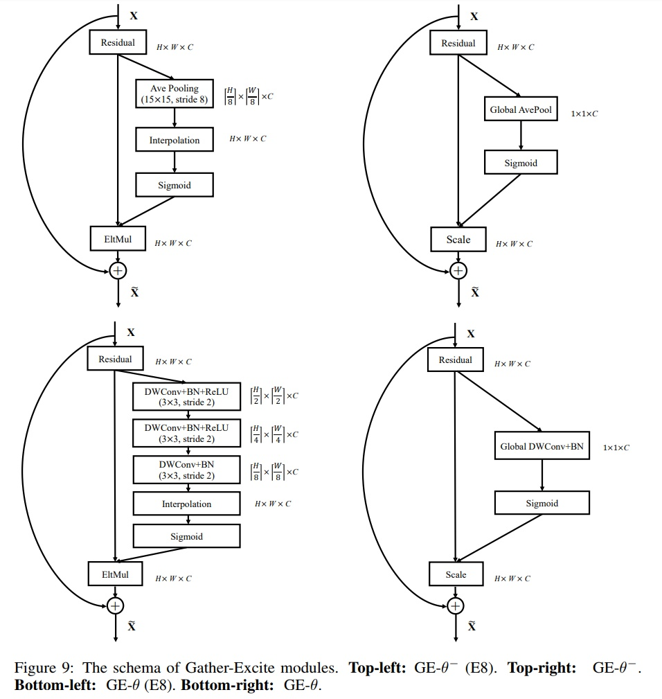

# Daily Thought (2019.7.1 - 2019.7.13)
**Do More Thinking!** ♈ 

**Ask More Questions!** ♑

**Nothing But the Intuition!** ♐

### 1.self attention机制三篇代表文章一览

主要目的：可以找到图像远距离的两个点之间的关系，不再像卷积那样只是局部的寻找关系，相当于增大了感受野。

以前模型的问题：

以前的模型在很大程度上依赖卷积操作模拟图像不同区域之间的依赖关系。每个卷积操作都有一个局部感受野（receptive field），而特征之间的远距离相关性往往要经过数个卷积层才会显现出来，这就为学习长期依赖带来了困难

- 如果模型过小，它可能无法学习相关性；
- 优化算法在调参时要仔细协调多层信息，实现难度大；
 即便调出最佳参数，如果输入模型从没见过的图像，模型的输出很可能会很糟糕。


文章：
- Non-local Neural Networks(https://arxiv.org/pdf/1711.07971.pdf)
- SAGAN Self Attention Generative Neural Network(https://arxiv.org/pdf/1805.08318.pdf)
- SE-Net Dual Attention Network for Scene Segmentation

**Non-local 的架构**



**SAGAN**

SAGAN的架构与non-local的基本一致







https://zhuanlan.zhihu.com/p/37277188

**SE-Net结构**



严格的来说是一种channel-wise attention和spital attention整合结构的设计。这本身还是算一种网络结构上的设计，目的是得到更优雅更effective的architecture

**attention机制**

attention机制首先我们把它认为是一种资源分配的机制，可以理解为对于原本平均分配的资源根据attentional对象的重要程度重新分配资源，重要的单位就多分一点，不重要或者不好的单位就少分一点，在DNN的结构设计中，attention所要分配的资源基本上就是权重了。

channel-wise attention和spital attention是在CNN结构设计当中特有的，最近几年还很火，不少CNN结构里都多多少少带了一点。

spital attention（视觉空间注意力机制），顾名思义，就是对于特征图上的每个位置进行attention调整，使模型关注到值得更多关注的区域上。

channel-wise attention（卷积通道注意力），比spital attention晚一点出来，但是也有点年头了，不过真正被带火还是因为SE-Net[1]，让我一度以为这篇文章就是channel-wise attention第一次被提出来。我们知道卷积网络的每一层都有好多卷积核，每个卷积核对应一个特征通道，相对于空间注意力机制，通道注意力在于分配各个卷积通道之间的资源，分配粒度上比前者大了一个级别。





**讨论**

作者把 feature maps position 间的关系和 channel-wise 的关系强行设置成单对单的两两关系，尽管邻接矩阵的design很很酷炫。但以上attention 对象之间的关系就真的只有 1 to 1 的两两关系吗？？这个值得商榷，且不说channel-wise之间可能存在 1对多，多对多的关系，在 position attention的时候，尤其是在较浅的层级，特征图还不是特别抽象的时候，比较接近于original input image，每个position 信号点所代表的位置都非常小，attention 的时候只关注单个signal之间的两两关系，有点不妥。

即便是中间经过了矩阵乘法，建模的是 1 对 多（all）的关系，那不是也跟用 fully connected layers 一样吗？


不过这种把原本需要黑盒建模的 CNNs internal relationship显式地抠出来，再“明明白白”地进行建模的操作，确实让review看起来很爽，也非常insight。

说道这里，还是赞叹SE-Net[1]优雅简洁的设计，channel-wise 的关系包含在那两层神秘而又包罗万象的 fully connected layers 里了。

https://zhuanlan.zhihu.com/p/54150694

### 2. GE-Net

Gather-Excite:Exploiting Feature Context in Convolutional Neural Networks

NIPS 2018 

SENet的改进版，更好地利用特征图空间上下文信息

虽然在深层网络中，特征提取器其感受野理论上已经大于输入图像大小，但是实际上，这特征提取器所作用的图像区域（实际感受野）却小很多[2]。这也就加深理解：利用好图像或特征图空间的上下文信息（feature context），能增强网络的性能。这在Inside-Outside Net[3]、ParseNet[4]、膨胀卷积[5]也可以得到证实。



**一些可选择的策略**





若GENet采用最大感受野，则它通过全局组卷积的方式，来获得最好的feature context。

在mxnet.gluon的实现时，用下面这层替代SE中的GAP层即可：
```
nn.Conv2D(C, kernel_size=(H,W),strides=(1,1)groups=C,use_bias=False)
```
这样每个特征图将与 W_c (HxW) 点乘后相加得到一个通道描述子。

如果不是采用最大感受野，那就调整下kernel_size和strides就行。GENet论文提供的源码:https://github.com/hujie-frank/GENet

GENet专注于如何从特征图中提取更有效的上小文，从而帮助对特征图间的信息进行调控。


在探索空间汇集特征上:
- SPM架构是空间局域汇集的较早提出者，他们是采用多级网格特征，手工固定汇集权重，生成特征金字塔。
- Learning smooth pooling regions for visual recognition提出参数化池化操作,定义了一些池化方法，学习优化其权重。
- Beyond spatial pyramids: Receptive field learning for pooled image features从空间中提取出过完备的局域，分别进行avg或max pooling得到过完备的感知域候选者，再训练分类器得到稀疏的子集，用于测试。
- Stochastic pooling for regularization of deep convolutional neural networks 随机池化方法，它是以按位置上的数值分配概率值，再以概率值来进行池化。
- 二阶池化(Semantic segmentation with second-order pooling)其比一阶池化（即AVG-pooling）具备更多的信息，替换普通网络的最后一层全局平均池化层，也能提高分类、语义分割、行为识别等任务上的精度。

https://zhuanlan.zhihu.com/p/54085213
