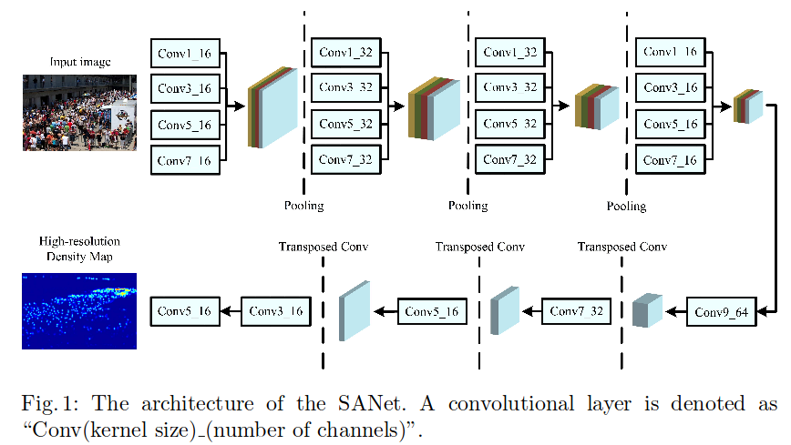
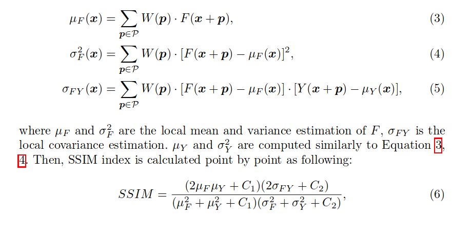
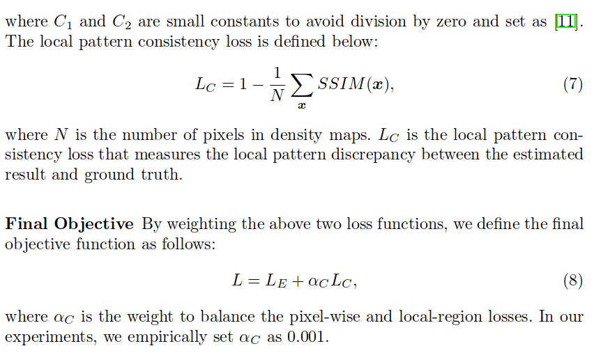

# Daily Thought (2019.7.14 - 2019.7.31)
**Do More Thinking!** ♈ 

**Ask More Questions!** ♑

**Nothing But the Intuition!** ♐
### 1.训练GAN的一些技巧
**1. 更多的filter**：

filter数目的增加将极大增加网络的参数量，通常来说，filter的数目越多越好

当使用很少的filter时，尤其生成器包含很少的filter时，生成的图像会特别模糊。所以，更多的filter能够获取更多的信息，并最终保证生成的图像具有足够的清晰度。

**2. 不要early stopping**

刚刚接触GAN的训练时，一个常见的错误：当我们发现损失值不变时，或者生成的图像一直模糊时，通常会终止训练，调整模型。这个时候我们也要注意一下，GAN的训练通常非常耗时，所以有时候多等一等会有意想不到的“收获”。
值得注意的是，当判别器的损失值快速接近0时，通常生成器很难学到任何东西了，就需要及时终止训练，修改网络、重新训练。

https://zhuanlan.zhihu.com/p/74663048

### 2.SANet (ECCV2018, Crowd Counting)
**Scale Aggregation Network for Accurate and Efficient Crowd Counting**

论文关键点：

- **multi-scale representation** is of great value for crowd counting task
- the crowd density estimation based approaches aim to **incorporate the spatial information** of crowd images.

说出了以往的crowd counting工作，核心就是**multi-scale的特征表示**，**以及空间信息的整合**

**以往工作的缺陷：**

- Multi-column的网络缺陷是scale的diversity完全是由column的数目决定

- 大多数工作的loss就是只有pixel-wise的Eculidean loss，但是生成的density map肯定不是每个pixel都是独立的，所以必然会导致模糊的情况，在图像生成领域只用这样一个loss肯定不太科学

- 有一些解决办法，就是附加一个adversarial loss来防止模糊，但是这样带来的问题就是会引入high-level信息，而且也会增加很多discriminator的计算量

**SANet主要是受到inception modules的启发**

利用scale aggregation modules in encoder去提升the representation ability and scale diversity of features

loss函数：
- Euclidean loss
- local pattern consistency loss （to exploit the local correlation in density maps）

**SANet的insights**

- multi-scale feature representations
- high-resolution density maps

结构：



使用了3个pooling层，降采样到原图的1/8大小

**提出的局部SSIM loss**

对生成的density map与ground truth都用11x11的gaussian kernel filter处理，得到的两个图像的均值，方差，参与计算SSIM，把这些局部的SSIM相加求平均，SSIM的值范围属于(-1，1)，local pattern consistency loss具体公式：





### 3.训练过程中最好的状况

每过一个epoch然后test一轮，test得到的metric稳定变好，类似这样, 这就说明参数很好：

```
100%|█████████████████████████████████████████| 423/423 [06:42<00:00,  1.10it/s]
100%|█████████████████████████████████████████| 119/119 [00:06<00:00, 19.52it/s]
epoch:6 scene:0 error:12.908884357003604
100%|█████████████████████████████████████████| 120/120 [00:06<00:00, 19.74it/s]
epoch:6 scene:1 error:34.05439680814743
100%|█████████████████████████████████████████| 120/120 [00:06<00:00, 19.89it/s]
epoch:6 scene:2 error:4.262372978528341
100%|█████████████████████████████████████████| 120/120 [00:05<00:00, 20.05it/s]
epoch:6 scene:3 error:21.219972960154216
100%|█████████████████████████████████████████| 120/120 [00:06<00:00, 20.16it/s]
epoch:6 scene:4 error:32.59304924805959
epoch:6 error:21.02125588959963 min_mae:19.604470044026193 min_epoch:4
100%|█████████████████████████████████████████| 423/423 [06:44<00:00,  1.10it/s]
100%|█████████████████████████████████████████| 119/119 [00:06<00:00, 14.65it/s]
epoch:7 scene:0 error:10.699510253778024
100%|█████████████████████████████████████████| 120/120 [00:06<00:00, 19.77it/s]
epoch:7 scene:1 error:28.620879582564037
100%|█████████████████████████████████████████| 120/120 [00:06<00:00, 19.88it/s]
epoch:7 scene:2 error:4.0876452922821045
100%|█████████████████████████████████████████| 120/120 [00:06<00:00, 19.81it/s]
epoch:7 scene:3 error:24.565539105733237
100%|█████████████████████████████████████████| 120/120 [00:06<00:00, 19.87it/s]
epoch:7 scene:4 error:28.884711265563965
epoch:7 error:19.38613480757393 min_mae:19.38613480757393 min_epoch:7
100%|█████████████████████████████████████████| 423/423 [06:42<00:00,  1.10it/s]
100%|█████████████████████████████████████████| 119/119 [00:05<00:00, 19.87it/s]
epoch:8 scene:0 error:8.834206977812181
100%|█████████████████████████████████████████| 120/120 [00:06<00:00, 19.95it/s]
epoch:8 scene:1 error:23.3993123571078
100%|█████████████████████████████████████████| 120/120 [00:06<00:00, 17.62it/s]
epoch:8 scene:2 error:4.91726580063502
100%|█████████████████████████████████████████| 120/120 [00:05<00:00, 20.11it/s]
epoch:8 scene:3 error:29.723037846883138
100%|█████████████████████████████████████████| 120/120 [00:06<00:00, 19.96it/s]
epoch:8 scene:4 error:24.97228194872538
epoch:8 error:18.385139206614042 min_mae:18.385139206614042 min_epoch:8
100%|█████████████████████████████████████████| 423/423 [06:42<00:00,  1.09it/s]
100%|█████████████████████████████████████████| 119/119 [00:06<00:00, 19.64it/s]
epoch:9 scene:0 error:8.840710732115417
100%|█████████████████████████████████████████| 120/120 [00:06<00:00, 19.74it/s]
epoch:9 scene:1 error:21.571629997094472
100%|█████████████████████████████████████████| 120/120 [00:05<00:00, 20.02it/s]
epoch:9 scene:2 error:4.984258516629537
100%|█████████████████████████████████████████| 120/120 [00:06<00:00, 19.98it/s]
epoch:9 scene:3 error:31.0109582901001
100%|█████████████████████████████████████████| 120/120 [00:06<00:00, 20.56it/s]
epoch:9 scene:4 error:23.65249671936035
epoch:9 error:18.027321869622487 min_mae:18.027321869622487 min_epoch:9
100%|█████████████████████████████████████████| 423/423 [06:45<00:00,  1.09it/s]
100%|█████████████████████████████████████████| 119/119 [00:06<00:00, 19.58it/s]
epoch:10 scene:0 error:7.2826555596680205
100%|█████████████████████████████████████████| 120/120 [00:06<00:00, 20.38it/s]
epoch:10 scene:1 error:18.143681446711224
100%|█████████████████████████████████████████| 120/120 [00:06<00:00, 19.54it/s]
epoch:10 scene:2 error:6.450200819969178
100%|█████████████████████████████████████████| 120/120 [00:06<00:00, 19.68it/s]
epoch:10 scene:3 error:37.119947624206546
100%|█████████████████████████████████████████| 120/120 [00:06<00:00, 20.05it/s]
epoch:10 scene:4 error:20.057794268925985
epoch:10 error:17.828432238360676 min_mae:17.828432238360676 min_epoch:10
100%|█████████████████████████████████████████| 423/423 [06:45<00:00,  1.10it/s]
100%|█████████████████████████████████████████| 119/119 [00:06<00:00, 20.33it/s]
epoch:11 scene:0 error:7.5706621739042905
100%|█████████████████████████████████████████| 120/120 [00:06<00:00, 19.59it/s]
epoch:11 scene:1 error:18.39623420238495
100%|█████████████████████████████████████████| 120/120 [00:06<00:00, 20.02it/s]
epoch:11 scene:2 error:6.236839707692464
100%|█████████████████████████████████████████| 120/120 [00:06<00:00, 19.96it/s]
epoch:11 scene:3 error:34.0715612411499
100%|█████████████████████████████████████████| 120/120 [00:05<00:00, 20.08it/s]
epoch:11 scene:4 error:20.275777022043865
epoch:11 error:17.32647455673982 min_mae:17.32647455673982 min_epoch:11
100%|█████████████████████████████████████████| 423/423 [06:43<00:00,  1.10it/s]
100%|█████████████████████████████████████████| 119/119 [00:05<00:00, 19.59it/s]
epoch:12 scene:0 error:6.988097379187576
100%|█████████████████████████████████████████| 120/120 [00:06<00:00, 19.93it/s]
epoch:12 scene:1 error:17.981695159276327
100%|█████████████████████████████████████████| 120/120 [00:06<00:00, 19.87it/s]
epoch:12 scene:2 error:6.577960745493571
100%|█████████████████████████████████████████| 120/120 [00:06<00:00, 19.89it/s]
epoch:12 scene:3 error:34.262095801035564
100%|█████████████████████████████████████████| 120/120 [00:06<00:00, 20.13it/s]
epoch:12 scene:4 error:19.86162854830424
epoch:12 error:17.151234087840542 min_mae:17.151234087840542 min_epoch:12
```

### 4. Multi-task任务中的问题
Multi-task learning 核心的问题通常是可简单分为两类：
- 1. How to share: 这里主要涉及到基于 multi-task learning 的网络设计。
- 2. Share how much: 如何平衡多任务的相关性使得每个任务都能有比 single-task training 取得更好的结果。


**网络设计和梯度平衡的关系**

无论是网络设计还是平衡梯度传播，我们的目标永远是让网络更好的学习到 transferable, generalisable feature representation 以此来缓解 over-fitting。为了鼓励多任务里多分享各自的 training signal 来学泛化能力更好的 feature，之前绝大部分研究工作的重点在网络设计上。直到去年才有陆续一两篇文章开始讨论 multi-task learning 里的 gradient balancing 问题


梯度统治: 

Gradient Domination在 multi-task learning 里又可根据 training data 的类别再次分为两类：
- one-to-many (single visual domain): 输入一个数据，输出多个标签。通常是基于 image-to-image 的 dense prediction。一个简单的例子，输入一张图片，输出 semantic segmentation + depth estimation。
- many-to-many (multi visual domain)：输入多个数据，输入各自标签。比如如何同时训练好多个图片分类任务。由于不同任务之间会有较大的差异，平衡梯度的目标是为了减缓任务本身的由于 variance, scale, complexity 不同而导致的差异。

在训练 multi-task 网络时候则会因为任务复杂度的差异出现一个现象，我把他称之为: Gradient Domination, 通常发生在 many-to-many 的任务训练中。因为图片分类可以因为图片类别和本身数据数量而出现巨大差异。而基于 single visual domain 的 multi-task learning 则不容易出现这个问题因为数据集是固定的。最极端的例子： MNIST + ImageNet 对于这种极端差异的多任务训练基本可以看成基于 MNIST initialisation 的网络对于 ImageNet 的 finetune。所以这种情况的建议就是：优先训练复杂度高的数据集，收敛之后再训练复杂度低的数据集。当然这种情况下，多任务学习也没有太大必要了。


multi-task learning 中， tasks之间彼此的相容性对结果也会有一些影响。当两个任务矛盾的时候， 往往结果会比单任务还要差不少。

Multi-task learning 还需要解决的是**Gradient domination的问题**。 

这个问题**产生的原因是不同任务的loss的梯度相差过大， 导致梯度小的loss在训练过程中被梯度大的loss所带走**。  

如果一开始就给不同的Loss进行加权， 让它们有相近的梯度， 是不是就能训练的好呢？   

结果往往不是这样的。 不同的loss， 他们的梯度在训练过程中变化情况也是不一样的；而且不同的loss, 在梯度值相同的时候， 它们在task上的表现也是不同的。在训练开始的时候，虽然balance了， 但是随着训练过程的进行， 中间又发生gradient domination了。  

**multi-task loss函数解决措施**

所以要想解决这个问题， 还是要合适地对不同loss做合适的均衡。实践中应该要如何调整呢？ 

其实很简单：假设我们有两个task, 用A和B表示。   

假设网络设计足够好， 容量足够大， 而且两个任务本身具有相关性，能够训得足够好。如果A和B单独训练， 他们在收敛的时候的梯度大小分别记为 Grad_a, Grad_b， 那么我们只需要在两个任务一起训练的时候， 分别用各自梯度的倒数（1/Grad_a, 1/Grad_b）对两个任务做平衡， 然后统一乘一个scalar就可以了。(根据单任务的收敛时候的loss梯度去确定multi-task训练中不同任务的权重。)因为loss的梯度在训练中通常会变小（这里用通常是因为一般mean square error等loss是这样， 其他有的Loss并不是。）， 如果我们确定这个网络在multi-task训练的时候能够达到原来的效果， 我们就只需要把平衡点设在两个任务都足够好的时候。 这样网络在训练过程中， 就自然能够达到那个平衡点， 即使一开始的时候会有gradient domination出现。

https://www.zhihu.com/question/268105631/answer/335246543
