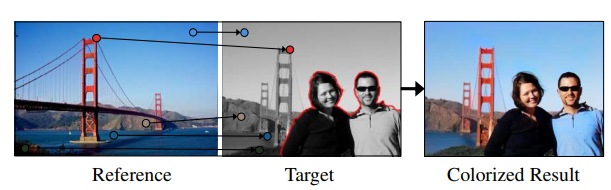
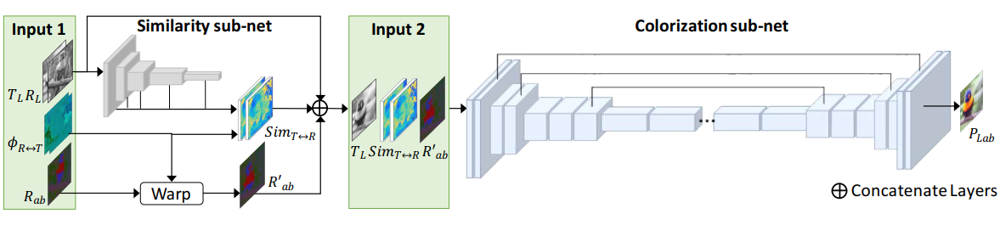
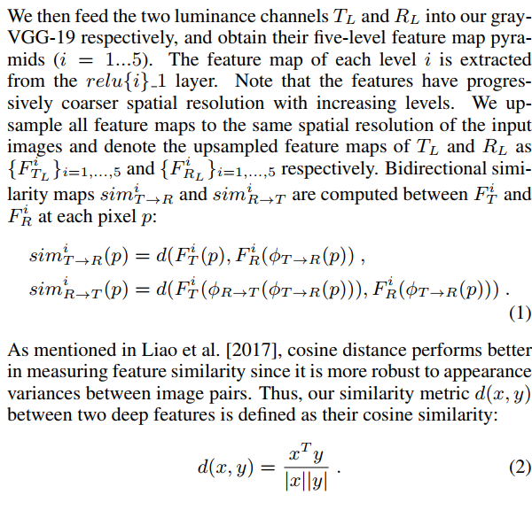
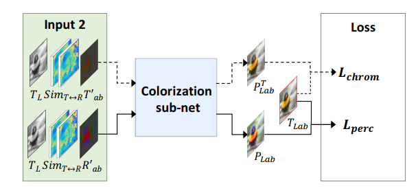
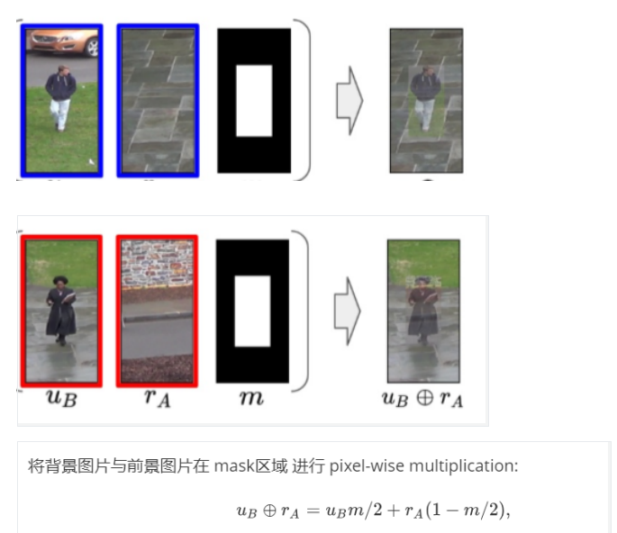
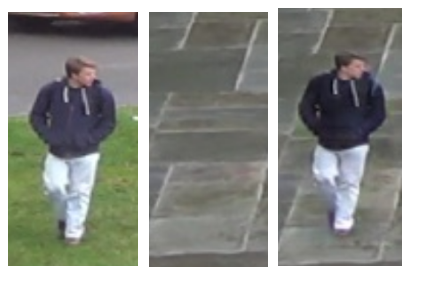
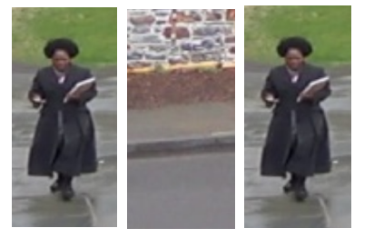
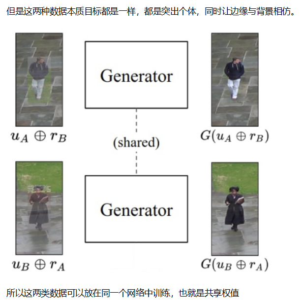

# Daily Thought (2019.6.1 - 2019.6.15)
**Do More Thinking!** ♈ 

**Ask More Questions!** ♑

**Nothing But the Intuition!** ♐

### 1. 论文 Deep Exemplar-based Colorization 基于参考样例来上色

**对于上色问题往往有一个问题就是，一般情况设计L1 loss因为会尝试去取一个中和的值，所以出来的颜色比较灰，暗淡**

**网络结构**

这里的参考图片保证与目标语义具有相关性

这里是很困难的去衡量reference与target，尤其是鉴于reference是彩色图，target是灰度图，为了解决这个问题使用了`gray-VGG-19`一个训练在图像分类任务的网络，这里只使用`luminance channel`去extract它们的特征，计算它们的特征之间的差异性

**对于上色问题，一般不是使用RGB颜色空间作为输入，而是使用CIE Lab颜色空间**

因为它是 **perceptually linear**

其次可以被分成为 a luminance channel L and two chrominance channels a and b

**输入维度**

- 灰度target image：H × W × 1
- color reference image： H x W x 3
- 双向映射函数: The bidirectional mapping function is a `spatial warping function` defined with bidirectional correspondences. It returns the transformed pixel location given a source location ”p”. The two functions are respectively denoted as φT->R (mapping pixels from T to R) and φR->T (mapping pixels from R to T )

有两个子网络：

- **The Similarity sub-net** computes the semantic similarities between the reference and the target, and outputs bidirectional similarity maps `simT<->R`
- **The Colorization sub-net** takes `simT<->R`, `T_L` and `R_ab` as the input, and outputs the predicted ab channels of the target `P_ab` 维度H×W×2, which are then combined with TL to get the colorized result `P_Lab` (P_L = T_L)

**similarity子网络**

双向相似maps计算方法：

前向相似性map `simT->R`反映了从T_L 到 R_L的匹配置信度

反向相似性map `simR->T`衡量了反向的匹配精确度

**colorization子网络**

输入是有13 channels，相似性map，每个方向各5个，因为vgg每层的feature

有两个branch：
- Chrominance branch： 网络学习去选择性的传播正确的reference color，依赖于how well T_L and R_L are matched?

### 2. Inserting Videos into Videos (CVPR 2019)

**主要任务就是提出一种思路将crop的个体插入到图片中**

**核心点1**：混合策略

**核心点2**：引入一个判别器来解决半监督策略的一个问题

对于`unpaired data`只用GAN loss监督

对于`paired data`用GAN loss, L1 loss , Perceptual loss监督

训练中最大的挑战在于训练数据是unpaired data 

真实数据中，是没有这样的成对数据（记作Real Pair，第三张图是合成出来的，数据中并不存在）：

只有这样的成对数据（记作Fake Pair）：

只是Real Pair的数据没有Ground Truth，监督的loss只能通过GAN loss

而对于Fake Pair的数据，有Ground Truth，所以监督可以有GAN loss, L1 loss, Perceptual loss

但是虽然Fake pair 与 Real pair数据合成任务是有一样目标的，但是因为loss的不同，在训练过程中，网络会通过自动学习到两者不同，并将两者区分开，网络会通过尝试区分开两者从而使每一类数据仅仅实现每一类数据的目标，也就导致Real pair的效果还是会比较差，但是Fake pair效果很好

这里解决办法就是尝试让网络区分开两类数据的这种行为变得更加困难，加一个判别器去判断合成结果的输入数据是属于Fake pair 类型 还是 Real pair类型，如果根据生成结果很容易判断出来是哪种类型，那么就说明生成结果不够好，就会加大生成器的loss，从而最终达到使Fake pair 与 Real pair输入网络得到的效果接近难以分辨的目的。
