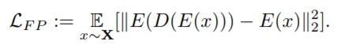
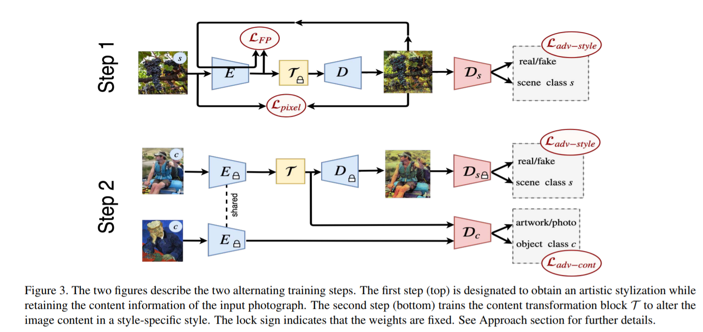
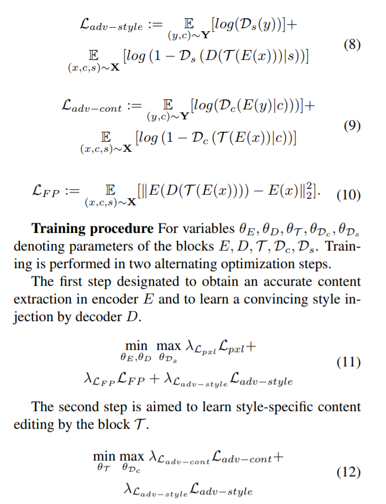
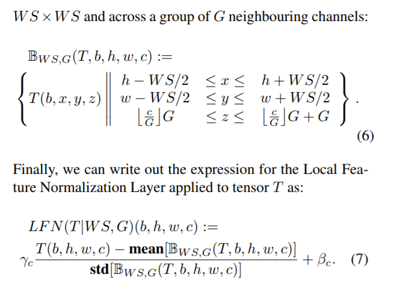

# Daily Thought (2019.6.20 - 2019.6.21)
**Do More Thinking!** ♈ 

**Ask More Questions!** ♑

**Nothing But the Intuition!** ♐

## CVPR 2019 Style Transfer 几篇论文
### 1. A Content Transformation Block For Image Style Transfer

**主要解决问题：**

当进行风格转换的时候，有时候图像内容也会发生比较大的转变，风格去影响了图片的颜色，形状，纹理特性，也会改变内容细节

因为**现阶段的风格转换算法其实没有任何的解释能力**，不能明确说明哪些部分应该保证内容不变，哪些部分应该保证风格转变

对于风格转换任务，普遍流程是：
- 降采样替换风格
- 合成风格图片
- 上采样

但是这几个任务不能被独立的学习与控制

本文就是为了解决这个问题，提出了一种`content transformation block`

**本文过程如下：**
- Force the encoder to explicitly extract content information
- The content transformation block T then modifies the content information in a manner appropriate to
the artist’s style
- Eventually the decoder superimposes the style on the altered content representation

本算法在transformation前后衡量风格图片与原本图片的内容相似性

本文观察发现，其实风格转换如果是`object-specific`会更加好一些，例如有些毕加索风格的鼻子会比较有特点，所以有这样的认识。

**之前风格转换中保证content信息尽量不变的loss设计：**

- perceptual loss

- fixpoint loss(FP loss)：让每个图片与经过风格化的图片 再经过style transfer的encoder，得到的style-specific encoding space得L2距离作为loss

**风格转换的至高境界：**

不仅想要去学习一个简单的风格化，更要学习一个content-specific的风格化，因为往往艺术家对于每个特定物体都有一个特定的画法

**本文方法**

本文目的是为了让属于同一类别class c的object representation更加closer

通过使用一个content transformation block，将encoder的结果`encoder representation` transform成为`object representation`

通过一个判别器discriminator区分real artworks’ content与input photographs之间object representation的区别

这里还需要提供一个内容信息c，使判别器对内容线索更加敏感

**流程**

阶段一：让`content transformation block`不参与训练，就是正常的风格转换，discriminator判断生成的图片是不是属于风格s

`风格对抗loss` + `前面提到的FP loss` + `per pixel l1 loss`

阶段二：让decoder与encoder不参与训练，只对content transformation block训练

discriminator有两个，第一个判断风格的不参与训练，只让判断内容的参与训练

**这篇文章核心亮点主要还是对style转换中，content的理解**

**现在普遍很多任务开始使用多个判别器训练，而且多阶段不同模块单独训练**

**关于content transformation block的结构**

concatenation of 9 "residual block"s

Each block consists of 6 consecutive blocks with a skip connection:

- `conv`-layer
- `LFN`-layer
- `lrelu`-layer
- `conv`-layer
- `LFN`-layer
- `lrelu`-layer

**LFN Local Feature Normalization Layer

局部区域，以小组channels内的normalization

