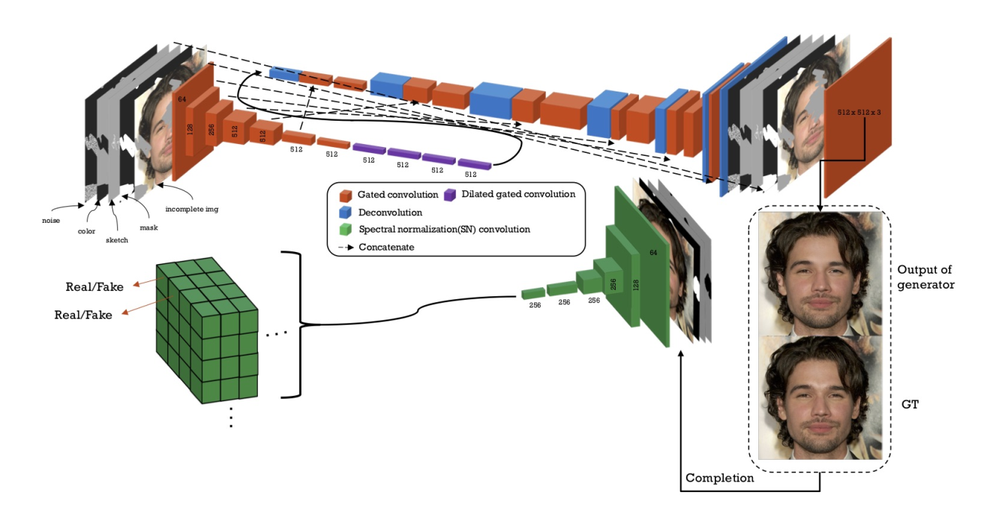
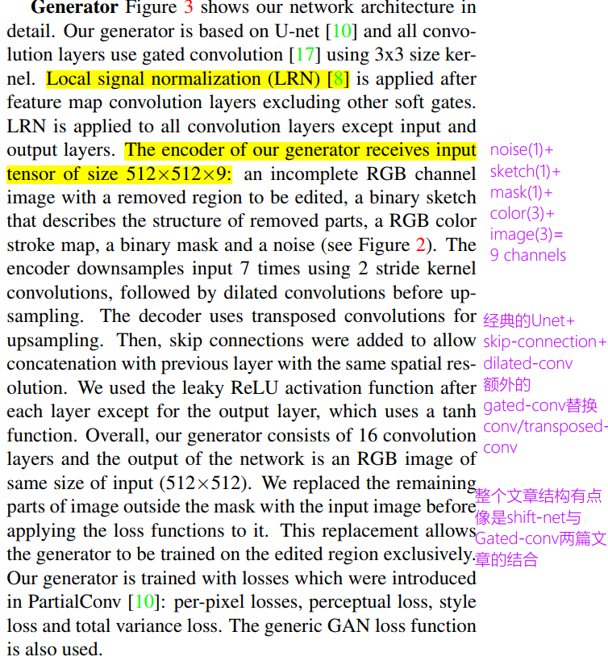
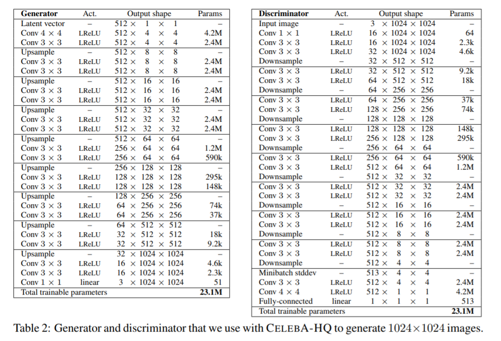
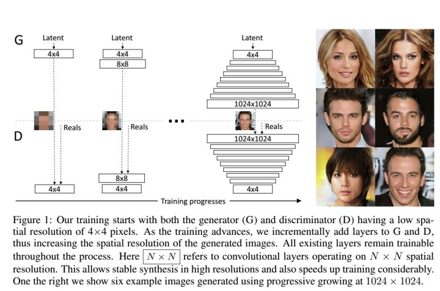
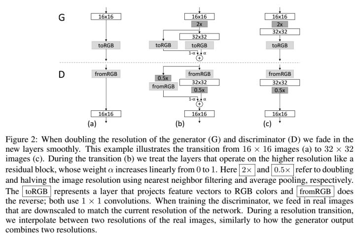
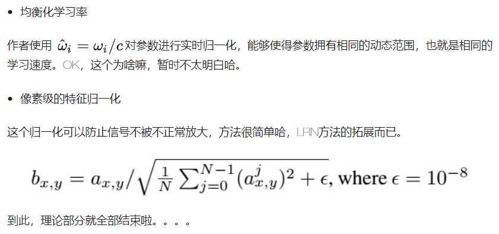

# Daily Thought (2019.3.1 - 2019.3.10)
**Do More Thinking!** ♈ 

**Ask More Questions!** ♑

**Nothing But the Intuition!** ♐

## FE-SNGAN论文收获
### 1.在论文中怎么画网络结构图？（3.1)


注意：选用这种字体比较好看，gated-conv, SN-conv, dilated-conv可以分颜色画出来

### 2.在论文中怎么说明网络结构？


具体网络结构可以在appendix中用表格列出



### 3. 

### 4. 论文: Progressive Growing of GANs for Improved Quality, Stabiity and Variation （ICLR2018）- 17年10月

解决的**问题**是：如果GAN要生成large resolution的图像，训练时只能被迫选用小的minibatch，因为memory limitation，以及为了training stablity.

本文的**贡献**是：

1). 将generator与discriminator从简单的low-resolution images，然后通过加一些layers让它们progressively般的成长，这些一层一层加进去的layers学习了很多higher resolutions的细节。

GAN的构想(formulation)其实没有明确要求resulting generative model能够代表完整的训练数据分布.

2). GAN习惯的常识(wisdom)就是trade-off between quality and variation. 所以有一些评价指标例如 inception score 和 MS-SSIM 等， 本文提出一种新的measuring evaluation 用于评价quality and variation

3). 提出一种机制，有效的解决了传统的mode collaspses，这种不健康的竞争导致梯度爆炸，generator网络 + discriminator网络的signal magnitudes 逐步升级(escalate).

**原来的GAN一步到位，所有图片大致内容结构 + fine scale details**

Progressive Growing GAN则是shift attention to increasingly finer scale details



当然在结构上，他们采用了类似残差结构来融合上一分辨率的图像和当前分辨率的图像



网络结构如下：


**GAN在训练过程有一个趋势，就是只capture training data中的一个子集的variation**

1.为了解决训练不稳定和G,D不良竞争的问题，提出两个tricks

2016 Salimans et al.提出**minibatch discrimination**作为解决办法

Compute feature statistics not only from individual images but also across the minibatch

所以在discriminiator后面加一个minibatch layer

本文提出一个简化版的解决：
We first compute the standard deviation for each feature in each spatial location over the minibatch. We then average these estimates over all features and spatial locations to arrive at a single value. We replicate the value and concatenate it to all spatial locations and over the minibatch, yielding one additional (constant) feature map. This layer could be inserted anywhere in the discriminator, but we have found it best to insert it towards the end.

所以上面的网络结构512层，变成513层

2.对生成器和判别器进行归一化



**Sliced Wasserstein distance （SWD）评价指标,替代Inception score + MS-SSIM**

```python
def sliced_wasserstein(A, B, dir_repeats, dirs_per_repeat):
    assert A.ndim == 2 and A.shape == B.shape                           # (neighborhood, descriptor_component)
    results = []
    for repeat in xrange(dir_repeats):
        dirs = np.random.randn(A.shape[1], dirs_per_repeat)             # (descriptor_component, direction)
        dirs /= np.sqrt(np.sum(np.square(dirs), axis=0, keepdims=True)) # normalize descriptor components for each direction
        dirs = dirs.astype(np.float32)
        projA = np.matmul(A, dirs)                                      # (neighborhood, direction)
        projB = np.matmul(B, dirs)
        projA = np.sort(projA, axis=0)                                  # sort neighborhood projections for each direction
        projB = np.sort(projB, axis=0)
        dists = np.abs(projA - projB)                                   # pointwise wasserstein distances
        results.append(np.mean(dists))                                  # average over neighborhoods and directions
    return np.mean(results)                                             # average over repeats
```

https://www.zhihu.com/question/67483407

### 5. 评价图像的生成质量+生成图像的丰富性

Inception score 请移步Salimans et al. 的Improved techniques for training GANs的第四节

multi-scale structural similarity 移步Wang等的高引用论文Multi-Scale Structural Similarity for Image Quality Assessment

Sliced Wasserstein distance （SWD）在Rabin et al.2011有公式定义

（需要看这篇论文再更进一步了解）

### 6. 论文：GAN Dissection: Visualizing and Understanding Generative Adversarial Networks
本文主要目的：就是通过对GAN内部的represenations可视化，从来解释很多GAN产生的很多无法解释的问题样本。

我们作为一个human observer，我们希望直观的了解为什么门会出现在建筑物上而不是树上
