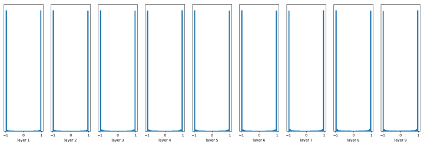
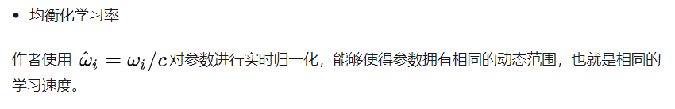
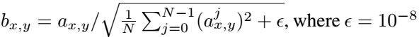

# Daily Thought (2019.3.1 - 2019.3.10)
**Do More Thinking!** ♈ 

**Ask More Questions!** ♑

**Nothing But the Intuition!** ♐

## FE-SNGAN论文收获
### 1.在论文中怎么画网络结构图？（3.1)


注意：选用这种字体比较好看，gated-conv, SN-conv, dilated-conv可以分颜色画出来

### 2.在论文中怎么说明网络结构？


具体网络结构可以在appendix中用表格列出


### 3. 

## Progressive Growing of GANs for Improved Quality, Stabiity and Variation （ICLR2018）- 17年10月

### 4. 论文概述

解决的**问题**是：如果GAN要生成large resolution的图像，训练时只能被迫选用小的minibatch，因为memory limitation，以及为了training stablity.

本文的**贡献**是：

1). 将generator与discriminator从简单的low-resolution images，然后通过加一些layers让它们progressively般的成长，这些一层一层加进去的layers学习了很多higher resolutions的细节。

GAN的构想(formulation)其实没有明确要求resulting generative model能够代表完整的训练数据分布.

2). GAN习惯的常识(wisdom)就是trade-off between quality and variation. 所以有一些评价指标例如 inception score 和 MS-SSIM 等， 本文提出一种新的measuring evaluation 用于评价quality and variation

3). 提出一种机制，有效的解决了传统的mode collaspses，这种不健康的竞争导致梯度爆炸，generator网络 + discriminator网络的signal magnitudes 逐步升级(escalate).

### 5. Progressive Growing 策略

**原来的GAN一步到位，所有图片大致内容结构 + fine scale details**

Progressive Growing GAN则是shift attention to increasingly finer scale details


当然在结构上，他们采用了类似残差结构来融合上一分辨率的图像和当前分辨率的图像


网络结构如下：


### 6. Minibatch standard deviation（Minibatch stddev 层）

**GAN在训练过程有一个趋势，就是只capture training data中的一个子集的variation**

2016 Salimans et al.提出**minibatch discrimination**作为解决办法

差不多思路就是计算结果的统计特征，不仅仅从individual image，而且也从整个minibatch计算。

做法也就是在discriminiator后面加一个**minibatch layer**

本文提出一个简化版的解决：
- **Compute stddev**: We first compute the standard deviation (标准差) for each feature in each **spatial location** over the minibatch. 
- **Average**: We then average these estimates over all features and spatial locations to arrive at a single value. 
- **Concatenate**: We replicate the value and concatenate it to all spatial locations and over the minibatch, yielding one additional (constant) feature map. 
- **Insert it to end**: This layer could be inserted anywhere in the discriminator, but we have found it best to insert it towards the end.


所以上面的网络结构512层，变成513层，因为将原来层与前面计算的整个minibatch的统计特征层concatenate在一起（512+1=513）

### 7.权值初始化(Weight Initialization)的回顾以及一种改进的权值调整策略

**事实上，如果训练过程中有动态normalization策略的话，权值初始化就没有显得那么必要了。

**Random Initalization 随机初始化**

例如：均值为0，标准差为0.01, 非线性变换为tanh，经历10层神经网络，这样的权值初始化就会造成gradient越来越小。

每一层输出分布的直方图：


如果调整，均值为0，标准差为1，那么：



神经元就会saturated了

**Xavier Initialization**

Xavier初始化的基本思想是保持输入和输出的方差一致，这样就避免了所有输出值都趋向于0

```python
W = tf.Variable(np.random.randn(node_in, node_out)) / np.sqrt(node_in)
```

Xavier初始化的推导过程是基于线性函数的，但是它在一些非线性神经元中也很有效，例如tanh


但是对于有些函数例如ReLU，效果就没那么理想了


前面看起来还不错，后面的趋势却是越来越接近0

**He Initialization**

专门用来解决ReLU初始化的问题，在ReLU网络中，假定每一层有一半的神经元被激活，另一半为0，所以，要保持variance不变，只需要在Xavier的基础上再除以2.

```python
W = tf.Variable(np.random.randn(node_in,node_out)) / np.sqrt(node_in/2)
......
fc = tf.nn.relu(fc)
```


**本文**

不使用当前的那些careful (考虑周到的) weight initialization，而是使用`N(0, 1)`正态分布的权值初始化，之后明确的去scale weight在运行过程中



c is the per-layer normalization constant from He’s initializer

这样做的优势就是动态的调整权重值，而不是只是权值在初始化的时候调整，那样影响比较subtle微小。

这样的方法类似于训练过程中的weight normalization的感觉

These methods normalize a gradient update by its estimated standard deviation, thus making the update independent of the scale of the parameter.

**使用这种方法的话，可以使得learning speed is the same for all weights.**

### 8. Pixelwise feature vector normalization 针对GAN的归一化策略

**关于GAN里面的normalization，为什么GAN不使用batch normalization**：

GAN很容易造成signal magnitudes escalation (也就是信号参数的量级爆炸)，这样就会导致两个网路generator与discriminator之间不健康的竞争

早期的方法都是用batch normalization的变体，但是batch normalization主要是为了消除covariate shift, 但是这个问题没有怎么在GAN中发现。

**GAN中最需要的其实是，限制signal magnitudes 以及 控制良好的competition**

**上面那种weight initialization策略以及下面这种normalization策略都可以在不引入参数的情况下有效达到上面的两个目的**

为了阻止the magnitudes in generator and discriminator spiral out of control

做法：Normalize the feature vector in each pixel to unit length in the generator after each convolutional layer

使用的是Local Response Normalization (LRN) 的变体




### 9. Sliced Wasserstein distance （SWD）作为GAN的评价指标
**衡量图像生成质量与生成多样性 替代Inception score + MS-SSIM**

**Inception score** 请移步Salimans et al. 的Improved techniques for training GANs的第四节

**multi-scale structural similarity** 移步Wang等的高引用论文Multi-Scale Structural Similarity for Image Quality Assessment

**Sliced Wasserstein distance（SWD）** 在Rabin et al.2011有公式定义

code：
```python
def sliced_wasserstein(A, B, dir_repeats, dirs_per_repeat):
    assert A.ndim == 2 and A.shape == B.shape                           # (neighborhood, descriptor_component)
    results = []
    for repeat in xrange(dir_repeats):
        dirs = np.random.randn(A.shape[1], dirs_per_repeat)             # (descriptor_component, direction)
        dirs /= np.sqrt(np.sum(np.square(dirs), axis=0, keepdims=True)) # normalize descriptor components for each direction
        dirs = dirs.astype(np.float32)
        projA = np.matmul(A, dirs)                                      # (neighborhood, direction)
        projB = np.matmul(B, dirs)
        projA = np.sort(projA, axis=0)                                  # sort neighborhood projections for each direction
        projB = np.sort(projB, axis=0)
        dists = np.abs(projA - projB)                                   # pointwise wasserstein distances
        results.append(np.mean(dists))                                  # average over neighborhoods and directions
    return np.mean(results)                                             # average over repeats
```

https://www.zhihu.com/question/67483407


### 10. 论文：GAN Dissection: Visualizing and Understanding Generative Adversarial Networks
本文主要目的：就是通过对GAN内部的represenations可视化，从来解释很多GAN产生的很多无法解释的问题样本。

我们作为一个human observer，我们希望直观的了解为什么门会出现在建筑物上而不是树上
