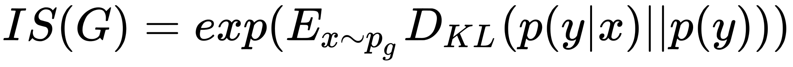
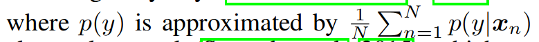
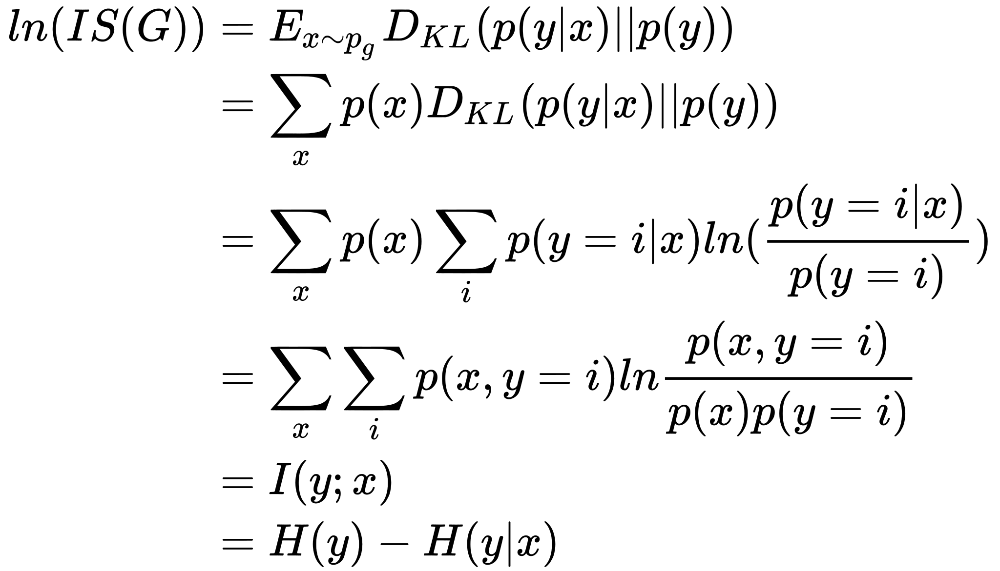
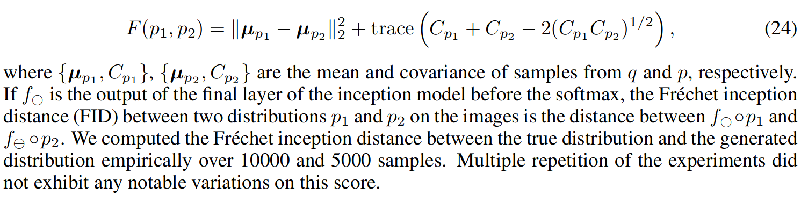

# Daily Thought (2019.3.6 - 2019.3.18)
**Do More Thinking!** ♈ 

**Ask More Questions!** ♑

**Nothing But the Intuition!** ♐

### 1.反卷积的两种理解方式
**方式1**：


完全可以看成为，先进行比例放缩，在卷积，替代实现如下：
```python
x = torch.nn.functional.interpolate(input, scale_factor=2)
x = conv2d(x)
```

**方式2**：
反卷积又名Fractionally Strided Convolution，也就是步长为分数的卷积。

我们知道步长大于1，一般可以达到降采样的效果，那么把反卷积说成步长为分数的卷积，也就可以达到上采样的效果了。


### 2.LocalResponseNormlization (LRN) 局部响应归一化

提出于NIPS2012,ImageNet Classification with Deep ConvolutionalNeural Networks,也就是Alexnet

**Alexnet的主要的贡献：**

- 1. 成功使用**ReLU作为CNN的激活函数**，并验证其效果在较深的网络超过了Sigmoid，成功解决了Sigmoid在网络较深时的梯度弥散问题。虽然ReLU激活函数在很久之前就被提出了，但是直到AlexNet的出现才将其发扬光大。

- 2. 训练时使用**Dropout**随机忽略一部分神经元，以避免模型过拟合。Dropout虽有单独的论文论述，但是AlexNet**将其实用化**，通过实践证实了它的效果。在AlexNet中主要是最后几个全连接层使用了Dropout。

- 3. 在CNN中使用**重叠的最大池化**。此前CNN中普遍使用平均池化，AlexNet全部使用最大池化，避免平均池化的模糊化效果。并且AlexNet中提出让步长比池化核的尺寸小，这样池化层的输出之间会有重叠和覆盖，提升了特征的丰富性。

- 4. 提出了**LRN**层，对局部神经元的活动创建竞争机制，使得其中响应比较大的值变得相对更大，并抑制其他反馈较小的神经元，增强了模型的泛化能力。

**LRN介绍**

公式：


其中这个a_x,y就表示网络层中的一个输入元素，[b,c,x,y]可以理解成在某一张图中的某一个通道下的某个高度和某个宽度位置的点，即第b张图的第c个通道下坐标为(x,y)的点。

`a`,`n/2`,`k`,`α`,`β`分别表示函数中的input,depth_radius,bias,alpha,beta，其中`n/2`,`k`,`α`,`β`都是自定义的，特别注意一下∑叠加的方向是沿着通道方向的,也就是一个点同方向的前面n/2个通道（最小为第0个通道）和后n/2个通道（最大为第d-1个通道）的点的平方和(共n+1个点)

简单的示意图:


https://blog.csdn.net/sinat_21585785/article/details/75087768

**LRN的一种变体**


可以在不引入参数的情况下，实现local Responce Normalization

**标准LRN实现**

pytorch实现：

`torch.nn.LocalResponseNorm`

Args:

- size: amount of neighbouring channels used for normalization
- alpha: multiplicative factor. Default: 0.0001
- beta: exponent. Default: 0.75
- k: additive factor. Default: 1

Shape:
- Input: :math:`(N, C, ...)`
- Output: :math:`(N, C, ...)` (same shape as input)

```python
>>> lrn = nn.LocalResponseNorm(2)
>>> signal_2d = torch.randn(32, 5, 24, 24)
>>> output_2d = lrn(signal_2d)
```

tensorflow实现：

`tf.nn.local_response_normalization`/`tf.nn.lrn`

```python
tf.nn.lrn(
    input,
    depth_radius=5,
    bias=1,
    alpha=1,
    beta=0.5,
    name=None
    )
```

### 3.关于训练与测试阶段输入Tensor的尺寸问题

一般而言对于网络中的卷积，其实不需要规范h, w两个维度的，只有在stride步长不等于1的时候，可能h, w会以2的倍数整倍增加

**对于训练阶段**，一般习惯上将图像尺寸设置为统一的，而且因为要下采样的缘故，所以一般将图片设置为256x256或者512x512甚至1024x1024

可能有些数据集图片并不一定是统一的尺寸，只需要进行一些预处理就可以得到统一的图像尺寸，放入一起训练

**对于测试阶段**，并不一定要求输入图像尺寸与训练时的所有图像尺寸统一。

对于tensorflow代码，可能你在测试的模型代码中把输出tensor的shape其中的，h， w维度设置成None，这样并不影响什么，因为tensorflow会根据你的输入以及函数功能自动生成输出的Tensor。

对于Pytorch完全不用考虑输入尺寸这个指定的问题了。

### 4.评估GAN合成图片的度量，Inception Score, Frechet inception distance(FID)

> 2019-Mar-1.10 提到了PSNR，SSIM，以及替代IS，SSIM的新指标：Sliced Wasserstein distance（SWD）

##### Inception Score

Inception score is introduced originally by Salimans et al. (2016)





p(y|x) is a trained Inception convolutional neural network

推导出上式的意义：



我们可以得到要使得生成图像的inception score高，就需要：

**1.最大化H(y);也就是对于输入的样本，通过inception_v3模型后的类别要均衡，衡量模式坍塌。**

**2.最小化H(y|x);说明对于输入的样本，通过inception_v3模型后预测某类别的置信度要高，衡量图片生成的质量。**

Barratt, Shane, and Rishi Sharma. "A Note on the Inception Score."arXiv preprint arXiv:1801.01973(2018).

衡量图片的生成质量是一个比较难的问题，一直以来也没有一个特别好的度量方式

inception score的思想，是通过将生成模型的评估问题，通过映射到分类器上，以此来简化评估的难易程度，是一个非常好的创新。当然这种映射必然存在的问题就是信息的丢失。

真实图片的inception_score是肯定比较高的，但是inception score高并不能代表生成的质量就好。(最简单的例子就是通过adversarial samples,可以通过简单的生成每个类的特征图谱，看似噪声的图像，但是其inception score会很高。)

https://www.zhihu.com/question/297551781/answer/506852113

##### Frechet Inception Distance (FID)
提出于Frechet inception distance (Heusel et al., 2017)

是一种衡量生成样例质量的方法，主要使用应用于生成样例的 inception model 的 final layer 的 2nd order information.

The Frechet distance (Dowson & Landau (1982)) is **2-Wasserstein distance** between two distribution p1 and p2 assuming they are both multivariate Gaussian distributions




