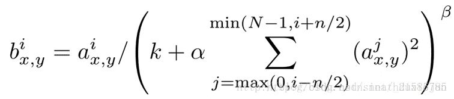

# Daily Thought (2019.3.6 - 2019.3.13)
**Do More Thinking!** ♈ 

**Ask More Questions!** ♑

**Nothing But the Intuition!** ♐

### 1.反卷积的两种理解方式
**方式1**：


完全可以看成为，先进行比例放缩，在卷积，替代实现如下：
```python
x = torch.nn.functional.interpolate(input, scale_factor=2)
x = conv2d(x)
```

**方式2**：
反卷积又名Fractionally Strided Convolution，也就是步长为分数的卷积。

我们知道步长大于1，一般可以达到降采样的效果，那么把反卷积说成步长为分数的卷积，也就可以达到上采样的效果了。


### 2.LocalResponseNormlization (LRN) 局部响应归一化

提出于NIPS2012,ImageNet Classification with Deep ConvolutionalNeural Networks,也就是Alexnet

**Alexnet的主要的贡献：**

- 1. 成功使用**ReLU作为CNN的激活函数**，并验证其效果在较深的网络超过了Sigmoid，成功解决了Sigmoid在网络较深时的梯度弥散问题。虽然ReLU激活函数在很久之前就被提出了，但是直到AlexNet的出现才将其发扬光大。

- 2. 训练时使用**Dropout**随机忽略一部分神经元，以避免模型过拟合。Dropout虽有单独的论文论述，但是AlexNet**将其实用化**，通过实践证实了它的效果。在AlexNet中主要是最后几个全连接层使用了Dropout。

- 3. 在CNN中使用**重叠的最大池化**。此前CNN中普遍使用平均池化，AlexNet全部使用最大池化，避免平均池化的模糊化效果。并且AlexNet中提出让步长比池化核的尺寸小，这样池化层的输出之间会有重叠和覆盖，提升了特征的丰富性。

- 4. 提出了**LRN**层，对局部神经元的活动创建竞争机制，使得其中响应比较大的值变得相对更大，并抑制其他反馈较小的神经元，增强了模型的泛化能力。

**LRN介绍**

公式：



其中这个a_x,y就表示网络层中的一个输入元素，[b,c,x,y]可以理解成在某一张图中的某一个通道下的某个高度和某个宽度位置的点，即第b张图的第c个通道下坐标为(x,y)的点。

`a`,`n/2`,`k`,`α`,`β`分别表示函数中的input,depth_radius,bias,alpha,beta，其中`n/2`,`k`,`α`,`β`都是自定义的，特别注意一下∑叠加的方向是沿着通道方向的,也就是一个点同方向的前面n/2个通道（最小为第0个通道）和后n/2个通道（最大为第d-1个通道）的点的平方和(共n+1个点)

简单的示意图:


https://blog.csdn.net/sinat_21585785/article/details/75087768

**LRN的一种变体**


可以在不引入参数的情况下，实现local Responce Normalization

**标准LRN实现**

pytorch实现：

`torch.nn.LocalResponseNorm`

Args:

- size: amount of neighbouring channels used for normalization
- alpha: multiplicative factor. Default: 0.0001
- beta: exponent. Default: 0.75
- k: additive factor. Default: 1

Shape:
- Input: :math:`(N, C, ...)`
- Output: :math:`(N, C, ...)` (same shape as input)

```python
>>> lrn = nn.LocalResponseNorm(2)
>>> signal_2d = torch.randn(32, 5, 24, 24)
>>> output_2d = lrn(signal_2d)
```

tensorflow实现：

`tf.nn.local_response_normalization`/`tf.nn.lrn`

```python
tf.nn.lrn(
    input,
    depth_radius=5,
    bias=1,
    alpha=1,
    beta=0.5,
    name=None
```

