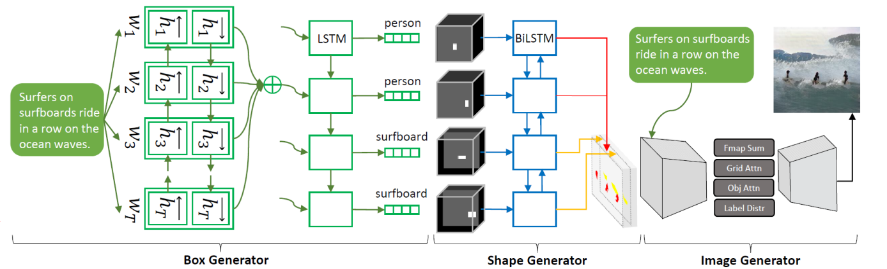
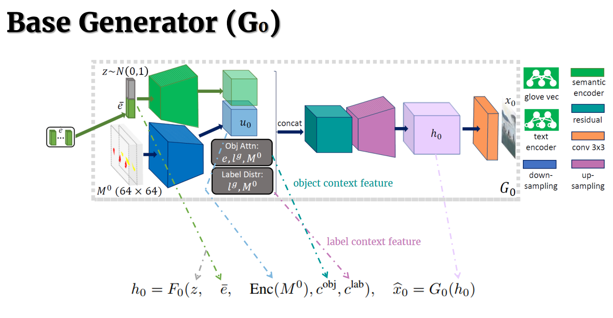
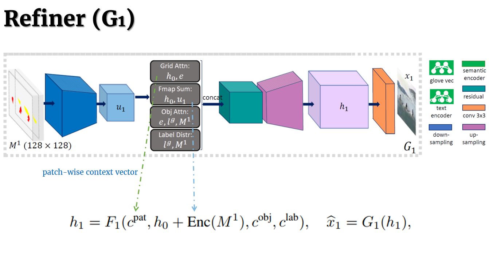
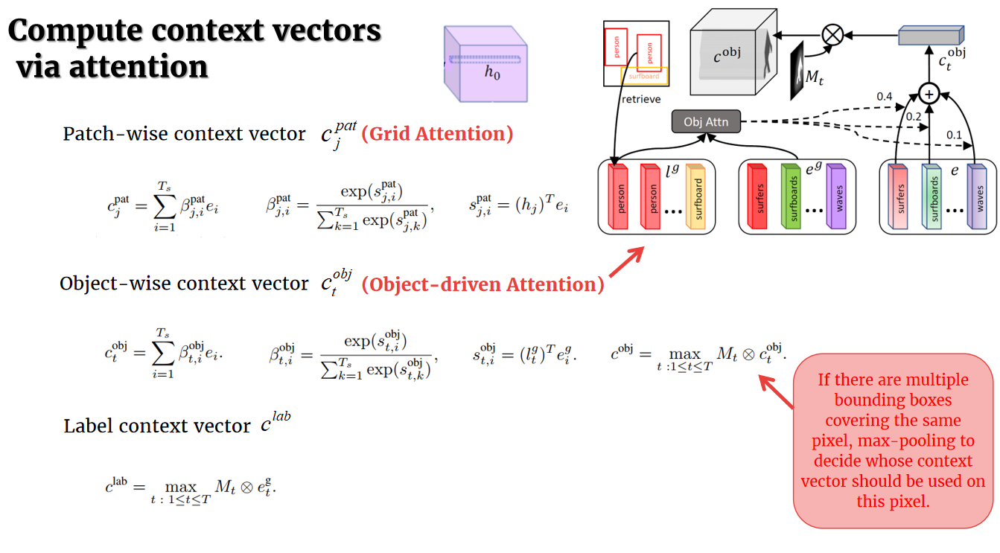
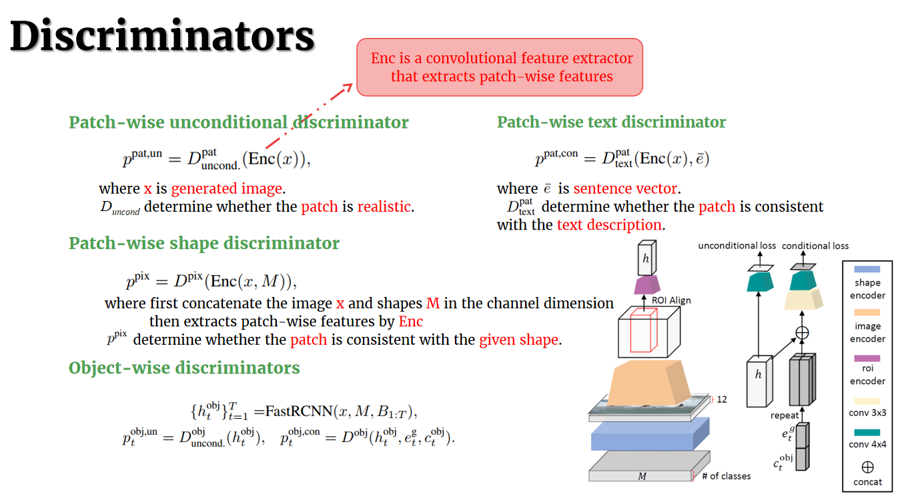
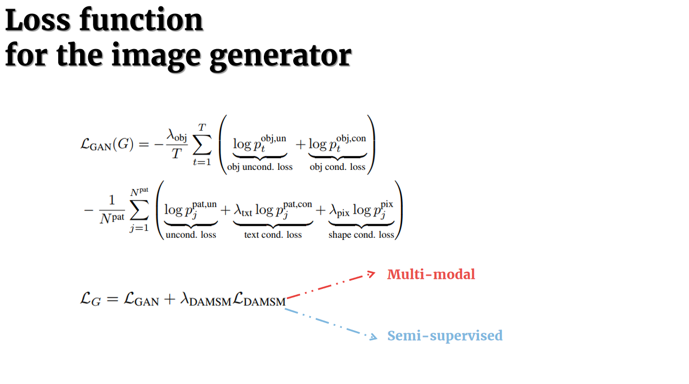

# Daily Thought (2019.3.18 - 2019.3.21)
**Do More Thinking!** ♈ 

**Ask More Questions!** ♑

**Nothing But the Intuition!** ♐

## 论文 Object-driven Text-to-Image Synthesis via Adversarial Training （obj-GAN） （CVPR2019）精读

#### 文本合成图像

文章主要分为两个阶段，第一阶段是 `word vectors` 转成 `bounding box`，以及 `shape`， 对应的 `label`.

总的来说就是生成符合语义的 semantic layout

第二阶段就是根据 semantic layout 以及前一阶段的 word vectors 之后合成图片

主要说一下Image Generator部分，多阶段Encoder-Decoder结构

分为Base Generator(G0) 与 Refiner(G1), 网络结构分别如下：

主要核心贡献就是object-driven attention机制

类似于softmax的方式来计算每个单词与当前object相关性的权重

判别器与loss函数如下：

## 论文 GAN DISSECTION: VISUALIZING AND UNDERSTANDING GENERATIVE ADVERSARIAL NETWORKS （ICLR2019）略读

