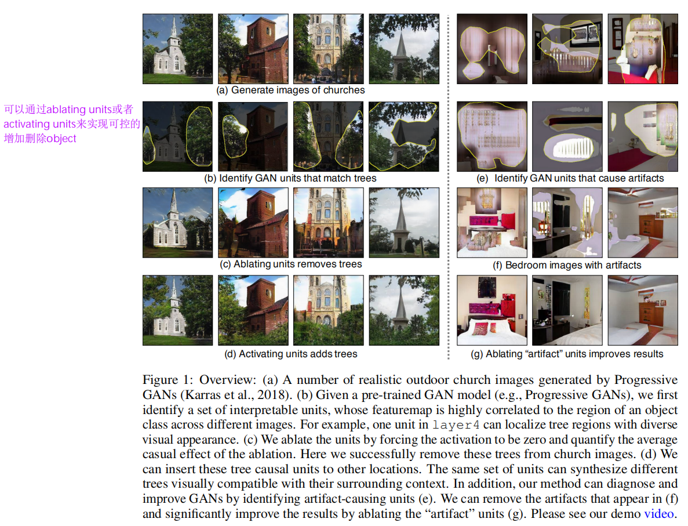
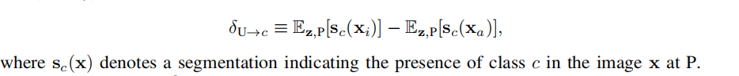

# Daily Thought (2019.3.18 - 2019.3.21)
**Do More Thinking!** ♈ 

**Ask More Questions!** ♑

**Nothing But the Intuition!** ♐

## 论文 Object-driven Text-to-Image Synthesis via Adversarial Training （obj-GAN） （CVPR2019）略读

#### 文本合成图像

文章主要分为两个阶段，第一阶段是 `word vectors` 转成 `bounding box`，以及 `shape`， 对应的 `label`.

总的来说就是生成符合语义的 semantic layout

第二阶段就是根据 semantic layout 以及前一阶段的 word vectors 之后合成图片

主要说一下Image Generator部分，多阶段Encoder-Decoder结构

分为Base Generator(G0) 与 Refiner(G1), 网络结构分别如下：

主要核心贡献就是object-driven attention机制

类似于softmax的方式来计算每个单词与当前object相关性的权重

判别器与loss函数如下：

## 论文 GAN DISSECTION: VISUALIZING AND UNDERSTANDING GENERATIVE ADVERSARIAL NETWORKS （ICLR2019）略读

文章的introduction写的非常好，本文的目的就是研究GAN的内部representation，例如:去解释一个门为什么出现在一个building上而不是一个tree上。
### 主要贡献

1.提出一种方法去visualizing and understanding GANs 在不同的抽象level上， 从每个neuron，到每个object，到不同物体之间的contextual relationship.

2.能够去manipulating images with interactive object-level control

### 主要方法

这篇文章主要是分析：object(such as tree) 是怎样被生成器G 的 internal representation 编码的（encoded）

用`r`表示生成器generator中间某层的的tensor, `z`表示latent vector，`x`表示 `HxWx3` 的生成图片

我们有一个类class C在图像中

`r`包含所有产生图片x的必要数据, `r`也包含着信息去deduce（引起）任何可能在图片中出现的类，

所以问题不是要知道是否关于class C的信息被presented在`r`里面，而是这样的信息怎样被编码在r里面

对于r在location P可能由两部分组成

- unit相当于feature map的一个channel
- U表示the set of unit indices of interest
- U补集就表示complement

**匹配出来与类别C最相关的一些unit**

对于每个unit也就是feature map的一个channel，经过上采样得到一个与生成图片相同分辨率的map，其中与类别c产生高响应值（超过一定阈值）这样的区域 与 生成图片关于类别c的语义分割区域 相计算得到IoU值，用这个IoU值来排序，存在IoU值的unit，就认为是有关联的Unit.

经过这个阶段可以匹配出来与某一个class有关的channels

**事实上，只进行上面的做法并不是具有太多实际意义**

**一个最终输出的output，肯定不会只与一个unit相关，肯定是依赖于一组units，也就是一组channels，所以我们需要一种方式去identity combinations of units cause the object.**

所以我们需要测试：whether a set of units U in r cause the generation of c by forcing the units of U on and off.

k是对于不同类别c，将会有不同值的 constant（hyper parameters）

提出average casual effect(ACE) of units U on the generation of on class c as:

但是ACE以及上面的一些度量只能用于单个unit，我们需要identity a set of units U 最大化 ACE 对于一类object C.

**Finding sets of units with high ACE**

也就是找到a set of units可以最大化ACE

### 实验部分
