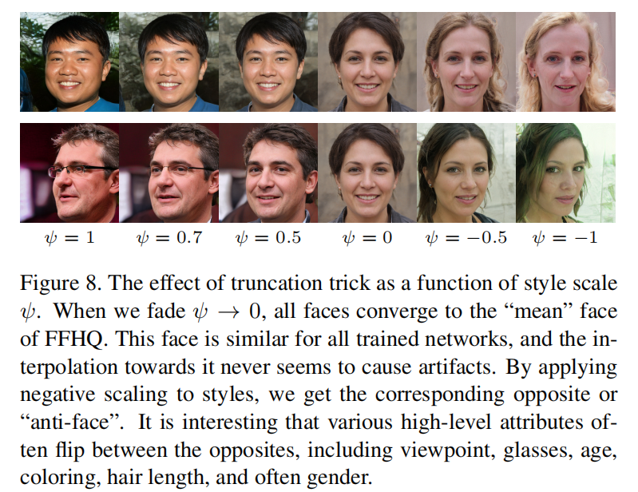
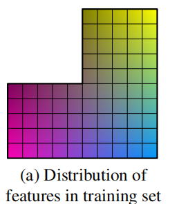
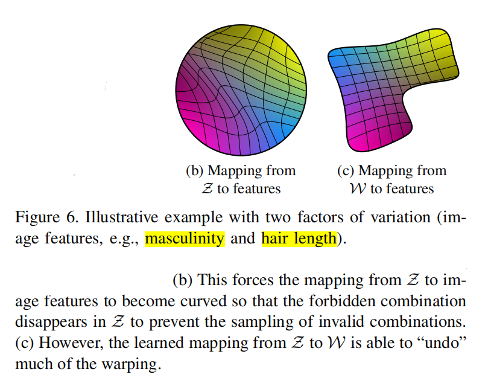

# Daily Thought (2019.3.21 - 2019.3.22)
**Do More Thinking!** ♈ 

**Ask More Questions!** ♑

**Nothing But the Intuition!** ♐

## 论文 A Style-Based Generator Architecture for Generative Adversarial Networks (StyleGAN) 精读

Author: `NVIDIA`的`Tero Karras`,也是`Progressive GAN`的作者

基于风格迁移的思路，提出一种新的架构模式

The new architecture leads to an automatically learned, unsupervised separation of high-level attributes

### 1. Each style controls only one convolution before being overridden by the next AdaIN operation

因为“风格”输入进去之后，只是参与 **"Normalization"** ，其实对整体输入信息没有太多影响，所以说只影响到下一个AdaIN之前的一个卷积层，相对每一个输入风格特征只影响最近的一层，这样的设计也就比较合理，而且便于用户根据网络深度引入不同level，低层次，高层次风格特征。

### 2. truncation trick in W
**问题**： If we consider the distribution of training data, it is clear that areas of low density are poorly represented and thus likely to be difficult for the generator to learn. This is a significant open problem in all generative modeling techniques.

**想法**：Drawing latent vectors from a truncated or otherwise shrunk sampling space tends to improve average image quality, although some amount of variation is lost

**做法**：

**理论依据**：来源于BigGAN，他们发现使用正交正则化（orthogonal regularization）来训练生成器，可以使其具有简单的截断特性（truncation trick），可以通过截断潜在空间的调节,在样本保真度和多样性之间精细调节。这种调节方法可以让模型在图像生成中达到当前的最佳性能.

**目的**：
对于GAN来说，隐变量的分布其实可以是任意分布，但是这个改变肯定会对生成结果产生影响，这个影响不一定是坏的影响：

BigGAN中做的`truncation trick`就是对于分布采样的一个控制，起到平衡多样性和真实性的作用。

另外综合不同的分布也可以提高GAN在ensemble中的多样性（MPM-GAN）

### 3. mixing regularization 
在训练的时候，使用两个latent code（两个z），而不是一个

we run two latent codes z1, z2 through the mapping network, and have the corresponding w1, w2 control the styles so that w1 applies before the crossover point and w2 after it.

也就是训练的过程中w1, w2交替注入AdaIN层

这样做的好处就是防止网络在学习的时候会误认为相邻的style是correlated（相关联的）。

### 4.原始的GAN从最开始引入噪声，相对于这种方式引入噪声存在的弊端

原来那种方式，会从早期的激活层中生成一些随机影响，理论证明是会导致localized effect，也就是早期的随机设定会导致有很强的局部化

那种也只是刚开始随机，之后都是固定模式，事实证明，我们经常看到生成的图片中其实有很多重复的模式

然而，本文中的架构模式，很好的回避了这个issue，因为在每个卷积层后面添加了per-pixel noise

### 5.随机噪声 与 全局影响 的关系

在style-based 生成器中，风格影响了整张图片，因为所有feature maps被scaled, biases通过用相同的值。

所以，全局影响，例如pose, lighting, background style能够被控制。

与此同时，noise被加入而且是独立于每个pixel，所以理想化的适合控制随机变动。

If the network tried to control, e.g., pose using the noise, that would lead to spatially inconsistent decisions that would then be penalized by the discriminator

### 6. Disentanglement studies（关于消去纠缠的研究）

理想化目标：就是latent space有一个线性子空间构成，每个值控制一个变化因子（variation factor）

但是这样理想目标的前提需要满足数据分布的原则：

**The sampling probability of each combination of factors in Z needs to match the corresponding density in the training data**

也就是任意每种影响因子排列组合对应的样本在训练数据的密度必须是完全相等的。

但是这肯定是几乎不可能达到的，举个例子：

有两个属性：长发/短发， 男性/女性

然而长发的男性是几乎不存在的，所以真实的训练集数据分布会是这样

**解决办法**

引入了中间的latent space W，能够去支持这样基于固定的分布来采样

its sampling density is induced by the learned piecewise continuous mapping f(z). This mapping can be adapted to “unwarp” W so that the factors of variation become more linear.

相当于连续的线性映射作用就是，让latent空间变得更加线性，即使数据并不是完美的分布

We expect the training to yield a less entangled W in an unsupervised setting, when the factors of variation are not known in advance

### 7. Perceptual path length
评价disentanglement的指标，详见论文
