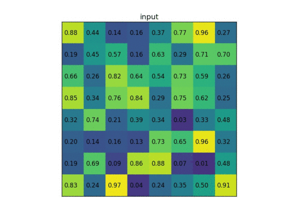
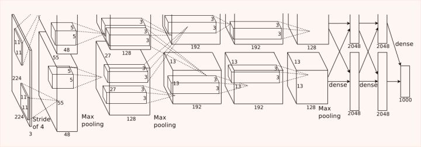
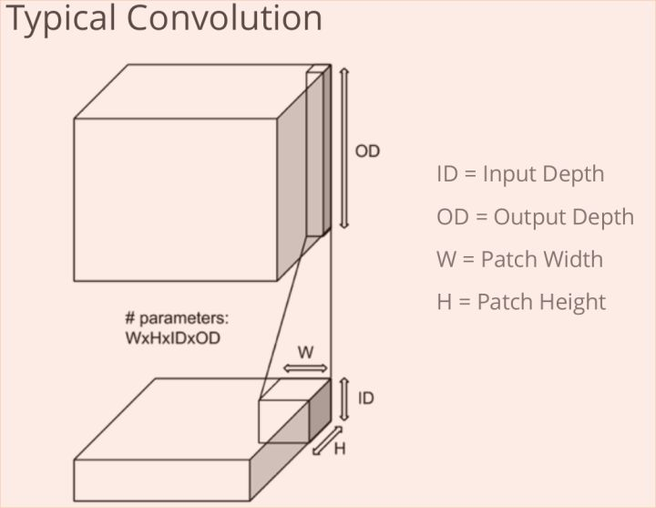
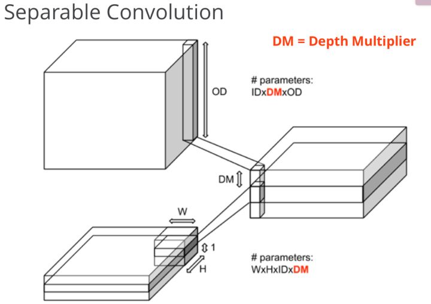
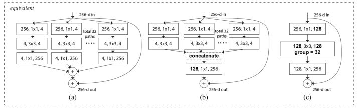
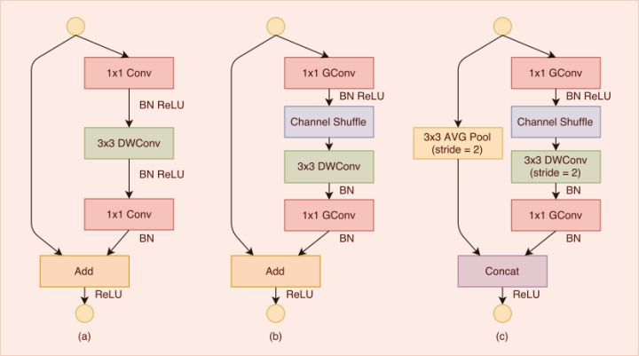

# Daily Thought (2019.3.26 - 2019.3.27)
**Do More Thinking!** ♈ 

**Ask More Questions!** ♑

**Nothing But the Intuition!** ♐

### 1.ROI pooling 与 ROI align
**ROI pooling**

假设现在我们有一个8x8大小的feature map，我们要在这个feature map上得到ROI，并且进行ROI pooling到2x2大小的输出。

假设ROI的bounding box为[x1, y1, x2, y2] = [0, 3, 7, 8]

将它划分为2x2的网格，因为ROI的长宽除以2是不能整除的，所以会出现每个格子大小不一样的情况。

进行max pooling的最终得到2x2输出

整个过程如下：

**ROI align**

在Faster RCNN中，`ROI pooling`有两次整数化的过程：

region proposal的xywh通常是小数，但是为了方便操作会把它整数化。

1. 将整数化后的边界区域平均分割成 k x k 个单元，对每一个单元的边界进行整数化。
2. 两次整数化的过程如下图所示：

事实上，经过上述两次整数化，此时的候选框已经和最开始回归出来的位置有一定的偏差，这个偏差会影响检测或者分割的准确度

为了解决这个问题，ROI Align方法取消整数化操作，保留了小数，使用双线性插值的方法获得坐标为浮点数的像素点上的图像数值。但在实际操作中，ROI Align并不是简单地补充出候选区域边界上的坐标点，然后进行池化，而是重新进行设计。

方法简述：

虚线部分表示feature map，实线表示ROI，这里将ROI切分成2x2的单元格。如果采样点数是4，那我们首先将每个单元格子均分成四个小方格（如红色线所示），每个小方格中心就是采样点。这些采样点的坐标通常是浮点数，所以需要对采样点像素进行双线性插值（如四个箭头所示），就可以得到该像素点的值了。然后对每个单元格内的四个采样点进行maxpooling，就可以得到最终的ROIAlign的结果。

在相关实验中，作者发现将采样点设为4会获得最佳性能，甚至直接设为1在性能上也相差无几。事实上，ROI Align 在遍历取样点的数量上没有ROIPooling那么多，但却可以获得更好的性能，这主要归功于解决了misalignment的问题。

https://zhuanlan.zhihu.com/p/37998710

### 2. DSConv (Depthwise Separable Convolution)

**思想：Depthwise(每个channel单独卷积) + Pointwise(channel融合后，1x1，每个点单独卷积)**

Xception、MobileNet等轻量化模型中使用深度可分离卷积（Depthwise Separable Convolution）

主要目的就是减小模型参数量，并且保证效果依旧不错的前提下

**CNN网络的研究**

自从把一个5x5卷积核用两个3x3卷积核，3x3卷积核分解成1x3和3x1卷积核后，对CNN的研究，目前集中在三个维度：channel， filter，和残差网络的connection。目标是把模型做小、做强、做到移动端，精度差点，没关系，可以加数据，离线多跑几轮。

无论`Xception`，还是`ResNeXt`，还有面向移动端的`ShuffleNet`和`MobileNet`。都是基于`Group Convolution`思想在channel维度进行“网络工程”，搭建新的模型。

**Group Convolution**

Group Convolution是指将channels细分成多个group,然后再分组进行Convolution，思想始于alexnet的双GPU架构设计，相当于把channels均分到两个GPU中。

**Separable Convolution**

在卷积层中间插入1x1卷积，即pointwise convolution

对于经典卷积操作：

如果OD是`256`，ID是`128`，卷积核大小`3x3`，需要的参数为`128x3x3x256=294912`个参数

Spearable卷积方法，假如`DM=4`，这样中间层的channel数为`128x4=512`，再经过`1x1`卷积降维到`256`个channel，需要的总参数为：`128 x (1x3x3x4 + 4x1x1x256) = 135680`，`Depthwise + pointwise` 参数量相当于普通卷积的`46%`，还增加了通道数`128x4=512` 增强了特征表达能力。

理想的卷积Block应该是先用`1x1`卷积核降channel，然后再进行`3x3`卷积提取特征，最后再用`1x1`卷积核降channel。

综上，**depthwise separable convolution = depthwise convolution + pointwise convolution**

**Xception, ResNeXt**

利用上述结构重新设计Inception model block，就是Xception；重新设计Resnet，就是ResNeXt架构。以达到在减少参数量的情况下增加模型的层数，既减少了存储空间，还增强了模型的表达能力。

通常来讲，如果对channel进行分组卷积，各小组就分头行动，互相没有交流，这样显然没有充分利用channel的信息。ShuffleNet在分组之前，先将channel随记打乱，这样对信息的利用更充分，因此可以通过设计降低模型参数量而不影响模型的表达能力。

https://www.zhihu.com/question/62478193/answer/200145164

