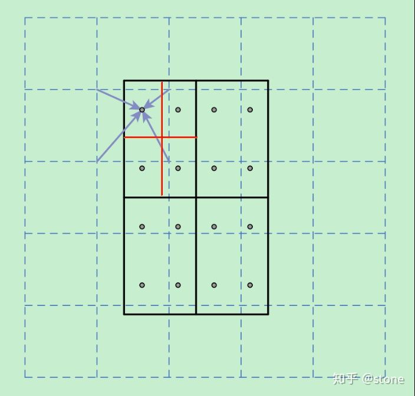

# Daily Thought (2019.3.26 - 2019.3.27)
**Do More Thinking!** ♈ 

**Ask More Questions!** ♑

**Nothing But the Intuition!** ♐

### 1.ROI pooling 与 ROI align
**ROI pooling**

假设现在我们有一个8x8大小的feature map，我们要在这个feature map上得到ROI，并且进行ROI pooling到2x2大小的输出。

假设ROI的bounding box为[x1, y1, x2, y2] = [0, 3, 7, 8]

将它划分为2x2的网格，因为ROI的长宽除以2是不能整除的，所以会出现每个格子大小不一样的情况。

进行max pooling的最终得到2x2输出

整个过程如下：

**ROI align**

在Faster RCNN中，`ROI pooling`有两次整数化的过程：

region proposal的xywh通常是小数，但是为了方便操作会把它整数化。

1. 将整数化后的边界区域平均分割成 k x k 个单元，对每一个单元的边界进行整数化。
2. 两次整数化的过程如下图所示：

事实上，经过上述两次整数化，此时的候选框已经和最开始回归出来的位置有一定的偏差，这个偏差会影响检测或者分割的准确度

为了解决这个问题，ROI Align方法取消整数化操作，保留了小数，使用双线性插值的方法获得坐标为浮点数的像素点上的图像数值。但在实际操作中，ROI Align并不是简单地补充出候选区域边界上的坐标点，然后进行池化，而是重新进行设计。

方法简述：

虚线部分表示feature map，实线表示ROI，这里将ROI切分成2x2的单元格。如果采样点数是4，那我们首先将每个单元格子均分成四个小方格（如红色线所示），每个小方格中心就是采样点。这些采样点的坐标通常是浮点数，所以需要对采样点像素进行双线性插值（如四个箭头所示），就可以得到该像素点的值了。然后对每个单元格内的四个采样点进行maxpooling，就可以得到最终的ROIAlign的结果。

在相关实验中，作者发现将采样点设为4会获得最佳性能，甚至直接设为1在性能上也相差无几。事实上，ROI Align 在遍历取样点的数量上没有ROIPooling那么多，但却可以获得更好的性能，这主要归功于解决了misalignment的问题。

https://zhuanlan.zhihu.com/p/37998710
