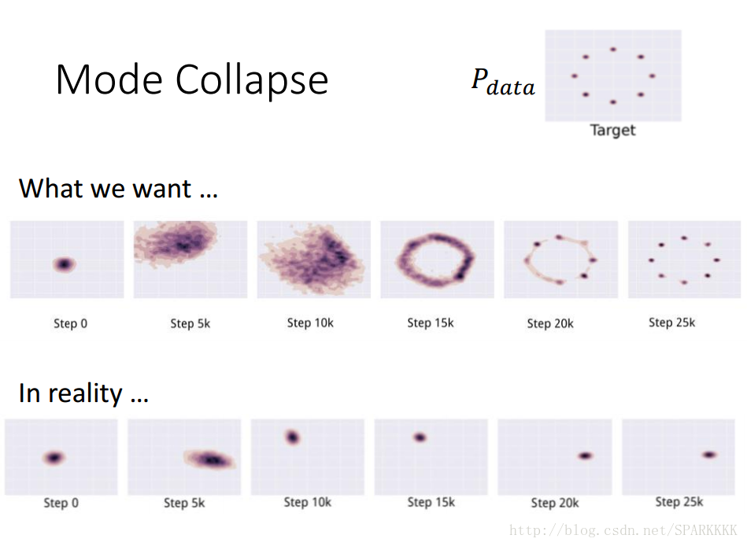
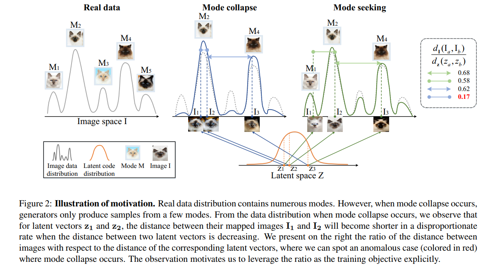
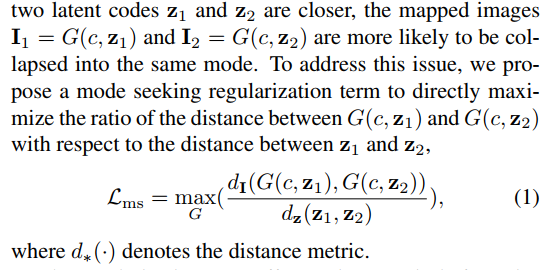

# Daily Thought (2019.3.27 - 2019.3.28)
**Do More Thinking!** ♈ 

**Ask More Questions!** ♑

**Nothing But the Intuition!** ♐

### 1. cGAN的mode collapse问题 （Mode Seeking GAN）
**论文 《Mode Seeking Generative Adversarial Networks for Diverse Image Synthesis》 CVPR2019**

**问题**

对于cGAN是很容易造成mode collapse问题的，为什么呢？

对于cGAN往往会重点关注prior conditional 信息，而会忽略输入噪声向量，所以就是会导致(variation)多样性不够。多样性不够，对于GAN这样就会导致mode collapse.

cGAN相对于普通的GAN，生成器产生的样本只来自单一或者少数mode这种的分布。

因为cGAN在学习的时候主要重视 高维结构化的conditional context信息，那么noise vector重要性被忽略。

**mode collaspe**

例如训练集有很多种类别(如猫狗牛羊)，但是我们只能生成狗(或猫或牛或羊)，虽然生成的狗的图片质量特别好，但是！整个G就只能生成狗，根本没法生成猫牛羊，陷入一种训练结果不好的状态。这和我们对GAN的预期是相悖的。

但往往mode collapse导致，mode多样性不够，不一定会造成只产生一种结果，往往会造成生成的mode是一种折中也就是两种都不是，介于两者之间所以就会产生一些奇怪的结果。

本篇主要是提出一种regularization term(正则项) 来解决这个mode collapse的问题

**之前方法**

之前解决cGAN中 的mode collapse 的方法：

要不就是task-specific(针对特定任务的)， 或者就是高计算量

**提出方法**

很简单，发现对于任意两个latent vector: z1, z2
- 如果有mode collapse，那么相当于少了几个mode，z1,z2对应生成的图片I1,I2之间的相似性就会高一些，所以图片的L1距离就会小（如下图）
- 如果mode collapse不存在，那么z1,z2对应生成的图片I1,I2距离就会大（相差的就会大）（如下图）

相当于提出一个正则的loss，尽可能最大化这个项用来有效减缓mode collapse 

