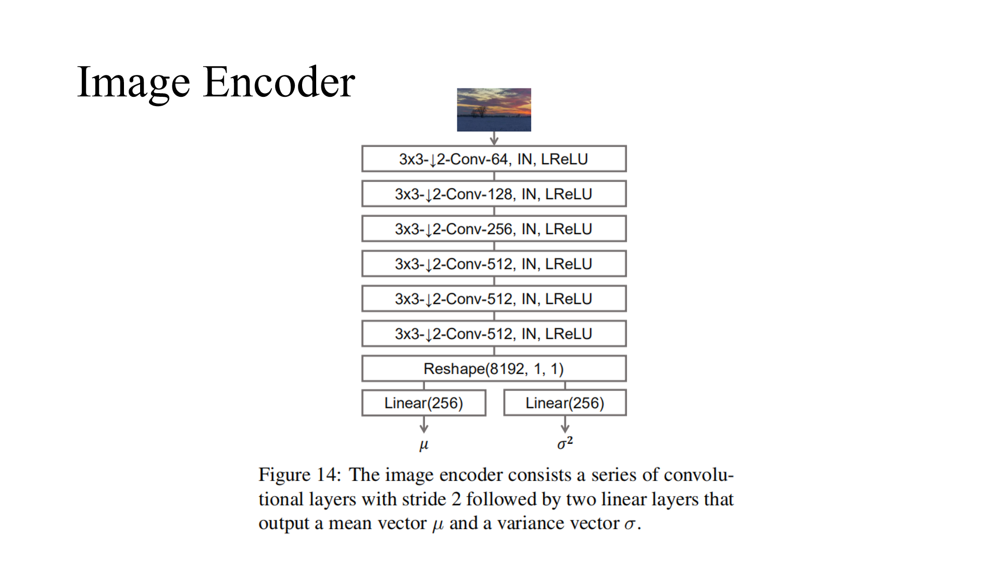
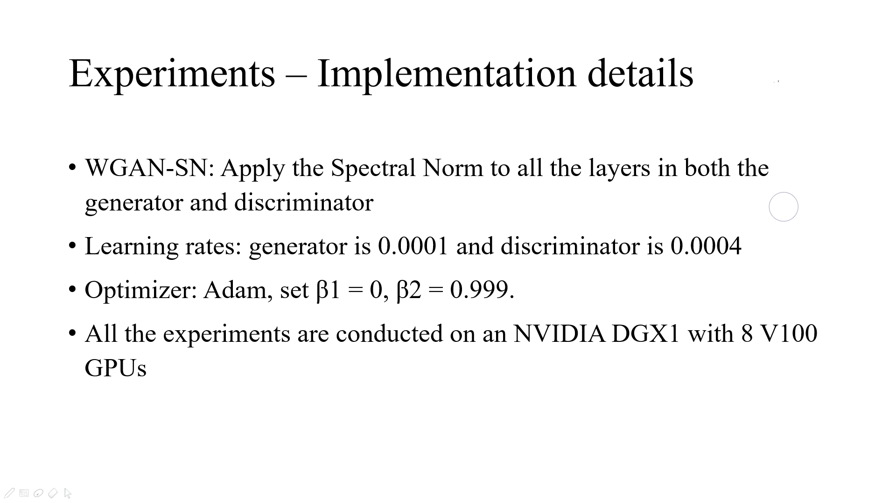

# Daily Thought (2019.3.29 - 2019.3.31)
**Do More Thinking!** ♈ 

**Ask More Questions!** ♑

**Nothing But the Intuition!** ♐
## 论文 Semantic Image Synthesis with Spatially-Adaptive Normalization (GauGAN) 精读
解决任务：segmentation map 转换成 image

### 1. “wash away”信息

**问题就是：为什么说是normalization层冲刷掉了信息，而不是说其他层呢？

本文贡献：提出一种空间自适应去归一化(SPADE)，来解决这个问题

### 2. Normalization层分类

### 3. SPADE

输入张量首先经过batch-norm之后，这边语义分割的mask输入到卷基层上，这个输入每个Label标签是一个整数，经过少数的卷积层学习到一种仿射变换，把这个归一化的张量再denormalization回去

与已有的条件归一化AdaIN方法不同，γ 和 β 不是向量，而是具有空间维度的张量。生成的 γ 和 β 经过逐元素的乘法和加法，再相当于denormalization回去

SPADE 方法中的仿射变化是从语义分割图中学习的。这与 Conditional Normalization 类似，不过 SPADE 中学得的仿射参数需要对空间自适应，也就是说对每个语义标签使用不同的 scaling 和偏置。使用这一简单的方法后，语义信号可以作用于所有层的输出，不受归一化过程的影响而丢失语义信息
### 4. 结构优点

下面的结构相对于上面的结构有下面两个优点：

- 1. 它的conditional 输入不是一开始作为输入的，它是中间输入，不断在强调这样的信息
- 2. 而且另一点就是传统的encoder-decoder一般没有随机噪声引入，但是这个有，有随机噪声引入，就可以提高多样性，而且有效减轻这种cGAN的mode collapse，因为那种原来的那种encoder-decoder结构cGAN属于强调context信息，弱化noise的作用，也就导致基本效果同样输入生成都是有相似的外观，产生mode collapse，所以这种结构应该更好

### 5. sychronized batch normalization
本身一般的BN，实现都是在一块gpu上进行BatchNorm，pytorch实现的BN，虽然你如果用多卡并行，他每个BN其实也是在单卡算的。

image classification这种任务输入224x224，299x299，一个12GB显存的卡，模型不大的话一个卡就可以跑batch-size 32或者更大，这样的话不用异步batch-norm效果也可以很好

但是对有些任务，输入比较大，模型比较大一个gpu可能只能跑batch-size只有几个

https://github.com/vacancy/Synchronized-BatchNorm-PyTorch

### 6. 网络结构

### 7.实验细节以及评价标准

### 8.L1 loss与L2 loss在图像修改上的一些影响
相比于`L1 loss`,`L2 loss`对于像素上的微小变化显然影响较小,`L2 loss`对于像素修改较大变动时会有很大的loss，可能对于图像增强会有比较好的效果
