# Daily Thought (2019.5.1 - 2019.5.3)
**Do More Thinking!** ♈ 

**Ask More Questions!** ♑

**Nothing But the Intuition!** ♐

### 1.checkerboard效应

就是指图片生成得到的结果好像有边框一样一格一格的

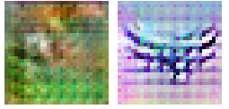

这种现象主要出现在strong color的图片上会多一些

造成uneven overlap，也就是重叠部分不规则

In particular, deconvolution has uneven overlap when the kernel size (the output window size) is not divisible by the stride (the spacing between points on the top).
 
这里的stride是deconv的stride，也就是scale factor，也就是当kernel size 不能被stride整除的时候容易发生checkerboard效应

我们可以看一下图示，一般我们的deconv就是 `stride=2, kernel size=3`

一维：

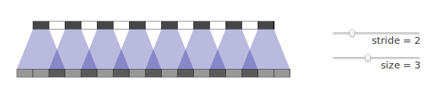

二维：

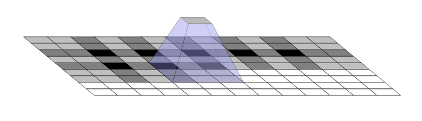

(二维更加严重：In fact, the uneven overlap tends to be more extreme in two dimensions! Because the two patterns are multiplied together, the unevenness gets squared. ）

一层一层复合下去也会非常严重

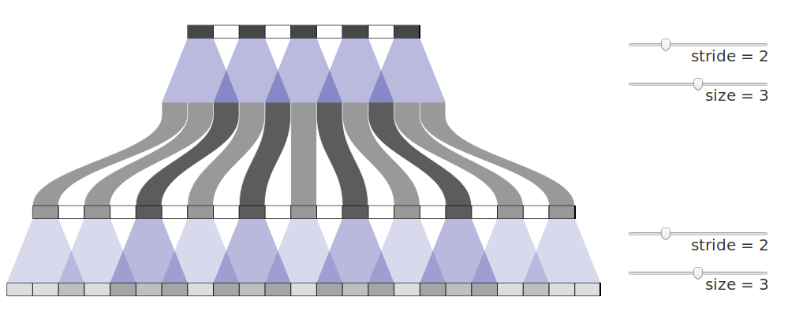

如果变成 `stride=2, kernel size=4`

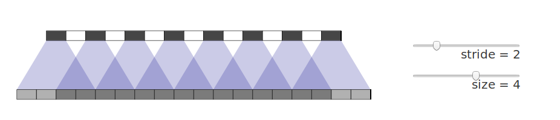

In addition to the high frequency checkerboard-like artifacts we observed above, early deconvolutions can create lower-frequency artifacts.

These artifacts tend to be most prominent when outputting unusual colors. Since neural network layers typically have a bias (a learned value added to the output) it’s easy to output the average color. The further a color — like bright red — is away from the average color, the more deconvolution needs to contribute.

但是其实理论上这种uneven overlap，model是可以学习然后自动在输出做到平衡它的：

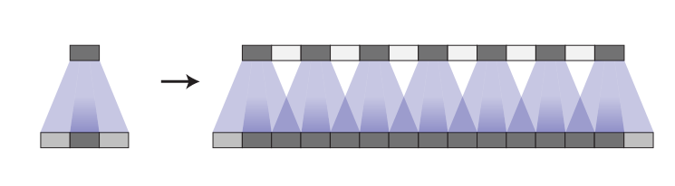

大致类似上图这样的原理

但是这样的artifact的balance操作对于模型，肯定会限制很多filters的多样性，从而限制了模型的容量以及模型的能力。

事实上，不只是uneven overlap, even overlap也会有这样的状况

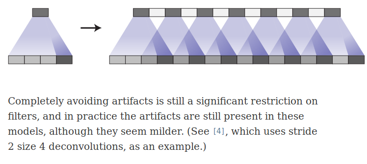

解决办法：

1. make sure you use a kernel size that is divided by your stride, avoiding the overlap issue. This is equivalent to “sub-pixel convolution“ a technique which has recently had success in image super-resolution

但是这种方法也还是会出现问题

**2. 最好的方式：就是先进行上采样，然后在进行卷积操作 (resize-convolution)**

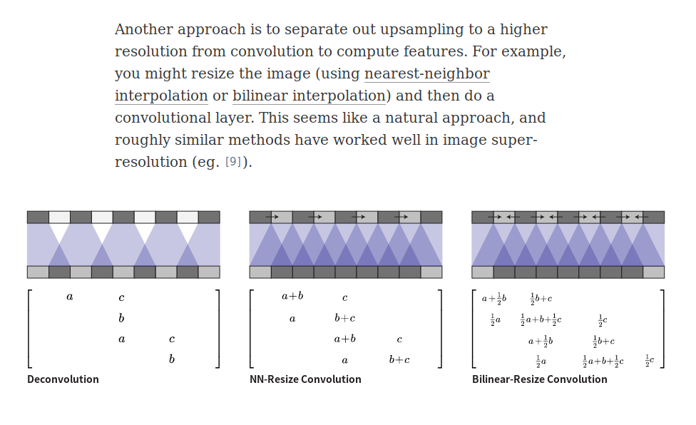

效果比较：

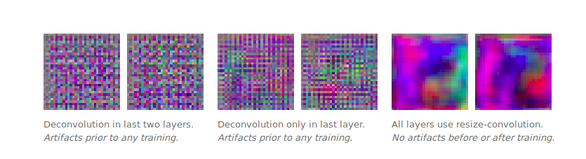

### 2. sub-pixel convolution

Sub-pixel convolution是一种巧妙的图像及特征图upscale的方法，又叫做pixel shuffle（像素洗牌）。本文主要介绍一种在超分辨率中经常使用的upscale方法——sub-pixel convolution

深度学习常用上采样操作：
- 直接上采样
- 双线性插值
- 反卷积

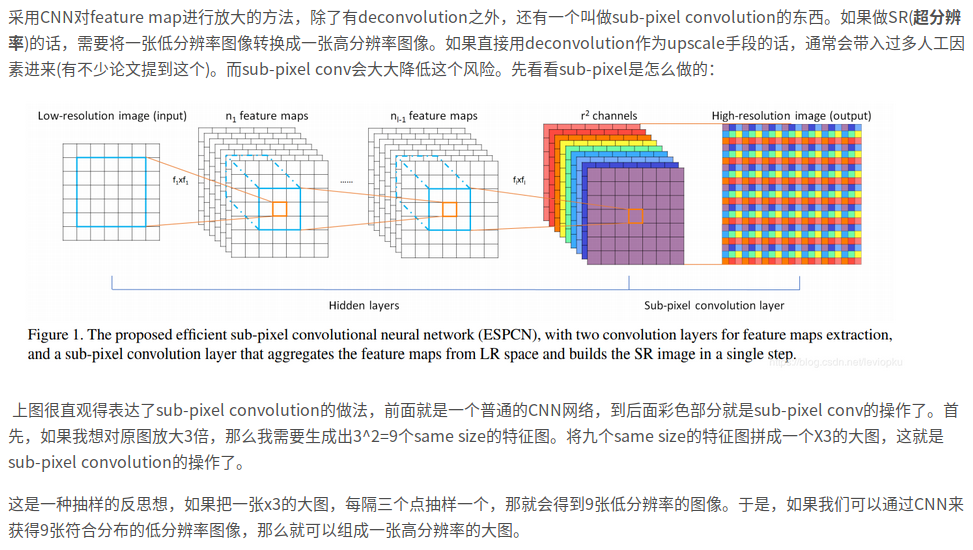

https://blog.csdn.net/leviopku/article/details/84975282

### 3. GAN的模型架构一览

主要介绍GAN在图像方向上的模型架构发展

从广义上来讲，图像领域的分类模型的任何进展，也算是判别器的进展（因为都是分类器，相关的技术都可能用到判别器中），而图像分类模型本质上从 ResNet 之后就没有质的变化，这也说明 ResNet 结构对判别器基本上是最优选择了。

很多工作都表明，GAN 的生成器的结果还有一定的探索空间，好的生成器架构能加速 GAN 的收敛，或者提升 GAN 的效果。

**DCGAN**

出自文章 Unsupervised Representation Learning with Deep Convolutional Generative Adversarial Networks

它提出了一种生成器和判别器的架构，这个架构能极大地稳定 GAN 的训练，以至于它在相当长的一段时间内都成为了 GAN 的标准架构。

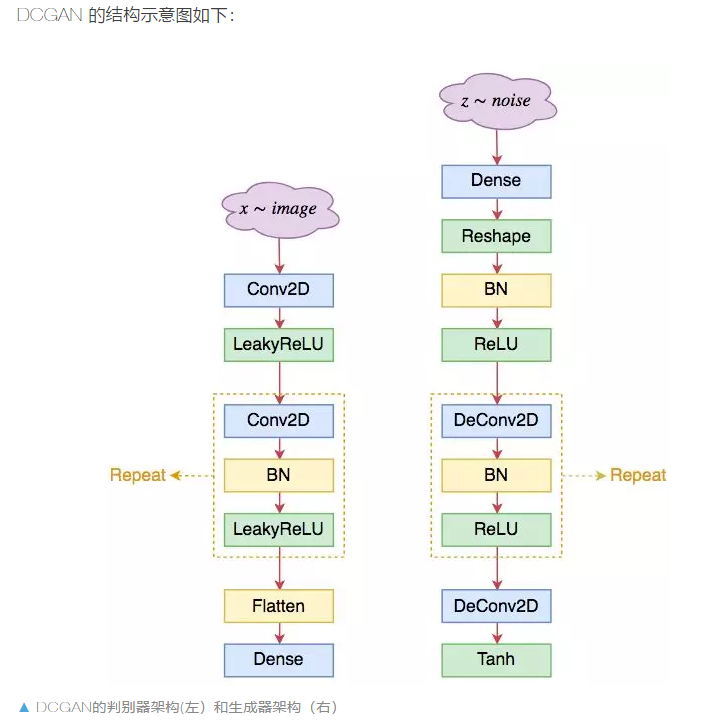

DCGAN 所提出的模型架构大致如下： 
- 1. 生成器和判别器均不采用池化层，而采用（带步长的）的卷积层；其中判别器采用普通卷积（Conv2D），而生成器采用反卷积（DeConv2D）；
- 2. 在生成器和判别器上均使用 Batch Normalization；
- 3. 在生成器除输出层外的所有层上使用 RelU 激活函数，而输出层使用 Tanh 激活函数；
- 4. 在判别器的所有层上使用 LeakyReLU 激活函数；
- 5. 卷积层之后不使用全连接层；
- 6. 判别器的最后一个卷积层之后也不用 Global Pooling，而是直接 Flatten。

几个要点：
- 1. 卷积和反卷积的卷积核大小为 4x4 或者 5x5；
- 2. 卷积和反卷积的 stride 一般都取为 2；
- 3. 对于判别器来说，第一层卷积后一般不用 BN，而后面都是“Conv2D+BN+LeakReLU”的组合模式，直到 feature map 的大小为 4x4；
- 4. 对于生成器来说，第一层是全连接，然后 reshape 为 4x4 大小，然后是“Conv2D+BN+ReLU”的组合模式，最后一层卷积则不用 BN，改用 tanh 激活；相应地，输入图片都要通过除以 255 然后乘以 2 减去 1，来缩放到 -1～1 之间。

虽然从参数量看可能很大，但事实上 DCGAN 很快，而且占显存不算多，所以很受大家欢迎。

**ResNet**

DCGAN的问题：

- 棋盘效应： 由于 DCGAN 的生成器中使用了反卷积，而反卷积固有地存在“棋盘效应（Checkerboard Artifacts）”，这个棋盘效应约束了DCGAN的生成能力上限。 准确来说，棋盘效应不是反卷积的问题，而是 stride > 1 的固有毛病，这导致了卷积无法“各项同性”地覆盖整张图片，而出现了交错效应，如同国际象棋的棋盘一般。而反卷积通常都要搭配 stride > 1 使用，因此通常认为是反卷积的问题。
- 事实上，除了反卷积，膨胀卷积也会有棋盘效应，因为我们可以证明膨胀卷积在某种转化下，其实等价于 stride > 1 的普通卷积。
- DCGAN 的非线性能力也许不足（深度不够）：如果输入的图片大小固定后，整个 DCGAN 的架构基本都固定的，包括模型的层数。唯一可以变化的似乎就只有卷积核大小（通道数也可以稍微调整，但其实调整空间不大），改变卷积核大小可以在一定程度上改变模型的非线性能力，但改变卷积核大小仅仅改变了模型的宽度，而对于深度学习来说深度可能比宽度更重要。问题就是对于 DCGAN 来说，没有一种自然而直接的方法来增加深度。

所以根据以上的问题自然会考虑到更深的ResNet结构：

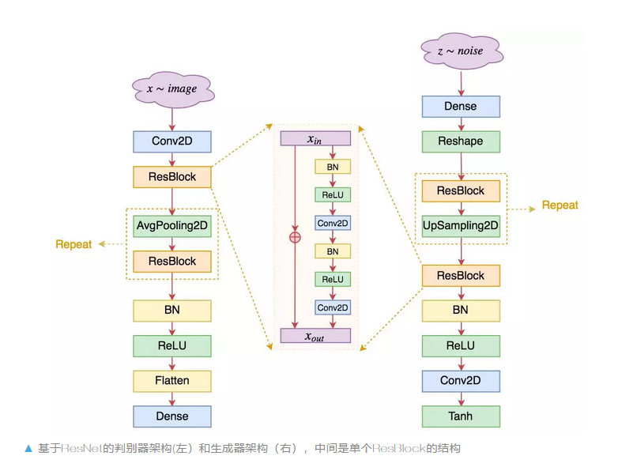

特点：
- 1. 不管在判别器还是生成器，均去除了反卷积，只保留了普通卷积层；
- 2. 卷积核的大小通常统一使用 3*3 的，卷积之间构成残差块；
- 3. 通过 AvgPooling2D 和 UpSampling2D 来实现上/下采样，而 DCGAN 中则是通过 stride > 1 的卷积/反卷积实现的；其中 UpSampling2D 相当于将图像的长/宽放大若干倍；
- 4. 由于已经有残差，所以激活函数可以统一使用 ReLU，当然，也有一些模型依然使用 LeakyReLU，其实区别不大；
- 5. 通过增加 ResBlock 的卷积层数，可以同时增加网络的非线性能力和深度，这也是 ResNet 的灵活性所在；
- 6. 一般情况下残差的形式是 x+f(x)，其中 f 代表卷积层的组合；不过在 GAN 中，模型的初始化一般要比常规分类模型的初始化更小，因此稳定起见，有些模型干脆将其改为 x+α×f(x)，其中 α 是一个小于 1 的数，比如 0.1，这样能获得更好的稳定性；
- 7. 有些作者认为 BN 不适合 GAN，有时候会直接移除掉，或者用 LayerNorm 等代替。

缺点：
ResNet 并非没有缺点。虽然从参数量上看，相比 DCGAN，ResNet 并没有增加参数量，有些情况下甚至比 DCGAN 参数量更少，但 ResNet 比 DCGAN 要慢得多，所需要的显存要多得多。

这是因为 ResNet 层数更多、层之间的连接更多，所以导致梯度更复杂，并且并行性更弱了（同一层卷积可以并行，不同层卷积是串联的，无法直接并行），结果就是更慢了，更占显存了。

**SELF-MOD**

**PGGAN**, **SAGAN**

PGGAN、SAGAN 等模型的，毕竟从分辨率或者 IS、FID 等指标上来看，它们也算是一个标志性事件。

不过严格来讲，PGGAN 并不是一种新的模型架构，它只是提供了一个渐进式的训练策略，这种训练策略可以用到 DCGAN 或 ResNet 架构上；

SAGAN 其实改动并不大，标准的 SAGAN 只不过在普通的 DCGAN 或 ResNet 架构中间，插入了一层 Self Attention，不能算生成器架构上的大变动。

Self-Mod: Self Modulated Generator，来自文章 On Self Modulation for Generative Adversarial Networks

Conditional Batch Normalization（条件 BN）:

相对与之前的无条件BN，beta,gamma是表示条件信息的：

条件BN首先出现在文章 Modulating early visual processing by language 中，后来又先后被用在 cGANs With Projection Discriminator 中，目前已经成为了做条件 GAN（cGAN）的标准方案，包括 SAGAN、BigGAN 都用到了它。

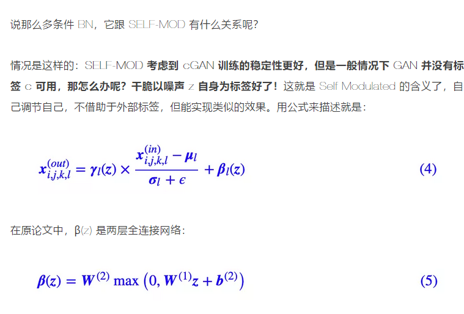

无条件 GAN 的 SELF-MOD 结构的生成器：

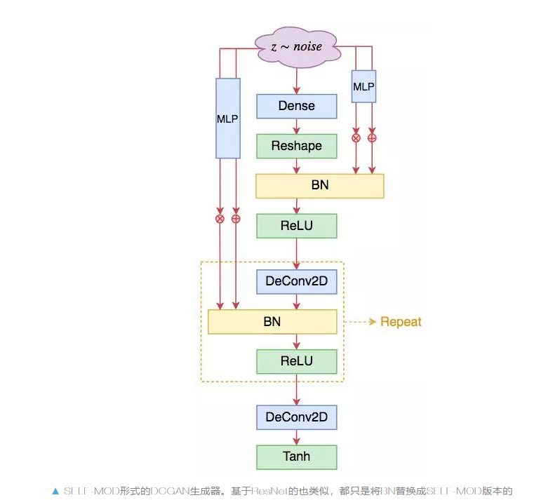

**StyleGAN**

本质上也是属于很接近于self-mod的一种

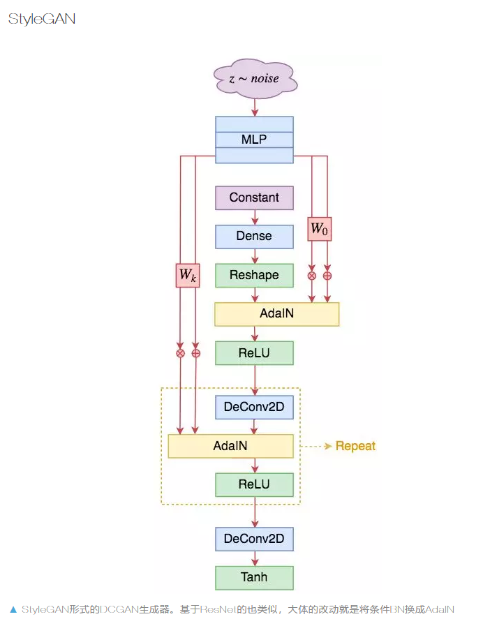

StyleGAN 的主要改动也就是生成器，相比于 SELF-MOD，它的不同之处在于：
- 1. 取消顶部的噪声输入，换成一个可训练的常数向量；
- 2. 将所有条件 BN 换成 AdaIN；
- 3. AdaIN 的输入条件是将噪声用多层 MLP 变换后，再用不同的变换矩阵投影为不同 AdaIN 的 β 和 γ。

**模型架构的重要性**：Deep Image Prior （Deep Image Prior. Proc. IEEE Conference on Computer Vision and Pattern Recognition (CVPR) 2018）这篇文章表明了一个事实：模型架构本身所蕴含的先验知识，是图像生成模型可以成功的重要原因。提出更好的模型架构，意味着提出更好的先验知识，自然也就有利于图像生成了。

https://mp.weixin.qq.com/s/9GeryvW5PI93FCmTpuFEPQ
