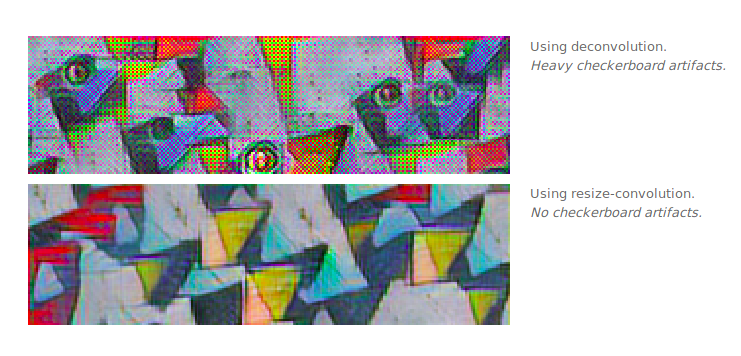

# Daily Thought (2019.5.1 - 2019.5.3)
**Do More Thinking!** ♈ 

**Ask More Questions!** ♑

**Nothing But the Intuition!** ♐

### 1.checkerboard效应

就是指图片生成得到的结果好像有边框一样一格一格的

这种现象主要出现在strong color的图片上会多一些

造成uneven overlap，也就是重叠部分不规则

In particular, deconvolution has uneven overlap when the kernel size (the output window size) is not divisible by the stride (the spacing between points on the top).
 
这里的stride是deconv的stride，也就是scale factor，也就是当kernel size 不能被stride整除的时候容易发生checkerboard效应

我们可以看一下图示，一般我们的deconv就是 `stride=2, kernel size=3`

一维：

二维：

(二维更加严重：In fact, the uneven overlap tends to be more extreme in two dimensions! Because the two patterns are multiplied together, the unevenness gets squared. ）

一层一层复合下去也会非常严重

如果变成 `stride=2, kernel size=4`

In addition to the high frequency checkerboard-like artifacts we observed above, early deconvolutions can create lower-frequency artifacts.

These artifacts tend to be most prominent when outputting unusual colors. Since neural network layers typically have a bias (a learned value added to the output) it’s easy to output the average color. The further a color — like bright red — is away from the average color, the more deconvolution needs to contribute.

但是其实理论上这种uneven overlap，model是可以学习然后自动在输出做到平衡它的：

大致类似上图这样的原理

但是这样的artifact的balance操作对于模型，肯定会限制很多filters的多样性，从而限制了模型的容量以及模型的能力。

事实上，不只是uneven overlap, even overlap也会有这样的状况

解决办法：

1. make sure you use a kernel size that is divided by your stride, avoiding the overlap issue. This is equivalent to “sub-pixel convolution“ a technique which has recently had success in image super-resolution

但是这种方法也还是会出现问题

**2. 最好的方式：就是先进行上采样，然后在进行卷积操作 (resize-convolution)**

效果比较：

### 2. sub-pixel convolution

Sub-pixel convolution是一种巧妙的图像及特征图upscale的方法，又叫做pixel shuffle（像素洗牌）。本文主要介绍一种在超分辨率中经常使用的upscale方法——sub-pixel convolution

深度学习常用上采样操作：
- 直接上采样
- 双线性插值
- 反卷积

https://blog.csdn.net/leviopku/article/details/84975282
