# Daily Thought (2019.5.5 - 2019.5.6)
**Do More Thinking!** ♈ 

**Ask More Questions!** ♑

**Nothing But the Intuition!** ♐

### 1. 知识蒸馏（Knowledge Distillation）

知识蒸馏是一种**模型压缩常见方法**，用于模型压缩指的是在teacher-student框架中，将复杂、学习能力强的网络学到的特征表示“知识”蒸馏出来，传递给参数量小、学习能力弱的网络。蒸馏可以提供student在one-shot label上学不到的soft label信息，这些里面包含了类别间信息，以及student小网络学不到而teacher网络可以学到的特征表示‘知识’，所以一般可以提高student网络的精度。
 
**Attention Transfer** 

传递teacher网络的attention信息给student网络。

首先，CNN的attention一般分为两种，`spatial-attention`, `channel-attention`。

本文利用的是`spatial-attention`.所谓spatial-attention即一种热力图，用来解码出输入图像空间区域对输出贡献大小。文章提出了两种可利用的spatial-attention,基于响应图的和基于梯度图的。

**spatial-attention ———— Activation-based**

基于响应图（特征图），取出CNN某层输出特征图张量A，尺寸：(C, H, W).定义一个映射F：

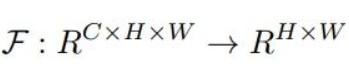

将3D张量flat成2D.这个映射的形式有三种供选择：

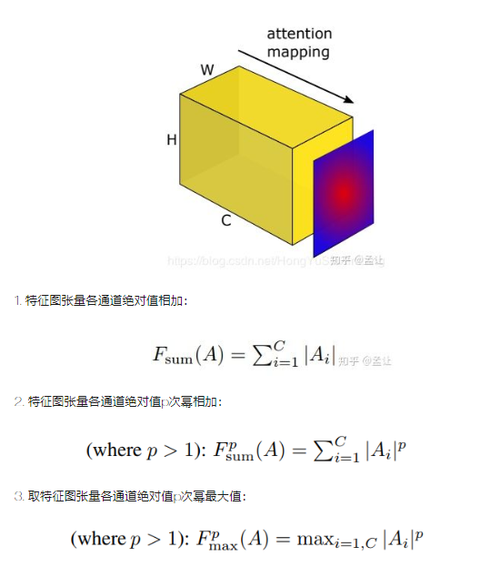

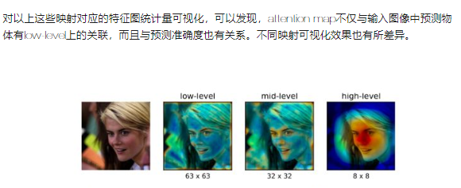

attention transfer的目的是将teacher网络某层的这种spatial attention map传递给student网络，让student网络相应层的spatial attention map可以模仿teacher，从而达到知识蒸馏目的。 teacher-student框架设计如下

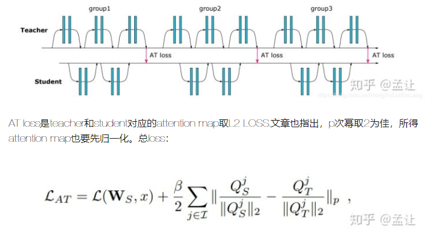

**Mutual Learning**

Deep Mutual Learning VS Knowledge Distillation:
- Deep Mutual Learning(DML)与用于模型压缩的一般知识蒸馏不同的地方在于知识蒸馏是将预训练好的、不进行反向传播的“静态”teacher网络的知识单项传递给需要反向传播的"动态"student网络。
- DML是在训练过程中，一众需要反向传播的待训student网络协同学习，互相传递知识。
- 所以区别就在是否teacher、student网络都需要反向传播。

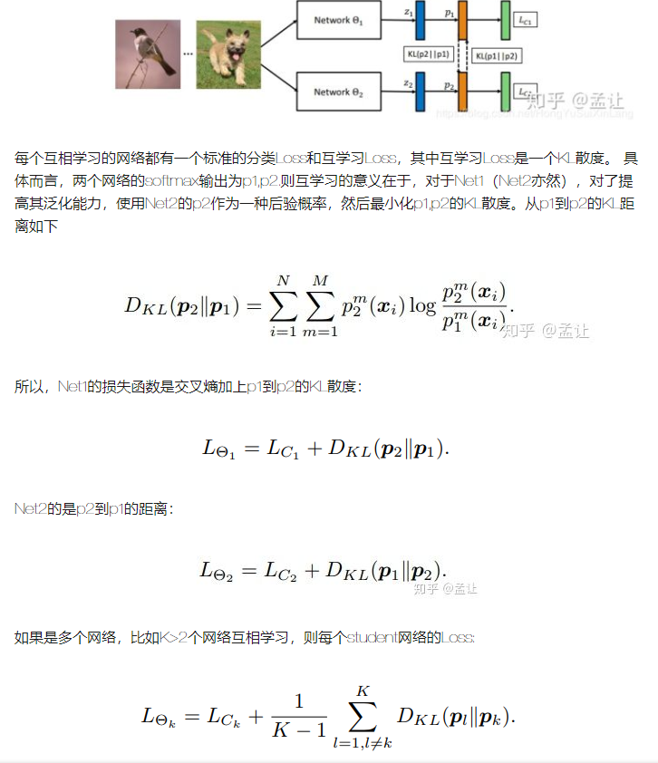

https://zhuanlan.zhihu.com/p/51563760

### 2. 卷积神经网络中的1x1卷积核

1x1卷积核，又称为网中网（Network in Network）[2]。

这里通过一个例子来直观地介绍1x1卷积。

如下图输入6x6x1的矩阵，这里的1x1卷积形式为1x1x1，即为元素2，输出也是6x6x1的矩阵。但输出矩阵中的每个元素值是输入矩阵中每个元素值x2的结果。

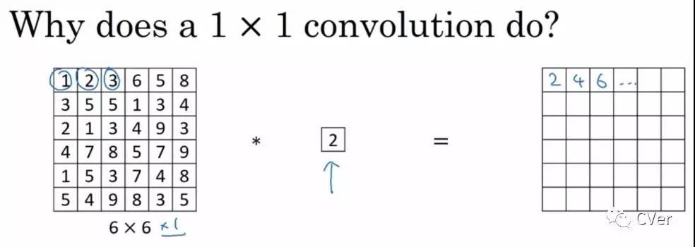

这里没有显示`1x1 conv`的作用，因为输入输出的channel都为1

如果输入输出channel数目不同呢？这时候可以把`1x1 conv`看成是**全连接**，如果输入channel:32, 输出channel:filter（数值）, 那么对于每个spatial location，就是长度为channel数目的vector与权重进行相乘再相加，作用基本就是全连接层的作用

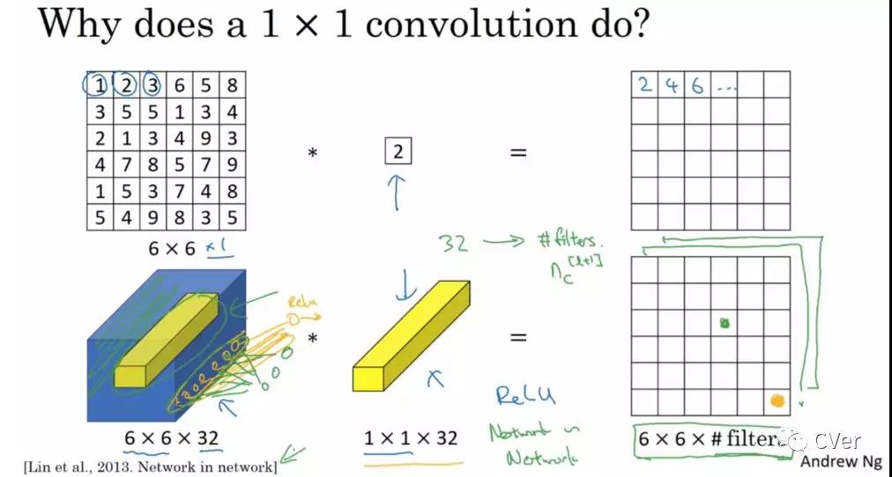

上述列举的全连接例子不是很严谨，因为图像的一层相比于神经元还是有区别的，图像是2D矩阵，而神经元就是一个数字，但是即便是一个2D矩阵（可以看成很多个神经元）的话也还是只需要一个参数（1x1的核），这就是因为参数的权值共享。

注：1x1卷积一般只改变输出通道数（channels），而不改变输出的宽度和高度

**1x1卷积作用**

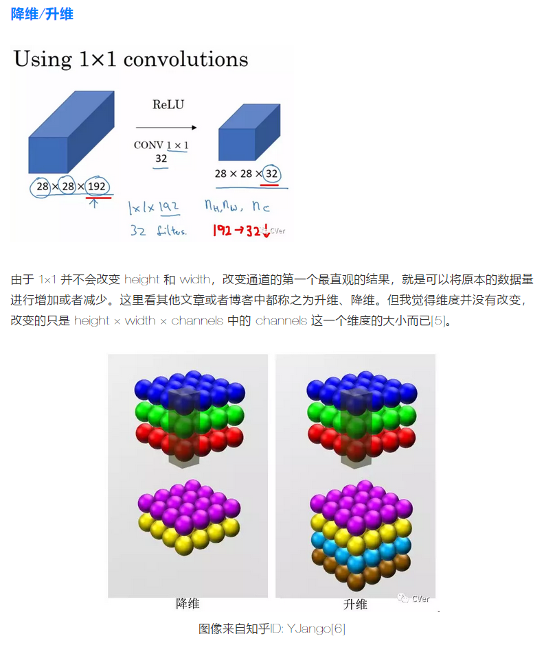

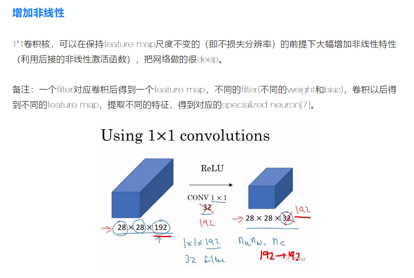

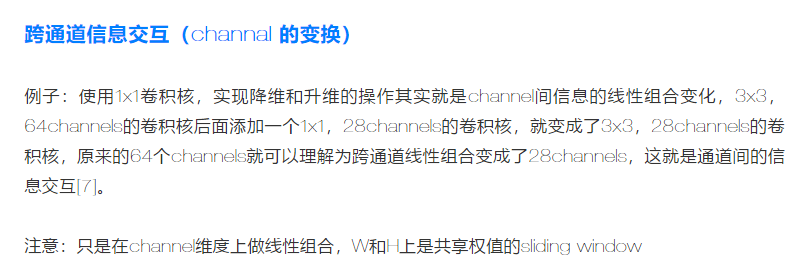

**1x1卷积的应用**

Inception

进行降维和升维, 对于每一个Inception模块（如下图），原始模块是左图，右图中是加入了1×1卷积进行降维的。虽然左图的卷积核都比较小，但是当输入和输出的通道数很大时，乘起来也会使得卷积核参数变的很大，而右图加入1×1卷积后可以降低输入的通道数，卷积核参数、运算复杂度也就跟着降下来了。

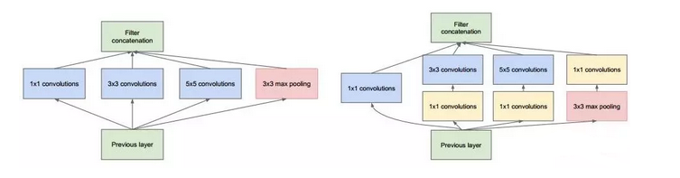

同时在并行pooling层后面加入1×1卷积层后也可以降低输出的feature map数量，左图pooling后feature map是不变的，再加卷积层得到的feature map，会使输出的feature map扩大到416，如果每个模块都这样，网络的输出会越来越大。

而右图在pooling后面加了通道为32的1×1卷积，使得输出的feature map数降到了256。GoogLeNet利用1×1的卷积降维后，得到了更为紧凑的网络结构，虽然总共有22层，但是参数数量却只是8层的AlexNet的十二分之一（当然也有很大一部分原因是去掉了全连接层）

ResNet

ResNet同样也利用了1×1卷积，并且是在3×3卷积层的前后都使用了，不仅进行了降维，还进行了升维，使得卷积层的输入和输出的通道数都减小
