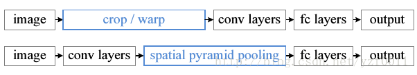
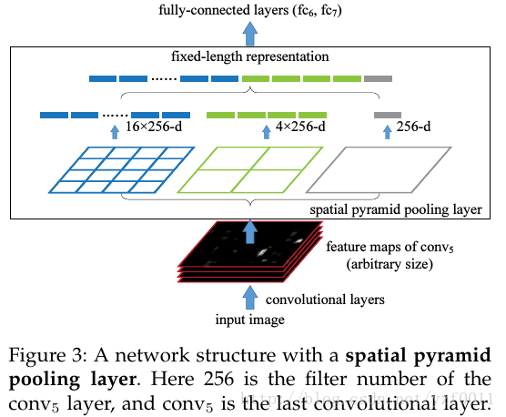

# Daily Thought (2019.5.30 - 2019.5.31)
**Do More Thinking!** ♈ 

**Ask More Questions!** ♑

**Nothing But the Intuition!** ♐

### 1. GAN训练过程中损失函数观察

在GAN的对抗训练过程中其实`discriminator`与`generator`的GAN loss是不太容易一起下降收敛的，因为两者是对抗关系，一般保证两个持续稳定互相稳定波动比较好

所以对于其他的loss才是决定效果的关键，训练过程主要是其他loss在下降，`GAN loss`本质上只是辅助逼真度，如果其他loss本身就无法完全达到目的，那么就很难再去依靠GAN loss达到目的

### 2. loss加权对于细小物体作用显著
我们经常会遇到细小物体分割的情况，比如分割电线，分割天际线，当然可以设计很多很fancy的模型去建模这些形态，但是实际在深度学习工程中，往往只要把这一类物体的损失权重调高几倍就够用了

loss加权，focal loss，或者是困难样本挖掘都能提高效果

### 3. SPP(Spatial Pyramid Pooling)
**背景**

在一般的CNN结构中，在卷积层后面通常连接着全连接。而全连接层的特征数是固定的，所以在网络输入的时候，会固定输入的大小(fixed-size)。但在现实中，我们的输入的图像尺寸总是不能满足输入时要求的大小。然而通常的手法就是裁剪(crop)和拉伸(warp)。

这样做总是不好的：图像的纵横比(ratio aspect) 和 输入图像的尺寸是被改变的。这样就会扭曲原始的图像

Kaiming He在这里提出了一个SPP(Spatial Pyramid Pooling)层能很好的解决这样的问题， 但SPP通常连接在最后一层卷基层。

**显著特点**

- 1. 不管输入尺寸是怎样，SPP 可以产生固定大小的输出 
- 2. 使用多个窗口(pooling window) 
- 3. SPP 可以使用同一图像不同尺寸(scale)作为输入, 得到同样长度的池化特征。

**使用场景**

- 可以用于object detention作为pooling层，因为object detection大小不等
- 也可以用于GAN的discriminator最后一层，例如行人生成，输入是不同大小的行人框，输出是一组feature向量表示GAN的结果，这里因为输入大小不同也可以使用SPP layer(详见：[Pedestrian-Synthesis-GAN: Generating Pedestrian Data in Real Scene and Beyond](https://arxiv.org/abs/1804.02047) )

https://www.cnblogs.com/zongfa/p/9076311.html
