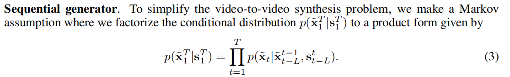
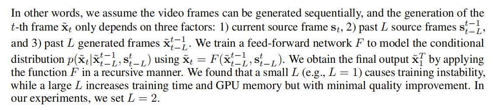
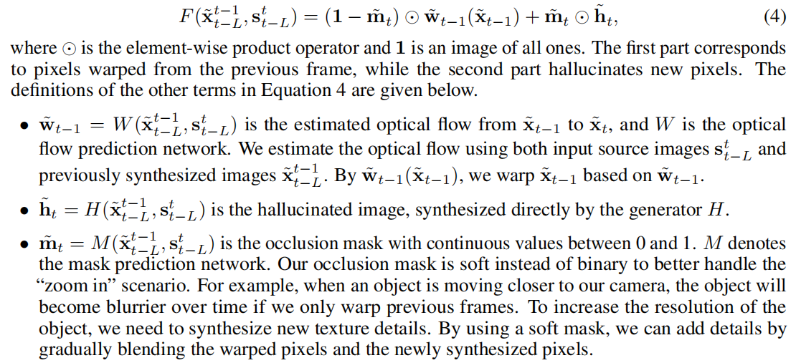

# Daily Thought (2019.9.1 - 2019.9.30)
**Do More Thinking!** ♈ 

**Ask More Questions!** ♑

**Nothing But the Intuition!** ♐

### 1.多尺度特征表示在深度学习中的重要意义

https://zhuanlan.zhihu.com/p/42080665

**空间金字塔池化(SPPnet):**

何凯明大神为了解决图像分类中存在的全连接层只能接受固定输入的问题，而提出了SPPnet

通过不同的下采样步长，得到固定大小的特征图，并且将特征图拉伸成向量并且进行拼接，这样做不仅可以使网络适应任意尺度的输入，而且因为不同的下采样步长，使网络获得了不同的感受野， 能够在不同尺度上捕捉信息，对于分类任务有明显的提升。但是全局平均池化，可以解决在图像分类中不能接受任意大小的输入的问题。

**PSPnet:**

说完SPPnet, 谈一下PSPnet ,它是SPPnet 在图像语义分割中的应用，只不过PSPnet 在使用不同下采样步长后，为了适应图像语义分割需要——保持特征的空间信息，没有将特征拉伸成向量，而是将不同尺度的特征图上采样至同样大小，进行concatenate 操作,PSPnet在语义分割中的perfomance还不错。

**ASPP(Deeplab)**

在语义分割中另一个融合多尺度特征的网络是aspp（通过在卷积核内插入不同的空洞，以扩大感受野，而避免下采样操作丢失过多的空间信息），由谷歌deeplab实验室提出。这个实验室提出的一系列语义分割技术，将语义分割精度推向89+。从最开始的将图像金字塔与attention model 结合，largeFOV ，然后加上全连接crf，再到aspp+crf，然后又提出aspp+skip结构，将aspp 输出的不同scale feature map上样至同样大小，然后在加入skip（有点类似unet，unet 实际上是encoder-decoder+skip），在到现在pascal voc 语义分割榜首，89+，估计这个精度一段时间内，没有其他的操作可以相媲美了，因为deeplab 在JFT-300M上预训练模型，这个数据集是image net的300倍，好像有几亿张图片。deeplab 的论文建议 多读，反复读，而且感觉deeplab 对图像金子塔，或是多尺度输入很钟爱，每篇论文都会探讨到多尺度问题。而且deeplab 的论文提出的一些训练策略也很值得学习。语义分割中还有一些unet, segnet ,deconv-net,refine-net,link-net等等太多了，但是可学习的东西并不多，论文里探讨的东西也不多，基本都是丢出个网络，给出个结果。不同网络之间的性能相差一两个百分点不能说明什么实际问题，因为深度学习的调参技巧很重要。

**FPNnet**

以上说了2大类，一是spp，二是aspp，下面要说的是FPNnet ，这个结构在目标检测中很重要，可以增加检测小目标的正确率。实际上和unet没什么太大区别，可能Unet采用concatenate, FPNnet 采用sum，而且FPNnet 在每一层都有预测，最后将不同层的预测做个融合。

**多尺度特征（图像金字塔）**

图像金字塔很重要，将不同scale 的图像送入网络提取出不同scale 的特征做融合，对于整个网络性能的提升很大，但是由于图像金字塔的多尺度输入，造成计算且保存 了大量的梯度在内存，从而导致对硬件的要求很高，而且测试时，增加了计算时间。多数论文并没有真的采用图像金字塔作，无论是分割还是检测，通常做法都是将网络进行多尺度训练，然后在测试阶段进行多尺融合，就算这样， faster rcnn等也没有将图像金子塔作为默认的设置。顺便说一下，我特别钟爱多尺度技术，目前做的论文在优化图像金字塔。
做个总结，多尺度信息很重要，当你网络到达瓶颈时，可不可以尝试一下多尺度技术，无论是多尺度训练还是多尺度融合，做完这个操作你会发现你的网络到达了一个新的高度，网络性能得到飞跃。

## Video Generation专题

### 2. Video-to-video Synthesis （NIPS2018）

对于视频（video），直接使用image synthesis的方式，会导致时序上的不一致，生成低质量的群体。

通过设计generators，discriminators并且伴随引入spatio-temporal adversarial objective.

为了简化video-to-video synthesis problem，作出一个Markov假设

视频信号包含了一大堆多余的信息在连续帧里，如果在连续帧里的optical flow已知，那么就可以通过warping当前帧，来估计下一帧，这种估计大部分正确除了一些遮挡地区，基于上述的观察，可以建模F：

对于M,H,W使用残差网络，如果为了生成高分辨率的video要采用coarse-to-fine的网络结构

使用多个GAN判别器可以有效解决GAN训练中的mode collapse问题
